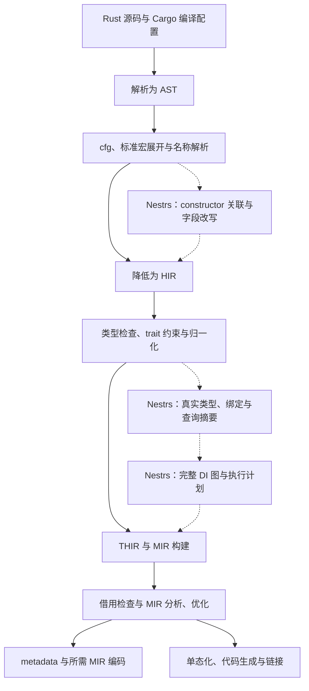
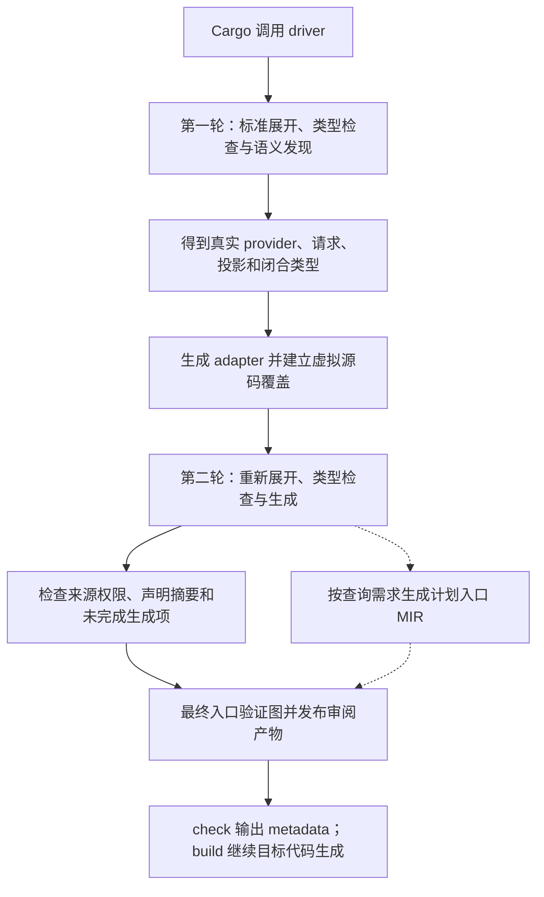
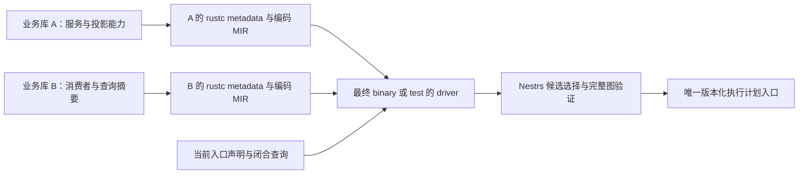
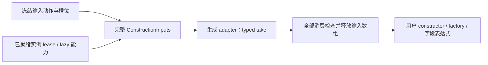

# rustc 的扩展能力与 Nestrs 编译器集成详解

本文解释当前仓库的编译器集成：**rustc 给外部工具提供了哪些接入层次，以及 Nestrs 怎样利用这些层次实现普通过程宏难以完成的分析。**

`cargo nestrs` 的分析能力来自三部分共同工作：rustc 提供已经解析、检查过的 Rust 语义；Nestrs 声明生成器把 DI 意图保留为可识别的类型化事实；Nestrs 自己的图编译器根据这些事实选择服务、检查约束并生成执行计划。rustc 本身不知道 Singleton、key、primary 或依赖注入规则。

本文同时维护 rustc 原理、编译器适配和生成反射层的实现约定。[Cargo 工具链说明](NESTRS_CARGO_TOOLCHAIN.md)介绍命令与配置，[IDE 指南](NESTRS_IDE.md)介绍编辑器接入，[core README](../nestrs-core/README.md)介绍计划进入运行时之后的行为。源码链接用于核对实现；文中的回归入口不表示本次文档更新已在所有平台重新运行测试。

历次缺陷的触发条件、根因、修复范围及复核中继续发现的遗漏统一保存在
[修复记录](NESTRS_FIXES.md)。本文描述当前实现，不把历史验收结论当作新一轮验证。

## 阅读路线

| 想弄清楚的问题 | 阅读位置 |
| --- | --- |
| 为什么过程宏还不够，rustc 多提供了什么？ | [扩展层次](#extension-levels)、[编译过程](#compiler-pipeline)、[真实语义](#semantic-facts) |
| `cargo nestrs check` 到底启动了什么？ | [工具组成](#tool-layout)、[驱动与两轮编译](#driver-pipeline) |
| 为什么连字段类型和构造函数都能改写，生成名称会不会冲突？ | [constructor 的介入位置](#constructor)、[生成名称与宏卫生](#generated-hygiene) |
| 怎样跨业务库发现服务和普通查询方法？ | [类型化声明与 metadata](#metadata)、[查询根分析](#query-roots) |
| 为什么普通大类型可以通过，递归增长仍会被拒绝？ | [查询分析的预算边界](#query-budgets) |
| 如何从语义分析变成运行时可执行的东西？ | [自动绑定](#autobind)、[DI 图与 MIR 入口](#plan) |
| 会不会绕过 Rust 的检查，内部接口有多不稳定？ | [query hooks](#query-hooks)、[权限边界](#trust)、[工具链约束](#maintenance) |
| 怎样对照当前代码继续学习？ | [完整例子](#walkthrough)、[源码与验证地图](#source-map)、[上游资料](#references) |

<a id="extension-levels"></a>

## 1. rustc 生态有多层扩展方式

“扩展 rustc”并不专指修改编译器源码。接管编译命令、生成 Rust 代码、查询已经完成的类型检查结果、替换一个内部查询的实现，是不同深度的扩展。越往编译器内部走，能得到的信息和能改变的行为越多，需要维护的兼容性也越多。

| 接入层次 | 能做什么 | 自身拿不到或不能保证什么 | 稳定性与 Nestrs 当前使用情况 |
| --- | --- | --- | --- |
| Cargo 子命令 | 增加 `cargo xxx`，编排构建、检查、测试与产物 | Cargo metadata 是 package/target 依赖关系，不是业务类型或 DI 图 | 常规工具接入方式；`cargo-nestrs` 使用 |
| `build.rs` | 根据构建环境生成文件、输出 cfg、链接参数等 | 没有应用完成类型检查后的 `TyCtxt`，不能直接询问某个业务类型的 trait 实现 | 稳定 Cargo 机制；Nestrs 保留正常 build script 行为，不靠它恢复 DI 图 |
| `macro_rules!` / 过程宏 | 接收语法输入，生成新的 Rust 项、表达式、类型和诊断位置 | 标准过程宏没有整个 crate 的类型数据库，也没有“给我所有实际 impl”的稳定 API | 稳定语言机制；Nestrs 用私有标准过程宏桥接生成声明 |
| `RUSTC_WRAPPER` / `RUSTC_WORKSPACE_WRAPPER` | 在 Cargo 启动 rustc 时接管调用，记录、修改参数或启动自己的 driver | wrapper 协议本身只交付命令行参数，不会自动附送类型分析能力 | Cargo 提供的配置入口；Nestrs 使用 `RUSTC_WRAPPER`，当前不组合其他 wrapper |
| `rustc_driver` / `rustc_interface` 回调 | 在自己的进程里运行编译器，在配置、解析、展开、分析等节点执行逻辑 | 不是面向第三方承诺版本兼容的插件 API；各节点可用信息不同 | `rustc_private` 内部接口；Nestrs 的主要接入层 |
| `TyCtxt`、类型检查结果和 visitor | 读取名称解析、类型、trait 求解、HIR/MIR、来源位置及外部 crate 信息 | 必须遵守查询依赖和当前阶段；无法通用地证明任意程序行为 | 内部接口；Nestrs 用于语义发现和跨 crate 分析 |
| 注册 lint | 让编译器按 lint 规则报告额外问题，例如基于语义的代码检查 | 自定义 lint 注册接口也依赖内部版本；不能单靠 lint 自动交付整个代码生成方案 | 一般扩展选择；当前 Nestrs 没有把 DI 作为一套 lint pass 实现 |
| query provider override | 包装或替换某个编译器查询的计算方式，包括特定 AST/MIR/可见性结果 | 必须保持编译器不变量、原有查询链和缓存契约，不能任意修改已发布结果 | 更深的内部扩展；Nestrs 对有限查询使用 |
| 自定义 codegen backend / 修改 rustc 源码 | 更换机器码生成后端，或修改编译器本身 | 成本更高，也不直接解决 DI 语义建模问题；后端接口同样不稳定 | 当前 Nestrs 没有自定义 LLVM/codegen backend，也不要求维护 rustc 源码分叉 |

Nestrs 选择了组合方式：稳定的 Cargo 和过程宏入口负责正常集成，固定版本的 compiler driver 负责需要真实语义的部分。业务 crate 仍然写 Rust，普通 `impl`、泛型约束、借用与 trait object 转换仍由 Rust 检查。

需要区分 **稳定 Rust 发行版**和**稳定编译器扩展 API**。即使固定的 rustc release 是稳定版，`rustc_middle`、`rustc_interface` 等 crate 也没有因此成为稳定公共库。

<a id="compiler-pipeline"></a>

## 2. 理解 rustc 的阶段与查询模型

下面是便于学习的数据依赖图，不是要求每个 query 严格执行一次的时间表。



不同表示解决不同问题：

| 表示或机制 | 可以怎样理解 | 对 Nestrs 的意义 |
| --- | --- | --- |
| Token / AST | 写了什么语法；AST 还保留较丰富的源码结构 | 过程宏生成声明，constructor 在解析完成后处理结构体和返回字面量 |
| HIR | 宏展开后的、降低过的 Rust 程序结构 | 遍历真正参与本次编译的项和函数体，读取查询调用与声明身份 |
| 类型检查结果 | HIR 节点对应什么类型，某次方法调用解析到了谁 | HIR 并非每个节点自身都附带完整类型；需要查询 typeck 结果 |
| THIR / MIR | 经类型处理、逐渐降低的函数体；MIR 以局部量、基本块和控制流组织 | 读取描述调用、保留查询摘要，生成受限制的计划入口 |
| metadata | rustc 写入依赖产物、供下游编译使用的信息 | 跨 crate 恢复声明、真实类型和必要 MIR，不要求下游重新扫描上游源码 |
| 单态化与 codegen | 为具体泛型实例选择代码并生成目标产物 | 保留 adapter 及其私有依赖的代码可达性，生成实际目标代码 |

rustc 内部大量工作由**查询系统**组织。可以把 `tcx.type_of(def_id)` 理解为“取得这个定义的类型”：已有结果时复用，需要计算时由 provider 执行，并继续请求其依赖的其他查询。

因此，`after_analysis` 不是“此前绝不构建 MIR”的界线。借用检查本身就可能请求 `mir_built`。一个 query hook 中也不能随意调用所有其他 query：若在 HIR 尚未构造时反过来询问依赖 HIR 的类型，就可能形成查询循环。

Nestrs 的实现遵守这个区别：constructor 的早期处理只使用当时已经存在的 AST 和解析表；后期语义分析才使用类型检查结果。生成计划的 MIR query 与最终审计也分别处理，不能假定它们按文档叙述顺序执行。

<a id="tool-layout"></a>

## 3. Nestrs 实际构建了哪些工具

| 组成 | 角色 | 是否进入应用运行时 |
| --- | --- | --- |
| `cargo-nestrs` CLI | 找到匹配工具链，配置 Cargo，管理 graph/IDE 等命令 | 否 |
| `nestrs-driver` | 链接固定版本 rustc 内部库，运行编译器和 Nestrs 语义扩展 | 否 |
| 私有 `nestrs-tool-bridge` 动态库 | 标准 proc-macro 桥接，把输入交给唯一的 `cargo_nestrs::codegen` 后端 | 仅供编译/编辑器加载，不作为应用运行时库 |
| `nestrs-core` | 装配不可变执行计划，负责实例、lease、生命周期与调度 | 是 |
| 生成的声明、adapter 和计划入口 | 将该应用的服务与 core 执行协议连接起来 | 其中的执行部分成为应用代码；分析事实供编译器消费 |

入口代码位于 [nestrs-driver.rs](../cargo-nestrs/src/bin/nestrs-driver.rs)。它使用 `#![feature(rustc_private)]`，引用 `rustc_driver`、`rustc_interface`、`rustc_middle`、`rustc_hir` 等编译器内部库，然后调用 `rustc_driver::run_compiler`。

这意味着 driver 自己运行了编译器库，并在编译过程中取得上下文。它不靠启动普通 rustc 后解析 stderr 来反推类型，也不只是给 rustc 加几个命令行参数。

工具构建使用 [build-toolchain.py](../tools/build-toolchain.py)。`compiler-driver` feature 把依赖 `rustc_private` 的 binary 与普通工具代码隔离开；core 不反向依赖这些编译器库。内部桥接位于 [internal/bridge/src/lib.rs](../cargo-nestrs/internal/bridge/src/lib.rs)，它只做 token 转换和委托，没有第二份声明生成器。

<a id="driver-pipeline"></a>

## 4. 一次 `cargo nestrs check` 如何运行

### 4.1 Cargo 仍然负责构建图

[commands/mod.rs](../cargo-nestrs/src/commands/mod.rs) 和 [toolchain.rs](../cargo-nestrs/src/toolchain.rs) 负责选择 rustc、driver、bridge，配置本次 Cargo 子进程：

```text
RUSTC                = 已验证的固定版本 rustc
RUSTC_WRAPPER        = nestrs-driver
RUSTDOC              = nestrs-driver
NESTRS_REAL_RUSTDOC  = 对应工具链中的真实 rustdoc
NESTRS_MACRO_BRIDGE  = 本次匹配的私有过程宏动态库
CARGO_TARGET_DIR    = 按编译器和工具工件身份隔离的目录
CARGO_INCREMENTAL   = 0
```

这里展示职责，不建议手工拼这些环境变量代替 CLI。Cargo 仍决定编译哪些 package、feature、target 和 build script。wrapper 接到的参数包含原 rustc 路径及其参数，driver 再选择相应流程。

版本、sysroot 和编译器能力探测转发给原 rustc。对于没有直接 core extern 的普通编译单元，driver 会在展开后检查 rustc 实际加载的依赖：完全没有 core 时继续普通编译；发现传递依赖 core 时，使用已经解析到的同一 core 工件接入 Nestrs 流程。它不凭上次构建残留的 sidecar 猜测当前是否使用 DI。

直接依赖 core 的编译单元得到 `--extern nestrs=<bridge>`。仅通过上游库使用容器的单元，在传递依赖探测成功后也会补入规范 core extern 和 bridge，再进入完整管线；探测发生在首次展开之后，不能据此承诺无直接 core 的源码可以从一开始使用声明宏。声明服务的 crate 应显式依赖 core，编辑器模型也依据直接 extern 提供宏依赖。下游解码上游 metadata 时也可能需要桥接动态库，因此实际编译还配置 bridge 目录的 `-L dependency=...`。前者解决应用中的宏名字，后者解决依赖 metadata 的递归加载；两者用途不同。

### 4.2 语义发现与最终生成分成两轮



`Discover` 与 `Generate` 都实现 `rustc_driver::Callbacks`：

| 回调 | 第一轮 `Discover` | 第二轮 `Generate` |
| --- | --- | --- |
| `config` | 安装 hooks 和源码快照 loader，保留所需 MIR，关闭最终计划生成 | 安装同组 hooks，启用计划生成，安装带快照校验的 overlay loader |
| `after_crate_root_parsing` | 准备反射声明及最终入口占位项 | 在本轮编译中重新准备 |
| `after_analysis` | 审计内部访问与 constructor，验证声明，发现待生成绑定，然后停止 | 重复审计与语义分析，核对声明摘要及生成完成情况，验证计划并捕获文档，成功后继续 |

第一轮不继续最终目标代码生成；它要回答“应该补充哪些代码”。第二轮回答“补充后的程序能否通过 Rust 检查，完整 DI 图是否成立”。这个划分使自动生成的 trait 投影也接受真实类型、约束、隐私和借用检查。

这里的两轮一致性检查具体包括源码快照、再次语义分析、provider/request/binding/blueprint 的预期计数，以及是否仍有待生成项。它不是对两轮完整语义图做结构哈希等价证明。

第一轮临时把 lint 等级上限设为 Allow，因为补充的 adapter 会改变代码使用关系；最终轮负责正常 lint 行为。这不等于吞掉第一轮的类型错误或取消最终检查。

### 4.3 FileLoader 改的是编译输入

rustc 允许配置源码读取器。Nestrs 用 `SnapshotLoader` 记录第一轮读取的源码，用 [OverlayFileLoader](../cargo-nestrs/src/compiler/autobind_codegen.rs) 在原模块的编译输入中插入生成项，再用 `CheckedLoader` 核对第二轮读取。

业务磁盘文件保持原样，生成片段和分析记录写到 target 下。若已读源码发生变化，或第二轮引入第一轮没读取的源码文件，会明确失败，避免把不同版本的业务代码拼成一个分析结果。

这不是整个构建的事务隔离：非确定过程宏、环境变量和过程宏自行读取的外部文件，并不都被源码快照覆盖。两轮编译也确实有成本，不能把这种集成描述为“单轮扫描即可完成”。

<a id="semantic-facts"></a>

## 5. rustc 提供的“真实语义”是什么

只看到 `Repository<User>` 这段文本，不足以决定它对应哪个服务。同名类型可能来自不同 crate；别名可能指向同一类型；泛型约束可能使某个 impl 根本不成立；关联类型要在具体上下文中才能确定。

| rustc 概念 | 含义 | Nestrs 如何使用 |
| --- | --- | --- |
| `DefId` / `LocalDefId` | 一个定义在编译器中的真实身份；前者可指向外部 crate | 区分同名声明，确认 marker 来自谁，找到具体 trait/方法/结构体 |
| `Ty<'tcx>` | 编译会话内的类型表示，携带结构和泛型实参等信息 | 比较服务真实身份、闭合泛型、检查 concrete/interface 组合 |
| 泛型参数与归一化 | 将具体实参代入，并按上下文解析关联类型等形式 | 使不同语法写法在正确语义下参与匹配，拒绝尚未闭合的请求 |
| `Instance` | 已选中的函数或方法实现及其具体泛型实参 | 选择泛型蓝图回调、trait 方法实现和查询摘要的实例 |
| trait obligation / `Unsize` | 由编译器证明类型约束以及 concrete 到 trait object 的转换是否成立 | 确定是否有合法投影，包括对象约束及相关类型关系 |
| `Span` / `SourceMap` | token、定义或表达式的来源范围和宏展开上下文 | 诊断指向用户字段/参数，判断生成代码来源 |
| `TyCtxt<'tcx>` | 访问当前编译会话查询与类型信息的上下文 | 连接上述信息，而不是另建一个字符串类型数据库 |

`DefId`、`Ty` 和 `Instance` 是编译器语义身份，不是应用运行时的 `TypeId`。也不能把某轮编译中的 `Ty<'tcx>` 存进跨会话全局缓存，期待下一轮继续使用。

例如 `type Db = Postgres;` 不会自动产生第二种服务身份，而两个模块各自声明的 `struct Database` 也不会因为显示名称相同就被合并。错误展示可以简化类型名字，匹配和选择必须一直使用真实身份。

<a id="constructor"></a>

## 6. 为什么 constructor 要介入名称解析之后、HIR 之前

假设一个服务通过显式构造函数接收依赖，并存入名称不同的字段。这里用简化业务片段说明关系，省略 `Database` 的声明和应用入口：

```rust
use nestrs::{constructor, injectable};

#[injectable]
struct OrderService {
    database: Database,
}

impl OrderService {
    #[constructor]
    fn new(connection: Database) -> Self {
        let chosen = connection;
        Self { database: chosen }
    }
}
```

工具要确定 `database` 保存的是哪个构造参数对应的注入令牌。仅按同名字段和参数匹配会失败；仅按相同类型匹配，在两个参数都是 `Database` 时同样不可靠。

当前分工是：

1. 标准属性宏生成 constructor 签名、依赖事实和 typed adapter，保留需要后续选择的候选。
2. [constructor.rs](../cargo-nestrs/src/compiler/constructor.rs) 包装 `resolver_for_lowering_raw`，先调用 rustc 原 provider，让 cfg、宏展开和名称解析完成。
3. 按真实结构体 `DefId` 关联 inherent impl；按 `Res::Local(NodeId)` 追踪参数和局部变量的实际绑定。
4. [constructor_body.rs](../cargo-nestrs/src/compiler/constructor_body.rs) 分析受支持的返回字面量来源，返回字段与依赖参数的映射；`constructor.rs` 据此改写字段包装类型，再把结果交还 HIR lowering。
5. 随后的类型检查与借用检查验证得到的程序。来源无法确认或分支不一致时给出诊断。

关联构造 adapter 时，driver 只连接经过来源认证的生成候选与辅助项：把真实辅助函数的
`AssocFn DefId` 写入该候选路径的解析结果，并以 `QSelf` 保留原服务类型及其泛型实参。
业务同名方法和常量仍保留自己的解析身份；不能仅靠更长的固定辅助名称规避冲突，也不
修改整个业务 impl 的宏卫生。生成调用继续接受标准类型、借用和隐私检查。

完成 `AssocFn` 解析前还会按真实泛型参数身份验证 impl Self 一一覆盖服务蓝图，拒绝
具体类型、重复参数等专门化形状。直接写入解析身份不能跳过原生关联方法探测要求的
Self 兼容性前提，否则可能把无法匹配的泛型 Self 交给 typeck 并触发编译器内部错误。

这段代码能处理简单别名和真实变量遮蔽，不意味着实现了任意 Rust 数据流的完整证明器。复杂无法确认的流必须被拒绝，不能依赖字符串猜测。

选择这个阶段有实际原因：更早还不知道一个名字究竟指向哪个定义；更晚才修改字段则会破坏已经建立的 HIR/typeck 关系。当前 wrapper 一次性取走原查询返回的 `Steal` 内容，修改后返回新的 AST/解析结果，不在查询结果已经发布后偷偷修改缓存。

新增包装节点有独立 `NodeId` 和解析记录，内层业务类型保留原来的泛型身份。此时不能调用依赖 HIR 的 `type_of` 查询来“方便地查一下”，否则容易形成自身依赖循环。

<a id="generated-hygiene"></a>

### 6.1 生成名称与业务名称怎样隔离

生成一个较长的固定名称仍可能与合法业务常量、函数或类型冲突。私有
[bridge](../cargo-nestrs/internal/bridge/src/lib.rs) 为共享 codegen 提供
`proc_macro::Span::def_site()`；自动字段构造和 constructor 的生成绑定，以及
factory 的内部辅助项使用该卫生来源，定位信息仍指向对应业务声明。factory 的
输入、元组和结果绑定复用原函数 `Ident`：该函数已占据模块的值命名空间，不会同时
是业务常量；调用原函数时使用 `self::函数名`，避免被局部绑定遮蔽。业务签名、类型、
表达式与函数体继续保留原 token 来源，不批量改写为工具作用域。

| 生成位置 | 当前处理 |
| --- | --- |
| 自动字段构造和 constructor 的输入、实例、错误绑定 | 定义处卫生隔离生成绑定及其引用，业务 `const error` 不会被解释为生成闭包的常量模式 |
| factory 的输入、元组和 `Ok` / `Err` 绑定 | 复用业务函数已有的值名称和原 `Ident`，对函数的调用使用 `self::` 路径；不另造可能命中业务常量的局部名 |
| 反射模块、provider 常量、字段模式和 cfg 辅助项 | 同样隔离生成项名称，业务同名声明及 `#[value(...)]` 调用保留原解析 |
| 跨属性展开的 constructor 关联项 | 使用上文已认证的辅助 `AssocFn DefId` 和服务 Self 身份连接，不依靠字符串改名 |
| 自动 trait 投影 | 在匿名常量的独立模块内生成，避免参数捕获业务常量；类型路径及 coercion 继续接受 Rust 检查 |
| 拼接 raw identifier 派生的内部符号 | 仅在拼接内部名称时 `unraw()`，业务引用保持原 `Ident`；输出关联类型约束时仍保留关键字所需的 `r#` |

具体入口见 [constructor_codegen.rs](../cargo-nestrs/src/codegen/constructor_codegen.rs)、
[自动字段构造](../cargo-nestrs/src/codegen/injection/macros/injectable/constructor.rs) 与
[factory codegen](../cargo-nestrs/src/codegen/injection/macros/factory/codegen.rs)。
定义处 span 是固定工具链下私有桥接的构建能力；构建授权不向普通应用传播，
普通 core / 工具单元测试也不依赖该授权。获取 span 不增加第二份生成后端。

<a id="metadata"></a>

## 7. 如何把 DI 声明变成跨 crate 可分析的事实

### 7.1 marker 的作用是保留类型化事实

过程宏看到 `#[inject] database: Database` 时，知道这里存在 DI 意图。普通 Rust 类型检查即使能确定 `Database` 的含义，也不会自行知道它应该作为一个注入输入。

因此 codegen 同时生成两类东西：

- **执行能力**：真实的构造、清理和投影 adapter，运行时需要它们。
- **声明事实**：带具体类型参数和静态策略的内部 marker/描述 helper，编译器据此恢复 provider、输入、key、策略和来源位置。

可以把 marker 概念性地理解为“这里声明了一个类型为 T 的输入，策略是 P”。这是讲解用的描述，不是应用可以调用的注册 API。实际名称和标量约定集中在 [protocol.rs](../cargo-nestrs/src/protocol.rs)，生成产物与执行协议见[第 10 节](#plan)。

marker 的名字本身不构成可信证据。driver 会结合真实定义身份、定义路径、签名和生成来源认证它，不能让业务代码写一个同名函数就伪装成内部声明。

这些生成代码统称 `nestrs-reflect`，是当前项目与编译配置的逻辑产物，**不是新的 Cargo package**。声明在自身私有作用域中生成 `__nestrs_reflect`、`CompilerKey`、typed adapter；开放泛型另有声明局部的 `ProviderDefinition` 与 helper。普通查询摘要由 driver 独立补充，所以没有属性声明的中间业务库也能贡献需求。协议源码由 codegen library 和 driver 分别私有编入，不跨 target 交换其中的 Rust 类型。

保留声明所属 crate 的生成位置，能让私有 concrete 和构造方法继续保持封装；把一切放进反向依赖业务库的统一生成 package 会引入依赖环和可见性问题。局部项来自宏展开或虚拟编译输入，最终入口来自 MIR，因此不承诺存在一个完整的 `nestrs-reflect.rs`，也没有手工 `register!` 步骤。core 生产代码只接收执行能力，不保留 `DependencyRequest`、`Delivery`、候选注册模型或全局泛型发现 trait。


### 7.2 library 发布事实，最终入口决定应用图



上游 library 可以声明一个依赖，而让下游应用提供实现。因此 library 编译只贡献声明、投影能力和查询摘要；完整图在最终 binary/test 组合处检查。

跨 crate 分析主要读取 rustc metadata 和必要的 MIR，不要求在当前目录扫描依赖库源码。上游私有 concrete 可以在自己拥有合法可见性的作用域生成投影能力，下游再按实际需求选择它；不需要把 concrete 改成公开类型。

### 7.3 为什么需要编码 MIR

下游可能第一次请求上游的 `Repository<User>`。工具必须找到经认证的局部 `ProviderDefinition::provider` 蓝图，用真实泛型实参求解对应 `Instance`，再读取描述函数的 MIR 并替换类型参数。

这里读取的是已编译表示，不是执行这个函数。`CompilerKey` 的 default/named/indexed 身份来自准确 enum 变体与受支持的静态描述；不会执行任意业务代码来猜 key。

当前实现同时采用：

- 声明 marker 使用 `inline(never)`，使必要的描述调用不会在优化中直接消失。
- driver 对参与分析的业务库及普通外部 helper 保留固定 rustc 的 `always_encode_mir`，确保 metadata-only 的 `cargo nestrs check` 也保留下游需要的 MIR；普通库的单次编译路径见[外部库查询分析](#external-query-mir)。

仅添加 inline 属性不能代替 metadata 编码开关。反过来，MIR 编码也不意味着可以对任意已发布 Rust 二进制进行稳定反射：格式、身份、查询和可用内容都受固定编译器与 Nestrs 声明协议约束。

<a id="autobind"></a>

## 8. 自动 trait 绑定如何得到证明

自动绑定涉及两个不同问题：

1. **Rust 问题**：某个 concrete 是否可以合法投影为请求的 trait object？
2. **DI 问题**：合法候选中，本次 type/key 请求应该选哪一个？

第一个问题交给 rustc，第二个问题由 Nestrs 定义规则。

[autobind_semantic.rs](../cargo-nestrs/src/compiler/autobind_semantic.rs) 收集已声明的 provider、factory 成功类型及必要闭合泛型，结合真实请求，通过类型归一化和 trait/`Unsize` 求解检查投影能力。它不会把所有普通 `impl Trait for T` 都自动注册成服务，也不会枚举无穷多泛型实参。

闭合的普通 trait impl 只在 rustc 归一化并确认其 Self 具有受认证的 provider 蓝图后，才进入 DI 候选队列及其复杂度预算。无关业务类型即使包含很大的有限元组，也不会被 DI 预算拒绝；真正的服务类型、查询类型和持续增长的泛型调用仍接受原有上限检查。

获得语义证据后，[autobind_codegen.rs](../cargo-nestrs/src/compiler/autobind_codegen.rs) 生成真实 Rust 投影代码。其关键操作在概念上是普通 coercion：

```rust
// 概念示意：实际 adapter 还负责连接 core 的类型化执行协议。
fn project(value: &Postgres) -> &dyn DatabasePort {
    value
}
```

这个 coercion 再由第二轮 rustc 检查。Nestrs 不合成 vtable、不伪造 trait object，也不以编译器插件身份延长业务借用。

知道一个类型的 `DefId`，不等于能在任意模块写出它的路径。[type_source.rs](../cargo-nestrs/src/compiler/type_source.rs) 结合实际 extern、合法重导出和 `visible_parent_map` 生成可命名路径。路径合法性与类型身份是两件事，都必须满足。

同一个自动 concrete/interface pair 在完整链接单元里保持幂等；显式 pair 优先，重复显式 binding 仍是错误。上游提供的潜在投影能力只有在实际需求下启用，未请求的接口不应触发无关歧义或无限泛型物化。

跨 crate 支持仍有明确边界：

- 汇总最终链接单元实际依赖的声明，不扫描磁盘上的全部 workspace 成员；只提供服务的库应被应用实际引用，例如 `use implementation_crate as _;`。
- 上游私有类型的投影留在上游合法作用域；公开重导出和 Cargo 依赖别名按真实可访问路径处理。消费者无需命名该私有 concrete，但必须能合法命名所请求的公开接口。
- 泛型字段继续沿描述 MIR 的真实 `Ty` / `Instance` 替换；精确 concrete/key 的显式 provider 优先于 fallback 蓝图。没有有限闭合信息时，不枚举开放类型族。
- 已确定的关联类型、父接口以及 `for<'a>` 父接口在各自绑定范围中求解，不把 `'a` 替换成 `'static`。
- 上游投影目录覆盖业务接口可证明的 `Send` / `Sync` 形状。额外的 `Unpin`、`UnwindSafe` 等会形成不同 trait object；目录缺少精确形状时，公开实现可能由下游补投影，私有实现不能绕过隐私。
- 宏生成项仍需要合法且可定位的虚拟源码插入位置，不能只因类型求解成功就保证能够生成 adapter。
- 同一最终程序要求同一份兼容 core，服务库须由匹配工具链生成 metadata。`graph` 另有入口直接依赖 core 的限制，见[工具链指南](NESTRS_CARGO_TOOLCHAIN.md#html-图边界)。

应用组织示例见[宏使用指南](NESTRS_MACROS.md)，真实多 crate 项目见 [cross-crate-binding](../cargo-nestrs/tests/fixtures/README.md#关键契约的阅读位置)。


<a id="query-roots"></a>

## 9. 普通异步查询方法如何成为编译期需求

业务可以直接写：

```rust
provider.get_required_service::<OrderService>().await?;
```

它不是查询宏。要在编译期知道 `OrderService` 是一个查询根，driver 必须识别实际解析到的查询方法和真实泛型实参，而不能搜索字符串 `get_required_service`。其他业务类型上的同名方法不能被当成 core 查询入口。

查询根用于触发受支持的类型闭合与投影需求，**不把一次普通查询变成必选注入边**。查询未注册的类型或 key 仍可通过编译，执行时按 API 返回 `None` 或 `ResolveError`；候选歧义以及已展开服务内部的非法依赖仍在编译期拒绝。因此 `get_required_service::<Missing>()` 与服务字段声明 `#[inject] missing: Missing` 的缺失处理不同。

[query_roots.rs](../cargo-nestrs/src/compiler/query_roots.rs) 从类型化 HIR 关系收集查询及调用摘要，把所需事实保留到 MIR/metadata 中。闭合调用链通过 `Instance` 解析和泛型替换展开，支持泛型辅助函数、闭合 impl 的 `Self`、关联方法、trait 默认方法等场景。

### 9.1 保留调用身份，再选择真实实现

具体来说，`preserve_summary` 会在业务 MIR 原入口之前添加带真实类型实参的 marker 调用基本块，使必要事实在后续优化与跨 crate 读取中仍可恢复。它不替换业务原调用、返回或借用关系，但确实改动了 MIR；不能称作纯只读观察，也不能在缺少产物证据时承诺额外调用成本必然为零。常量引用另走原生 `required_consts`，不混入这组新 marker 调用。

还要处理容易被语法扫描漏掉的情况：

- 标准 trait 方法和运算符，例如 `Iterator::next`、`Add::add` 与 `+`。保留真实关联方法及泛型实参，再让 rustc 选择业务实现；不只检查业务 crate 自己定义的 trait。`Iterator::collect` 等默认方法可以继续转发到业务实现：当闭合实参包含已知查询方法所属的真实名义类型或查询函数/闭包时，按需读取标准库泛型 MIR 中的函数项与调用边，再由 `Instance` 选择实际实现。这个筛选不按方法名匹配，不枚举其他 impl，也不直接把某个类型的所有方法当成已调用。
- 自动解引用在类型检查的 adjustment 中保留每一步真实接收类型与 `Deref`／`DerefMut` 方法。它不一定出现在普通方法调用记录中，因此必须单独收集，仍由 rustc 对闭合实参选择业务实现。
- `dyn Trait` 调用普通泛型业务对象的方法时，保留真实 unsize 转换的源类型和目标类型，通过私有 `QueryUnsize` 摘要跨 crate 传递。闭合后使用 rustc 的 `CoerceUnsized` 字段与尾部类型规则恢复具体对象，再与已出现的相关虚调用匹配；对象形状、关联类型及父接口转换经真实 `Unsize` 求解。父接口引用在代入具体类型后继续由 rustc 归一化，再比较真实类型身份，因此 `Child<T>: Run<T::Target>` 中的投影与其闭合结果遵循相同规则。归一化失败明确报告，不能静默遗漏查询。最后由 `Instance` 选择覆盖实现或默认方法。普通对象无需成为 provider，仅发生类型擦除也不会把其所有方法种成查询根。
- 隐式析构在原生 move 分析与 drop elaboration 完成后、优化前保存 `Drop` 对应的真实析构函数项，沿既有查询摘要协议传递。这能排除已经移入 `forget`／`ManuallyDrop` 的值，同时保留已编译的 `if false` 分支。闭合后读取 rustc 生成的实际析构胶水，继续追踪用户 `Drop` 与字段、容器的析构；不按 `Box`／`Vec` 名称手写释放规则，也不在分析时执行析构。类型及关联类型的有限名义关系只筛选相关性，是否存在实际析构调用仍以原生 MIR 为准。
- 元组或闭包的 `Clone::clone` 可能解析为 `ShimKind::Clone`，其公共方法 DefId 无法表示具体字段调用。收集器与析构胶水一样读取该真实实例的 MIR，并按完整 `InstanceKind` 与实参去重；这类 MIR 已按具体类型生成，不再代入 trait 声明参数。嵌套元组、闭包捕获与跨 crate helper 中的字段克隆继续由 rustc 选择实际业务实现，不手写聚合字段规则，也不执行业务 `Clone` 来寻找查询。
- 函数指针藏在关联常量或内联 const 中。保留常量的真实 `DefId` 和泛型实参，并使用原生 `required_consts` 与常量 CTFE MIR 摘要；不把函数指针伪装成普通 `FnDef`。
- 不可变 `static` 初始化器中的固定函数指针，包括经关联常量、内联 const 或 const fn 取得的函数项。固定 rustc 不向上游 metadata 编码 static 初始化器 MIR，因此生产库把这些已类型检查的闭合摘要汇入现有私有查询 summary 函数；下游读取真实类型和函数身份，不读取已求值 static 或函数地址。与本 crate 的 HIR 规则一致，已编译但未调用的私有不可变 static 初始化器也贡献闭合需求。这里不分析运行期修改函数指针后的目标，也不为 mutable static 增加跨 crate 摘要协议。
- 下游才闭合的上游泛型查询。读取上游摘要后代入本次实参，而非假定库编译时已经知道应用中的所有类型。

读取 CTFE MIR 表示不等于为了发现根而执行用户常量求值。正常 Rust 编译仍有自己的常量求值职责；Nestrs 不额外运行用户常量去取得函数地址。

Clone 的分析遵循实际 Rust 调用语义：`clone_from` 继续沿所选方法 body，引用、
`Arc` / `Rc` 的克隆不因此调用所指对象的 `Clone`；而 `Copy` 类型的自定义 `Clone`
仍可能由元组或捕获该值的闭包调用。固定 rustc 还存在 `TrivialClone` 等无需字段
调用的实现，不能把读取 `ShimKind::Clone` 写成“对所有 Clone 实例递归克隆字段”。
代码中其他 coroutine 形态的匹配分支也不等于所有未稳定语言特性已经完成运行验收。

<a id="external-query-mir"></a>

### 9.2 没有 Nestrs 摘要的外部库如何转发查询

业务调用仍以优化前保存的摘要为准。没有 Nestrs 摘要的普通外部库和标准库，按需读取
真实闭合调用的原生 MIR；helper 无需为了转发业务 trait 调用而添加 core 依赖。
普通库仍使用单次原生编译，driver 保留其 MIR metadata，使 `cargo nestrs check`
与 `build` 都能恢复下游需要的调用关系，不为 helper 注入 core 运行期依赖。
调用、析构和类型擦除同时读取 rustc 优化前保存的 `mentioned_items`，常量继续读取
`required_consts` 及 CTFE MIR，所以普通库内已编译的 `if false` 转发也参与分析。
摘要按定义缓存，闭合调用按真实实例与实参去重，不扫描整套依赖库，也不执行用户
函数或常量来恢复函数地址。相关性筛选只决定是否继续发现，最终实现仍由 `Instance`
选择；与查询无关的普通泛型递归不会仅因调用 `Vec<T>::new()` 而被纳入展开。
筛选还沿真实函数签名、trait 约束、父接口和关联类型声明的约束查找查询关系，
例如 `M: Family<P>`、`Family::Target: Run<P>`；`Target` 可以只出现在 helper
函数体中。这个关系闭包按定义身份去重，不靠 helper 名称，也不无限展开泛型实参。

<a id="query-budgets"></a>

### 9.3 相关性筛选、实际服务与展开预算

相关性粗筛中的“查询载体”仍不等于实际 DI 请求。同一 trait 的某个实现含查询，
只说明需要继续选择实际闭合实现，不能把其他空实现或转发 helper 的全部类型参数
直接当成服务类型。有限而宽的 `Wide` 可以用于普通调用、`Box::new`、类型擦除，
也可以作为只查询 `Repository<u8>` 的 helper 的无关泛型实参。
实际 `Service` 查询记录和 provider 候选继续接受原单类型预算；若查询的是
`Repository<Wide>`，不会因经过 helper 或虚调用而绕过限制。
服务表达式中的关联投影先归一化再核对实际类型；若 `<Wide as Family>::Target`
为 `u8`，`Repository<<Wide as Family>::Target>` 按 `Repository<u8>` 检查。
不含待归一化别名的服务类型仍在归一化前检查，归一化结果也需满足原上限。
函数和常量的发现使用迭代索引记录每条展开链：同一个真实实现沿该链再次出现、
类型树继续变大并超过原阈值时，受控报告 `NESTRS-DI008`。普通函数或常量的身份
已确定时，在归一化前提前检查；trait 关联项必须先由 `Instance` 选择实际实现，
不能用共同的 trait 方法声明把不同 impl 误当成递归。默认方法按实际采用的 body
身份判断。不同起点的独立调用不会互相比较大小；100,000 次展开总量上限仍保留。
这是编译期有限类型分析的边界，不是运行时限制。
这里的相关性仍是保守筛选：若关联类型的约束使 helper 进入发现链，同一个真实
helper 反复扩大泛型实参时，即使最终选中的叶子实现不查询服务，也可能达到上述
增长限制。它与两个不同 impl 仅共享 trait 方法声明的情况不同，后者不构成重入。

不可变 static 的常量摘要使用显式队列，并以 100,000 个不同常量实例限制闭包展开；它不按普通常量链深度计数。此时尚未确定查询相关性，所以不提前把 DI 单类型复杂度上限施加给无关常量；闭合查询进入后续分析后仍接受原有类型复杂度检查。

### 9.4 已编译代码与运行轨迹的区别

这一分析是受限的静态闭包，不是程序实际执行轨迹预测：

| 情况 | 当前含义 |
| --- | --- |
| 查询位于 `if false` 内，代码仍参与编译 | 仍贡献查询需求；不能依赖优化消除来隐藏结构错误 |
| 查询位于从未调用、但已参与类型检查的函数体 | 已闭合的记录仍参与收集；不是只从 `main` 实际可达的调用开始 |
| 代码被 `#[cfg(...)]` 排除 | 不参与本次程序，不贡献该代码的查询需求 |
| 查询类型和调用链可以有限闭合 | 在已支持的摘要规则中展开 |
| 动态 key | 运行时求值一次，从已冻结路由选择；不会扩展新服务图 |
| 类型族持续增长，如 `A<T> -> A<Vec<T>>` | 受复杂度与展开预算约束，不能宣称任意递归泛型都能完成分析 |

当前单类型表达式复杂度上限为 `max(8 × recursion_limit, 1024)`，闭合类型集合和查询展开各有相应的 100,000 预算。这些限制保护编译资源，不是“普通 DI 链只能有这么多层”；很复杂但有限的类型也可能触发保护。

<a id="plan"></a>

## 10. rustc 语义怎样变成 DI 执行计划

### 10.1 DI 图规则由 Nestrs 实现

[compiler/di_plan/mod.rs](../cargo-nestrs/src/compiler/di_plan/mod.rs) 将真实类型和声明实例映射到图模型；[src/di_plan.rs](../cargo-nestrs/src/di_plan.rs) 是不依赖 rustc 的选择与图算法实现。

编译器适配层先处理显式 provider 与蓝图的优先关系，按实际需求物化闭合蓝图、启用潜在投影，再把已展开的声明交给纯模型。纯模型负责 type/key 精确匹配、trait 候选与 primary、optional 的合法缺席、依赖环、生命周期传播以及拓扑顺序等；它不需要理解完整 Rust 语法，也不自行实现 Rust trait 求解器。

这里的 Singleton、Scoped、Transient 是服务的生命周期标签，与 Rust 的引用 lifetime 和借用检查是两个层次。rustc 检查引用是否合法；Nestrs 检查服务是否会持有不符合其 scope 约束的依赖。

Lazy 边仍在完整图里参与结构验证和关闭约束，只是不作为消费者立即激活的前置任务。Optional 可以允许缺席，不能隐藏候选歧义、环或生命周期错误。这些都是 Nestrs 的框架语义。

最终 binary/test 在 check/build 时验证完整注册图，不以用户是否执行 `ServiceProvider::build(None)` 为前提。编译成功说明类型和受支持的 DI 结构成立；数据库是否能连上、factory 是否成功，仍属于运行期问题。

### 10.2 为什么生成一个特殊 MIR 入口

计划包含上游私有类型的回调、已选投影、输入动作与路由。若强迫最终应用源码直接命名每个内部定义，会与合法的库封装冲突。

Nestrs 在最终入口 crate 准备一个工具拥有的私有占位函数，由 [di_plan/emission.rs](../cargo-nestrs/src/compiler/di_plan/emission.rs) 对它的 `mir_built` 查询生成计划装配逻辑，并设置版本化符号 `__nestrs_reflect_v2`。

这里的 MIR 生成范围受限：它根据已检查计划调用认证过签名、来源和类型的执行 adapter 回调，以及 core 私有计划写入函数。它不重写任意业务函数来强行消除类型错误，也不在编译器进程里执行用户 constructor、factory、Default、value 或 cleanup。

MIR hook 是需要维护的可信实现边界，不能仅因“使用了 rustc”就自动宣称其生成绝对安全。业务 adapter 仍由普通 Rust 编译；内部 emitter 则要额外维护函数签名、参数类型、目标指针宽度和入口来源等约束，并由编译器集成测试验证。

### 10.3 编译期与目标运行时的最后一步

生成 MIR 时，编译器持有真实类型与函数身份，但不会把宿主进程的 `TypeId`、函数指针或 vtable 数值序列化给目标程序。

目标程序第一次装配时，入口调用目标端执行 adapter 回调，取得真实 `TypeId` 与函数地址，写入 core 的不可变计划。入口共享的 `OnceLock` 复用该计划，各次 build 仍创建独立 runtime、缓存和服务实例。此时不再做候选选择、泛型展开或图拓扑分析，但也不能称作“零回调、零分配”。


`*.nestrs-reflect.json` 和 HTML 使用的 `*.nestrs-plan.json` 是同源的审阅/展示产物，schema 与编号约定不同。运行时不从 JSON 加载 DI 计划。

rlib 保留必要回调 MIR 和原生代码可达性，包括私有 static、TLS、inline 和 generic 依赖；它不贡献另一份最终入口符号，也不安装进程可变注册表。相关代码在 [registration_reachability.rs](../cargo-nestrs/src/compiler/registration_reachability.rs)。

### 10.4 core 执行协议与直接构造输入

当前私有协议见 [activation/adapter.rs](../nestrs-core/src/activation/adapter.rs)：

| 契约 | 内容与职责 |
| --- | --- |
| `ActivationAdapter` | 服务的真实类型、`Constructor::{Class, Factory}`、输入能力与 cleanup |
| `InputAdapter` | `service_type`、`kind: InputKind`、可选的 `project` |
| `ProjectionAdapter` | `trait_type`、`concrete_type`、唯一的 `project`；不创建实例 |
| `graph::plan` sink | 按已选数字编号接合节点、输入、路由、顺序和运行默认值 |

worker 从冻结计划构造完整 `ConstructionInputs`。每个 `ConstructionInput` 保存请求的准确类型、Required/Optional/LazyRequired/LazyOptional 形态，以及缺席、现有 lease 或 lazy 能力。生成代码按已知 `T` 调用 `take` 系列：普通实例经真实 projector 写入栈上的 `Option<Injection<T>>`，准确类型、形态和同一实例身份验证成功后才消费槽位。None 和未请求的 lazy 同样接受类型与形态验证。



不再生成逐参数 `InputPreparer`，也没有 `PreparedInput` 的 `Box<dyn Any>` 中转载荷。自动字段与显式 constructor 使用 typed 元组暂存已读取的输入并复用上下文绑定，生成名称的隔离另由[宏卫生](#generated-hygiene)保证。自动字段的 Default/value 仍在 struct literal 中按原顺序、原字段类型上下文求值。全部 typed 输入读取、`ensure_all_consumed()` 与输入数组释放完成后，才调用用户代码。

Class 取得拥有 lease 的令牌；Factory 的普通参数借用真实 `FactoryLeaseFrame`，保活 lease 从同一份输入派生并随 factory future 存活。lazy 参数按值交付弱 owner 能力，交付时不请求目标。它们复用 core 的同一个 Coordinator，不增加第二套缓存或状态机。输入数组、lease 列表、实例存储与异步 future 仍可能分配；“移除逐参数装箱”不等于容器零分配。

当前入口 `__nestrs_reflect_v2` 配套 `graph::plan::plan_set_options_v3`，options sink 分别接收 root 和 scope 的初始化默认值及共享构造上限。新增 scope 配置使 sink 升级为 v3；执行入口仍为 v2，JSON 格式 version 仍为 1，不把三者混为同一个版本。driver 在引用 core 的最终 check/build 中核对该 sink 的存在与完整 unsafe Rust 签名，**没有 provider 的空图也检查**，不等链接才发现旧 core。core、driver、bridge 需要配套重编译；CLI 的 driver/bridge 指纹隔离旧缓存。未经工具链生成计划的生产应用调用 build（传 None 或 Some）均会返回 `BuildError::CompilerPlanUnavailable`，不会静默构造空容器。

options sink 的参数顺序是输出指针、root Eager 标志、scope Eager 标志、共享构造
上限，签名为 `unsafe fn(*mut (), bool, bool, usize) -> ()`，使用 Rust ABI 且没有
泛型或可变参数。这里只写入编译期默认值，不调用初始化流程；运行时
`build(None)` 使用这些默认值，`build(Some(options))` 完整覆盖，scope 再按其创建
参数选择配置。创建与失败清理语义统一见 [core README](../nestrs-core/README.md)。

### 10.5 在哪里审阅生成计划

[artifact.rs](../cargo-nestrs/src/compiler/di_plan/artifact.rs) 在最终入口 metadata 路径上替换扩展名，写入 `*.nestrs-reflect.json`。普通 Linux 构建路径通常为：

```text
<Cargo target>/nestrs/<compiler identity>/<driver+bridge fingerprint>/
    <profile 或 target/profile>/deps/<入口工件名>.nestrs-reflect.json
```

Windows 普通缓存使用完整身份的短哈希；graph 和 IDE 还各有构建目录。准确位置应依据本次 Cargo 工件，不能硬编码示例路径或把旧 feature/profile 的文件当成当前计划。Linux 可在编译后查找：

```sh
cargo nestrs check -p nestrs-di-example --bin checkout
find target/nestrs -name '*checkout*.nestrs-reflect.json'
```

| 清单字段 | 含义 |
| --- | --- |
| `format`、`version`、`entry` | 格式 `nestrs-reflect`、JSON schema `1`、执行入口 `__nestrs_reflect_v2` |
| `crate`、`target` | 当前最终入口和编译目标 |
| `initialization`、`scopeInitialization`、`maxConcurrentActivations` | 入口 package 固化的启动默认值 |
| `nodes` | provider、生命周期、初始化策略、adapter 来源与输入槽位 |
| `projections`、`routes` | 实际使用的投影及已经确定的 type/key 查询目标 |
| `order`、`dependents` | 依赖优先顺序与反向依赖索引 |

节点、投影和槽位编号从 `0` 开始，仅在当前清单内有效；`target: null` 是已确定缺席的 optional 输入，`projection: null` 只表示无需 trait 投影。完整候选先通过验证，再裁剪未使用投影并重编号，未被查询的注册 provider 仍接受完整验证。

JSON schema `version: 1` 与执行 ABI `v2` 是独立版本。HTML 使用的 `*.nestrs-plan.json` 另有展示 schema，其中节点与槽位从 `1` 开始，还保留 `primary` 等展示信息；两份 JSON 不能交换编号或互相替代。它们都不含运行期实例或宿主裸指针，不是稳定公开反射 API，也不作为运行时输入。修改 JSON 不会改变已编译程序，清理缓存后重新编译即可重建。

<a id="query-hooks"></a>

## 11. 当前具体覆盖了哪些 rustc query

`configure_compiler` 在 `Config::override_queries` 中安装以下扩展。这是固定版本的真实接口地图，不是对未来 rustc 版本的 API 承诺。

关键安装代码直接对应 driver 中的实现：

```rust
config.opts.unstable_opts.always_encode_mir = true;
config.override_queries = Some(|_, providers| {
    internal_access::install_queries(providers);
    constructor::provide(providers);
    registration_codegen::provide(providers);
    registration_reachability::provide(providers);
    di_plan::provide(providers);
});
```

回调接收到当前编译器的 provider 表，各模块保存需要包装的原函数，再把对应槽位改为自己的函数。对不属于 Nestrs 处理范围的定义，包装器继续返回原 provider 的结果。

| 安装模块 | 查询 | 当前职责 |
| --- | --- | --- |
| [internal_access.rs](../cargo-nestrs/src/compiler/internal_access.rs) | 外部 `visibility`、`module_children`；本地 `resolutions`、`def_span`、`def_ident_span` | 支持工具生成代码访问 core 私有执行协议，维护生成来源，并配合完整访问审计 |
| [constructor.rs](../cargo-nestrs/src/compiler/constructor.rs) | `resolver_for_lowering_raw` | 在真实展开与名称解析后、HIR lowering 前关联 constructor 与字段 |
| [registration_codegen.rs](../cargo-nestrs/src/compiler/registration_codegen.rs) | `mir_built`、`mir_drops_elaborated_and_const_checked` | 保留调用和声明摘要；在原生析构展开后保留真实 Drop 胶水查询关系 |
| [registration_reachability.rs](../cargo-nestrs/src/compiler/registration_reachability.rs) | `effective_visibilities` | 维持生成回调及其原生代码依赖的编译可达性 |
| [di_plan/emission.rs](../cargo-nestrs/src/compiler/di_plan/emission.rs) | `mir_built`、`codegen_fn_attrs` | 生成受认证计划入口的函数体及其版本化导出符号 |

多个模块包装同一个 `mir_built` 时，每层保存安装时的 provider，并按链调用。安装顺序因此是实现契约的一部分，不能简单把 provider 赋值顺序当成无关整理。

当前调用链是 `plan_mir → reflection_mir → rustc 原始 mir_built`；取得原始 body 后先保留查询摘要，再由最外层针对已启用的受认证计划入口生成装配 MIR。普通业务函数不会被替换成计划入口。

Drop 摘要使用另一条 query 包装链：先取得原生 `mir_drops_elaborated_and_const_checked` 的结果，再记录其中的真实析构关系。此时已完成 move/drop 展开，但尚未进行常量分支优化，因此 `forget` 和 `ManuallyDrop` 不会制造析构需求，已编译的 `if false` 分支仍能贡献查询根。

还要区分三个“缓存”：

- rustc 单会话 query 缓存：同一查询结果可以复用。
- Cargo 编译产物缓存：相同构建输入的产物可能不需要重建。
- Nestrs 自己调用的普通图编译函数：不会因为身处一个 callback 就自动成为 rustc query。

当前 `plan_mir` 与 `after_analysis` 的验证路径可能分别调用一次计划编译。借用检查可能先触发前者，而来源审计和两轮摘要核对发生在后者；审阅 sidecar 只有在后者通过后才发布。当前尚未实现这两条路径之间的单会话计划复用，不能据此宣称图只计算一次或自动获得 incremental 加速。

<a id="trust"></a>

## 12. 编译器扩展与业务权限的边界

生成 adapter 需要调用 core 私有执行协议，而应用不能借此直接访问内部模块。当前 [internal_access.rs](../cargo-nestrs/src/compiler/internal_access.rs) 采用两部分配套机制：

1. 在编译器内部为指定 core 定义提供必要的名称解析通道。
2. 对 HIR 中的实际访问做来源审计，只允许经认证的工具生成来源，包括私有桥接宏、指定的 core 内部宏展开、metadata 传递的生成卫生，以及 driver 自建的专属虚拟源或本轮记录的精确源码范围。

判断依据包括实际桥接工件身份、宏卫生来源与工具记录的字节范围；业务自定义宏、伪造名字和用户传入宏的 token 不因此获得权限。每轮编译重置授权范围，防止前一轮的信息泄漏到后一轮。
普通业务函数可以与内部声明回调同名：未经认证的定义不进入反射目录，也不会仅因
拼写相同而被拒绝。版本化执行计划入口仍是私有 ABI，普通源码不能直接调用或取址；
真实生成回调继续接受完整签名和来源检查。

这是一项主动维护的权限例外，单独安装可见性 hooks 而不执行审计不构成合法集成。core metadata 的普通 Rust 可见性和业务公共 API 保持原约定，也不提供 `__private` 公共内部 ABI 让用户绕过检查。

同时，自动投影必须在能合法命名 concrete/interface 的作用域生成，`Unsize` 和真实 coercion 必须成立。编译器有能力操纵内部表示，不代表框架可以跳过业务类型、隐私或借用规则。

这套设计保护的是语言与框架边界，不是构建沙箱。Cargo build script 与过程宏仍按 Rust 构建模型运行；`cargo nestrs check` 和 graph 不执行 DI 构造，不等于整个构建过程没有外部代码执行。

<a id="diagnostics"></a>

## 13. 为什么可以把错误定位到用户源码

拿到内部类型并不自动带来好诊断。如果工具只输出 MIR marker 名称，用户仍然很难知道该改哪里。当前实现把诊断来源作为声明协议的一部分显式保留。

[codegen/source.rs](../cargo-nestrs/src/codegen/source.rs) 与内部 `PlanOrigin` 记录保留字段、参数、类型、key、lifetime 等位置。复合类型还保留末 token 来源，driver 在同一文件且范围合法时恢复完整高亮，避免只指到 `dyn` 或泛型类型的第一个 token。

图算法提供结构化证据，如消费者、输入槽位、冲突候选与真实依赖边。[compiler/di_plan/diagnostics.rs](../cargo-nestrs/src/compiler/di_plan/diagnostics.rs) 把证据翻译为业务名称、主位置、相关位置、原因与修复提示；[compiler/diagnostics.rs](../cargo-nestrs/src/compiler/diagnostics.rs) 通过 rustc 统一发出诊断。

因此同一条错误可在终端中高亮源码，也可通过 Cargo `--message-format=json` 交给编辑器。`NESTRS-DIxxx` 放在消息正文中，不冒充 Rust 官方 `E0xxx` 错误码；内部细节放在末尾 `cause`，过长内容另存诊断工件。

上游源码片段只有通过 metadata 中的源码校验后才用于展示。文件缺失或变化时，工具保留并注明位置来自原编译记录，不展示不匹配的源码片段；若连有效用户 Span 也无法恢复，则明确说明没有精确位置。

完整格式见[DI 诊断说明](NESTRS_DIAGNOSTICS_DESIGN.md)，真实多错误输出见[多个依赖错误示例](../example/di-errors/README.md#一次编译中的多个错误)。多个错误可以一起报告，但不能保证在任意前置 Rust 错误或无法继续分析的状态下仍枚举整个程序的一切错误。

<a id="editors"></a>

## 14. rustdoc 与 rust-analyzer 怎样复用能力

### rustdoc 和 doctest

rustdoc 不经过 `RUSTC_WRAPPER`，因此 CLI 另外设置 `RUSTDOC` 指向 driver，并保存真实 rustdoc 的路径。

当前 doctest 流程先由 driver 在文档配置下检查真实源码和私有访问，再从 HIR 提取文档载体，交给匹配版本的真实 rustdoc；每个 doctest 编译通过 driver builder 接入完整流程。具体实现在 [documentation.rs](../cargo-nestrs/src/compiler/documentation.rs)。这解释了为什么只注入宏动态库还不够：doctest 自身也可能是需要汇总 DI 图的最终入口。

hidden line、`compile_fail`、`should_panic`、`no_run`、`ignore` 及 crate 的 `doc(test(attr(...)))` 仍由真实 rustdoc 处理。每段示例独立构建，禁止用户另配 test builder 或合并 DI 图。`no_crate_inject` 的固定版本兼容由载体名称适配，不修改业务示例。

载体只保留文档结构，示例依赖 Cargo 已构建的真实业务库。普通方法保留测试名称，复杂 impl self 的载体名称通过 HIR 索引区分，`documentation.origins.json` 记录原声明与位置。普通注释以原 Rust 文件为来源，`#[doc = include_str!(...)]` 以实际 Markdown 为来源；相对 `include!`、`include_str!`、`include_bytes!` 和嵌套读取继续基于该目录。不能恢复来源时明确失败，不省略示例冒充成功。生成载体和示例保存在 target，业务目录不写临时文件。

当前只交付测试所需的 rustdoc 流程，没有 `cargo nestrs doc` HTML 文档命令。

### 原版 rust-analyzer

`cargo nestrs init` 根据 Cargo 工件和真实编译单元生成 `rust-project.json`，向原版 rust-analyzer 提供依赖、cfg、环境及同一个 proc-macro bridge。编辑器使用自己的分析引擎和标准过程宏服务。

**rust-analyzer 不运行这里的 rustc query hooks。** 为让 constructor 显示与真实编译一致，driver 捕获语义选择，工具把对应编译单元的模型传给 bridge 的编辑器分支，而非让编辑器独立猜测 struct/impl 与字段来源。

保存后的检查通过配置的 `cargo nestrs init check` 等流程取得完整 rustc 与 DI 诊断。未保存编辑的即时反馈仍受 rust-analyzer 自身分析和最近有效模型的边界约束；结构性改动需要刷新，不能承诺未保存代码已完成最终应用图验证。实现入口见 [ide/mod.rs](../cargo-nestrs/src/ide/mod.rs) 和[IDE 指南](NESTRS_IDE.md)。

<a id="maintenance"></a>

## 15. 为什么必须固定 rustc，以及维护代价在哪里

当前 [toolchain.json](../cargo-nestrs/toolchain.json) 固定：

```text
release: 1.99.0
commit:  b940084d7eb6a299eb4bfeb8e34901bc051e7ac4
host:    x86_64-unknown-linux-gnu / x86_64-pc-windows-msvc
```

这表示仓库支持的编译器身份，不表示其他 patch/nightly/host 只要“看起来差不多”也可使用。内部 query 签名、AST/MIR 结构、metadata 和编译器动态库都可能变化；版本号相近不能替代完整身份检查。

`rustc-dev` 提供构建 driver 所需的编译器库；`rust-src` 主要服务标准库源码和编辑器相关需求，两者作用不同。构建脚本只在工具构建命令中设置 `RUSTC_BOOTSTRAP=nestrs_driver,nestrs_tool_bridge`，限定 driver 使用内部接口，私有 bridge 使用定义点 span 隔离生成绑定与业务常量。bridge 将该 span 显式交给唯一 codegen 后端，业务 token 保留原来源。普通 core/工具单元测试无需授权；CLI 启动应用构建时移除该变量，不把不稳定语言功能全局开放给业务。

doctest 编排还有一个受限用途：为固定 rustdoc 的 `--test-builder-wrapper` 临时按文档 carrier crate 名授权，snippet builder 在重新启动 driver 前清除该授权。它不让业务代码继承任意不稳定语言功能。

工具按 release、commit、host 和 driver/bridge 联合内容指纹隔离缓存。更新桥接工件同样会影响缓存身份，不能只替换一个 dylib 后沿用旧工具组合。

| 代价 | 当前影响 |
| --- | --- |
| 编译器版本绑定 | 升级必须适配内部接口并回归，不能只改 pin 文件 |
| 两轮语义编译 | Nestrs 编译单元重复展开与分析；普通依赖和 core 有各自分支，不能说所有 crate 一律编译两次 |
| 编码额外 MIR | metadata 保留更多分析材料，带来产物和读取成本 |
| 多个 query hooks | 安装顺序、时序、原 provider 链和权限审计都需要维护 |
| 当前关闭 incremental | Cargo 仍可复用未变工件，但不启用 rustc 的细粒度 incremental 编译 |
| 生态工具集成 | doctest、IDE、wrapper 组合与 Clippy 需要分别处理；应用级 Clippy 当前尚未交付 |

升级 rustc 时，应先核对 hooks 的签名和调用条件，再验证构造函数 lowering、普通查询及常量摘要、跨 crate MIR、私有类型投影、计划入口、原生诊断、doctest 和 IDE。运行时单元测试无法覆盖这些编译器契约。

扩展能力也有明确上限：它不证明网络初始化成功，不执行任意程序来推导依赖，不支持无限类型族或运行时扩图，不自动获得所有 target 的支持，也不因生成了 MIR 就免除内部 ABI 的正确性责任。

<a id="walkthrough"></a>

## 16. 沿一个小例子串起整个过程

下面是一个服务声明片段，省略 Cargo.toml 和运行时入口；可运行项目见[结账示例](../example/di-checkout/README.md)。

```rust
use nestrs::injectable;

trait DatabasePort: Send + Sync {
    fn label(&self) -> &'static str;
}

#[injectable]
struct Postgres;

impl DatabasePort for Postgres {
    fn label(&self) -> &'static str {
        "postgres"
    }
}

#[injectable]
struct OrderService {
    #[inject]
    database: dyn DatabasePort,
}
```

应用再通过普通方法查询 `OrderService`。各层分别知道以下事实：

| 步骤 | 谁负责 | 发生的事情 |
| --- | --- | --- |
| 1 | Cargo / CLI | 解析依赖与 feature，选择匹配工具并启动 driver |
| 2 | proc macro / codegen | 将字段改为可存放注入令牌的形式，生成两个 class 声明及一个接口输入事实 |
| 3 | rustc | 确定 `Postgres`、`OrderService`、`DatabasePort` 的真实身份，检查 impl 和生成的 Rust |
| 4 | Nestrs 语义发现 + rustc 求解 | 发现 `dyn DatabasePort` 需求，确认已声明的 `Postgres` 可以合法投影 |
| 5 | codegen / 第二轮 rustc | 在合法作用域补投影 adapter，重新检查真实 coercion 和完整声明 |
| 6 | Nestrs 图编译器 | 对请求的 key 选择候选，建立 `OrderService → Postgres` 依赖，检查环和生命周期 |
| 7 | Nestrs MIR emitter / rustc | 生成计划装配入口，check 写 metadata，build 继续生成目标代码 |
| 8 | 目标程序 / core | 装配真实 adapter 和类型身份；默认 Lazy 配置下，首次查询先构造 `Postgres`、交付令牌，再构造 `OrderService` |

Eager 配置或声明要求的提前初始化，可以在 build 阶段完成相应构造。编译期验证图与运行期选择何时构造是分开的。

如果再声明另一个实现 `DatabasePort` 的 provider，rustc 可能完全接受这两个合法 impl；最终选择是否歧义，要由 Nestrs 按相同 key 与 primary 规则决定。若没有合法候选，诊断应首先指向 `OrderService.database` 并解释缺失关系，marker/MIR 细节放在 cause。

如果把 `Postgres` 移入上游业务库，事实通过 metadata/MIR 到达最终入口；如果换成 `Repository<User>`，多出的是蓝图 `Instance` 的求解和泛型替换。整个路径仍然复用同一套语义发现、图验证和执行协议。

<a id="source-map"></a>

## 17. 对照源码的阅读与验证地图

建议先读入口，再按一个问题追踪，不必从头遍历全部编译器代码。

| 阅读顺序 | 文件 / 入口 | 重点问题 |
| --- | --- | --- |
| 1 | [commands/mod.rs](../cargo-nestrs/src/commands/mod.rs)、[toolchain.rs](../cargo-nestrs/src/toolchain.rs) | 如何保持 Cargo 职责、选择工具并隔离产物？ |
| 2 | [nestrs-driver.rs](../cargo-nestrs/src/bin/nestrs-driver.rs)：`run`、`Discover`、`Generate`、`configure_compiler` | 哪些 crate 走哪些分支，回调何时运行？ |
| 3 | [bridge](../cargo-nestrs/internal/bridge/src/lib.rs)、[codegen](../cargo-nestrs/src/codegen/mod.rs)、[protocol.rs](../cargo-nestrs/src/protocol.rs) | 一条声明生成什么，编译器按什么约定读取？ |
| 4 | [constructor.rs](../cargo-nestrs/src/compiler/constructor.rs)、[constructor_body.rs](../cargo-nestrs/src/compiler/constructor_body.rs) | 为什么需要真实解析身份和 pre-HIR 改写？ |
| 5 | [autobind_semantic.rs](../cargo-nestrs/src/compiler/autobind_semantic.rs)、[type_source.rs](../cargo-nestrs/src/compiler/type_source.rs) | 类型证明与合法源码路径如何分别处理？ |
| 6 | [query_roots.rs](../cargo-nestrs/src/compiler/query_roots.rs)、[registration_codegen.rs](../cargo-nestrs/src/compiler/registration_codegen.rs) | 普通查询、泛型实例与跨 crate 摘要如何连接？ |
| 7 | [compiler/di_plan](../cargo-nestrs/src/compiler/di_plan/mod.rs)、[纯图模型](../cargo-nestrs/src/di_plan.rs) | rustc 身份在哪里转成 DI 图实体，规则由谁决定？ |
| 8 | [emission.rs](../cargo-nestrs/src/compiler/di_plan/emission.rs)、[artifact.rs](../cargo-nestrs/src/compiler/di_plan/artifact.rs) | 如何分别生成入口和审阅产物？ |
| 9 | [internal_access.rs](../cargo-nestrs/src/compiler/internal_access.rs)、[registration_reachability.rs](../cargo-nestrs/src/compiler/registration_reachability.rs) | 私有访问授权与目标代码可达性为何不是同一件事？ |
| 10 | [core graph/plan.rs](../nestrs-core/src/graph/plan.rs)、[activation/adapter.rs](../nestrs-core/src/activation/adapter.rs) | 运行时实际接收到什么，哪些编译期概念已经消失？ |

对应的验证不应只覆盖图算法：

| 契约 | 现有验证入口 |
| --- | --- |
| driver、真实类型和生成行为 | [compiler_contracts.rs](../cargo-nestrs/tests/compiler_contracts.rs) |
| 自动绑定的需求数、投影身份和 check/build 负例 | [autobind_contracts.rs](../cargo-nestrs/tests/autobind_contracts.rs)、[正式 auto-binding 夹具](../cargo-nestrs/tests/fixtures/auto-binding/Cargo.toml) |
| constructor 的名称解析与来源映射 | [constructor_contracts.rs](../cargo-nestrs/tests/constructor_contracts.rs) |
| 普通查询、泛型、trait 方法与常量摘要 | [query_method_contracts.rs](../cargo-nestrs/tests/query_method_contracts.rs) |
| 隐式 Deref/DerefMut、析构胶水与关联字段 | [query_implicit_contracts.rs](../cargo-nestrs/tests/query_implicit_contracts.rs) |
| 元组、闭包的 Clone shim 与非法图拒绝 | [query_clone_contracts.rs](../cargo-nestrs/tests/query_clone_contracts.rs) |
| 无 core 外部 helper、关联类型与优化前调用关系 | [query_external_contracts.rs](../cargo-nestrs/tests/query_external_contracts.rs) |
| 普通泛型对象的 dyn 调用、类型擦除与父接口转换 | [query_dynamic_contracts.rs](../cargo-nestrs/tests/query_dynamic_contracts.rs) |
| 生成局部绑定、内部项与业务表达式卫生 | [runtime_codegen_hygiene.rs](../cargo-nestrs/tests/fixtures/di/tests/runtime_codegen_hygiene.rs)、[runtime_generated_item_hygiene.rs](../cargo-nestrs/tests/fixtures/di/tests/runtime_generated_item_hygiene.rs)、[autobind_hygiene.rs](../cargo-nestrs/tests/autobind_hygiene.rs) |
| 原始标识符与关联类型拼写 | [runtime_identifier_hygiene.rs](../cargo-nestrs/tests/fixtures/di/tests/runtime_identifier_hygiene.rs)、[autobind_raw_types.rs](../cargo-nestrs/tests/autobind_raw_types.rs) |
| check/build 阶段的完整图验证 | [aot_graph.rs](../cargo-nestrs/tests/aot_graph.rs)、[纯图算法测试](../cargo-nestrs/tests/di_plan.rs) |
| 跨 crate、私有实现、重导出与闭合泛型 | [cross-crate fixture](../cargo-nestrs/tests/fixtures/README.md#关键契约的阅读位置)、[verify-cross-crate-binding.py](../tools/verify-cross-crate-binding.py) |
| 源码诊断、跨 crate 位置与 Cargo JSON | [diagnostics.rs](../cargo-nestrs/tests/diagnostics.rs) |
| 无关复杂类型与真实 DI 展开预算 | [type_budget_contracts.rs](../cargo-nestrs/tests/type_budget_contracts.rs) |
| 反射审阅产物与实际计划一致 | [reflection_artifacts.rs](../cargo-nestrs/tests/reflection_artifacts.rs) |
| 原版编辑器和图展示 | [verify-ide.py](../tools/verify-ide.py)、[verify-graph.py](../tools/verify-graph.py) |

这些是已有回归的定位入口，不是本文宣称新跑过的一轮验收。执行环境与命令见[Cargo 工具链说明](NESTRS_CARGO_TOOLCHAIN.md)，各轮实际结果及未覆盖范围见[修复记录](NESTRS_FIXES.md)。仅运行不带 `compiler-driver` feature 的普通工具单测，无法验证 rustc 内部集成。

<a id="references"></a>

## 18. 延伸阅读

先了解稳定入口，再深入编译器内部资料，会更容易区分哪些是应用 API，哪些是固定版本维护责任：

- [Cargo：外部子命令](https://doc.rust-lang.org/cargo/reference/external-tools.html)：`cargo xxx` 如何找到外部工具。
- [Cargo：环境变量](https://doc.rust-lang.org/cargo/reference/environment-variables.html)：`RUSTC`、`RUSTC_WRAPPER`、`RUSTDOC` 等配置的含义。
- [Rust Reference：过程宏](https://doc.rust-lang.org/reference/procedural-macros.html)：标准 token 输入输出、宏形式与 Span。
- [rustc-dev-guide：编译器概览](https://rustc-dev-guide.rust-lang.org/overview.html)：编译阶段和主要中间表示。
- [rustc-dev-guide：driver 与 interface](https://rustc-dev-guide.rust-lang.org/rustc-driver/intro.html)：如何驱动编译器和理解回调。
- [rustc-dev-guide：查询系统](https://rustc-dev-guide.rust-lang.org/query.html)：query、provider 和依赖关系。
- [rustc-dev-guide：MIR](https://rustc-dev-guide.rust-lang.org/mir/index.html)：MIR 表示及其作用。
- [Unstable Book：rustc_private](https://doc.rust-lang.org/unstable-book/language-features/rustc-private.html)：内部编译器 crate 的使用性质。

上游开发文档会跟随 rustc 演进。理解概念可以参考最新资料，复制 API、query 签名和 MIR 操作时应以本仓库固定 commit 对应的编译器源码及现有 driver 为准。
