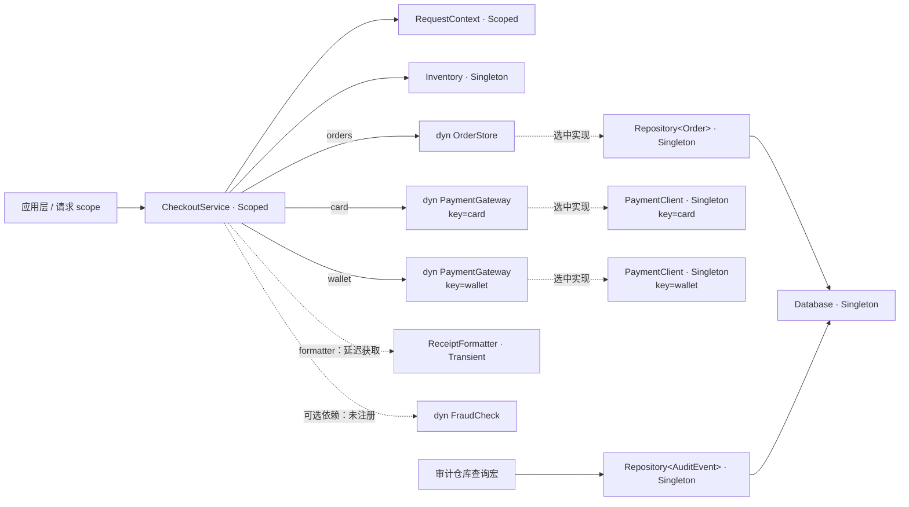

# 电商结账：完整的 Nestrs DI 示例

这个项目是一个可直接接收下单参数的电商结账 CLI。它从用户输入创建请求，预留库存、选择支付渠道、保存订单、生成收据，再根据实际成功或失败结果记录审计。每笔请求有自己的 scope，应用在退出前等待容器关闭。

项目采用单个可执行程序的组织方式：`src/main.rs` 声明私有模块并启动应用，业务实现属于这个 binary；没有为了演示或集成测试而额外导出的 `lib.rs`。命令行、应用生命周期、业务模型和基础设施分别承担明确职责。

本项目根目录为 `example/di-checkout/`，Cargo package 名称保持 `nestrs-di-example`，唯一程序入口为 `checkout`。父目录 `example/` 只组织多个示例，完整索引见[示例目录](../README.md)。

数据库、支付客户端和初始化延迟都在进程内模拟。订单和审计记录保存在仓库的内存表中，退出进程后不会持久保留。运行示例不需要数据库服务、HTTP 服务或支付账户，也不会产生真实扣款。

## 运行

先按[仓库 README](../../README.md)构建匹配的 CLI、driver 与私有桥接库，并将 CLI 加入 PATH，然后在仓库根目录执行：

```bash
cargo nestrs run -p nestrs-di-example -- sample
```

也可以进入本目录运行默认的 `checkout` 二进制：

```bash
cd example/di-checkout
cargo nestrs run -- sample
```

`sample` 会执行后文的四个固定业务场景。日常下单使用 `place-order`，输入由 CLI 解析并转换成 `CheckoutRequest`：

```bash
cargo nestrs run -p nestrs-di-example -- place-order \
  --customer Alice --sku KEYBOARD --quantity 1 \
  --payment card --payment-token approved

# 只提供客户名称时，使用默认商品、数量和 card 渠道
cargo nestrs run -p nestrs-di-example -- place-order --customer Bob

# 查看入口与下单命令的帮助
cargo nestrs run -p nestrs-di-example
cargo nestrs run -p nestrs-di-example -- place-order --help
```

`place-order` 参数如下：

| 参数 | 默认值 | 含义 |
| --- | --- | --- |
| `--customer NAME` | 必填 | 下单客户名称 |
| `--sku SKU` | `KEYBOARD` | 商品编号 |
| `--quantity N` | `1` | 购买数量，金额由商品目录计算 |
| `--payment CHANNEL` | `card` | 支付渠道，支持 `card`、`wallet` |
| `--payment-token TOKEN` | `approved` | 本地模拟支付凭据；`declined` 表示拒付 |

不提供子命令时只显示帮助，不构造 DI 容器或执行下单。`card` 和 `wallet` 是可用支付渠道；本地支付适配器以 `declined` token 模拟业务拒付。每次启动程序都从一份新的内存数据开始，因此两次独立 CLI 调用不会共享订单或库存。

单笔下单成功退出码为 `0`，业务拒绝或初始化等应用错误为 `1`，CLI 参数错误为 `2`。`sample` 中拒付与缺货是预设场景，处理完整个流程后正常退出 `0`。无参数帮助和显式 `--help` 也退出 `0`。

示例复用应用的 Tokio runtime。默认采用 Lazy 模式，只在查询服务时激活所需的依赖。下面的全局参数可放在子命令之前或之后，用于对照不同初始化方式：

```bash
# 预先初始化所有 Singleton 及其必要依赖
cargo nestrs run -p nestrs-di-example -- sample --eager

# 建立 scope 后，先预热该 scope 的 Scoped 服务
cargo nestrs run -p nestrs-di-example -- sample --warm-up-scopes

# 将整个 provider 的构造并发上限设为 1，观察初始化顺序
cargo nestrs run -p nestrs-di-example -- sample --max-concurrency 1

# 参数可以组合使用
cargo nestrs run -p nestrs-di-example -- sample --eager --warm-up-scopes --max-concurrency 1

cargo nestrs run -p nestrs-di-example -- --help
```

本示例默认使用 **4** 个构造名额和 **4** 个 Tokio worker。`--max-concurrency` 接受正整数，控制服务构造的并发数量；它不限制已经构造好的业务服务同时处理多少个结账请求。Eager 只预热 Singleton；它不会提前创建请求 scope，也不会把 Scoped 或 Transient 变成 Singleton。

## 用浏览器查看实际依赖图

依赖图由 `cargo nestrs graph` 生成。它逐个编译并链接所选入口，进入
编译器生成的图导出入口，读取静态依赖图；不会运行下单入口、构造服务、执行 factory
或 `#[value]` 表达式，也不需要启动 Tokio runtime。

```bash
# 项目总览，当前项目仅包含 checkout
cargo nestrs graph -p nestrs-di-example

# 只看结账应用
cargo nestrs graph -p nestrs-di-example --bin checkout

# 指定 HTML 输出位置
cargo nestrs graph -p nestrs-di-example --bin checkout --output target/checkout-di.html
```

项目图当前只有 `checkout`，因此上述 package 命令在图校验与文件写入成功后返回
退出码 `0`，不需要额外加 `--bin`。显式 `--bin checkout` 可直接查看单入口图。
故意违反 DI 生命周期的程序已迁入工具回归 fixture，不参与本项目的注册或图导出。

上面的命令从仓库根目录执行。从本项目目录导出时，可以省略 package 参数：

```bash
cd example/di-checkout
cargo nestrs graph
```

两种方式选择同一个 package，默认页面都位于仓库根的 `target/nestrs-di.html`，不是
`example/di-checkout/target/`；命令会输出实际文件路径。`--output` 相对于调用目录解析，
例如在本目录内可以用 `--output ../../target/checkout-di.html`。

HTML 包含完整图数据、样式和脚本，不依赖网络、CDN 或本地 Web 服务。图导出属于 CLI，
业务代码的 `ServiceProviderOptions` 只配置容器行为。

打开项目页面后可以直接浏览总览，也可以选择 `checkout`，然后这样探索结账流程：

1. 搜索 `CheckoutService`，点击节点查看注入字段、生命周期和声明位置。
2. 沿 `orders` 字段查看 `dyn OrderStore → Repository<Order> → Database → AppConfig`；接口节点与服务节点分开，虚线“选中实现”表示接口投影。
3. 查看 `card`、`wallet` 两个字段请求的 `dyn PaymentGateway` 接口节点；它们的 key 不同，分别选择对应的 `PaymentClient` provider。
4. 查看可选风控输入 `FraudCheck` 的缺席状态，以及 `formatter` 延迟字段与 Transient `ReceiptFormatter` 的生命周期。
5. 缩放和平移画布，查看 `Repository<AuditEvent>`；它由查询宏贡献闭合类型声明，并与订单仓库共享数据库。

服务节点编号标识 provider 声明，与 `[构造]` 日志里的实例编号不同。接口请求节点
只是展示请求到实现的关系，不创建另一份实例；声明与接口请求的数量以本次导出的图为准。
每个字段或参数保留独立输入槽位与连线，所以图上两条边指向同一
Transient 声明，运行时仍会分别构造两个实例。

图展示当前链接单元的静态服务关系，不表示实例初始化状态或业务资源是否可用。
依赖缺失、歧义、环和非法生命周期会使相应入口校验失败：单入口模式不导出新图，
项目模式则将诊断写入报告并保留其他有效入口。外部数据库或支付资源故障只会在
真正实例化服务时显现。HTML 写入错误由 CLI 报告，不影响普通容器构建。

## 业务场景与预期结果

商品 `KEYBOARD` 初始库存为 **5**，单价为 **19,900 分（199.00 元）**。`sample` 子命令执行以下场景；`place-order` 只处理本次输入的一笔请求：

| 场景 | 输入 | 预期业务结果 | 库存变化 |
| --- | --- | --- | --- |
| 并发请求一 | 数量 1，`card` 支付 | 支付成功，创建订单并返回收据 | 减少 1 |
| 并发请求二 | 数量 2，`wallet` 支付 | 支付成功，创建订单并返回收据 | 减少 2 |
| 支付拒绝 | 数量 1，支付 token 为 `declined` | 返回支付拒绝，不创建订单，归还预留库存 | 净变化为 0 |
| 库存不足 | 数量 99 | 在支付前返回库存不足，不扣款、不创建订单 | 不变 |

`sample` 只在 CLI 层提供这四笔输入，和 `place-order` 共用应用层的 `process_orders`。应用每批最多处理两笔请求，由 `tokio::join!` 并发推进，各自拥有 scope；等待本批请求及其 scope 关闭完成后再处理下一批。因此 Alice、Bob 属于第一批，Carol、Dave 属于第二批，第二批的两个拒绝场景也并发执行。这个业务并发安排与 DI 构造任务上限是两个不同设置。

库存不足诊断显示的是请求当时的可用数量。Carol 的库存预留尚未回滚时，Dave 可能看到只剩 1 件；拒付处理完成后，最终库存恢复到 2 件。

成功请求的完成顺序、订单编号对应关系与日志交错顺序可能变化，但最终应当得到：

- 成功订单 **2 张**，购买数量分别为 1 和 2。
- 两张订单的金额分别为 **19,900 分**和 **39,800 分**。
- `KEYBOARD` 剩余库存 **2 件**。
- 支付拒绝和库存不足场景没有新增成功订单。
- 应用层在每次 `place_order` 返回后，根据实际请求和结果写入审计；四个业务场景共 **4 条**。

忽略日志时间戳，汇总行应为：

```text
[结果] 成功订单 2 笔；剩余库存 2 件；成交金额 597.00 元；审计 4 条
```

支付拒绝属于业务结果，不等于 DI 初始化失败。库存不足也应由结账流程正常处理，不能通过构造另一个容器来恢复状态。

## DI 如何组成这段业务

图中的连线区分普通依赖输入、延迟字段、接口选中的实现和可选输入的缺席；应用层只在请求入口获取业务服务，业务服务通过已注入的字段调用协作者。



`AppConfig` 也是 Singleton，用于提供模拟资源初始化所需的配置。上图省略了配置依赖，便于观察请求范围与共享服务的边界。

| DI 能力 | 示例中的使用方式 | 阅读时应注意的行为 |
| --- | --- | --- |
| Singleton | `AppConfig`、`Database`、`Inventory`、两个闭合仓库，以及两个 keyed `PaymentClient` | 同一个 root 的多个 scope 共享这些实例；不同 key 的支付客户端仍是两个独立实例 |
| Scoped | `RequestContext`、`CheckoutService` | 同一 scope 中重复获取会复用实例，不同 scope 的请求上下文隔离 |
| Transient | `ReceiptFormatter` | 每次消费或直接获取时创建；注入 Scoped 服务的 formatter 会随那个服务实例复用，不会在每次业务方法调用时自动重建 |
| 延迟字段 | `#[inject] #[lazy] formatter: ReceiptFormatter` | 消费者构造时只接收句柄，成功订单首次格式化收据时才 `get().await`；拒付和缺货分支不创建格式器 |
| 异步 factory | 模拟数据库和支付客户端初始化 | 依赖满足后才能启动，互不依赖的初始化可以重叠执行 |
| Trait 注入 | `dyn OrderStore` 绑定到 `Repository<Order>`；`dyn PaymentGateway` 绑定到 `PaymentClient` | 业务代码依赖接口；订单绑定的闭合泛型实现会在图编译期间被纳入 |
| Keyed 注入 | `#[inject("card")]` 与 `#[inject("wallet")]` 的字段均为 `dyn PaymentGateway` | trait 查询继承请求 key，取得同一 concrete 类型的两个独立客户端 |
| Optional 注入 | `Option<dyn FraudCheck>` | 本例不注册该接口，因此字段为 `None`，结账仍能正常运行 |
| 查询宏发现泛型根 | `Repository<AuditEvent>` | 没有业务服务依赖它，也能由查询宏在 build 之前贡献闭合类型声明 |
| 异步关闭 | scope 与 provider 的 `dispose_async` | 请求结束先关闭 scope，最后关闭 root；初始化失败路径也安排关闭 |

`#[inject]` 字段看起来声明的是普通服务类型，Nestrs 编译器会在 Rust 类型检查前把它改写成只读注入 token。共享状态的更新仍由业务服务自己的同步机制负责；DI 不会自动让库存的“检查并扣减”成为原子操作。

字段和工厂参数的注入属性只接受裸标记 `#[inject]` 或单个 key 字面量，例如 `#[inject("card")]`、`#[inject(123)]`。`#[inject(key = ...)]` 会导致编译错误。`#[injectable]`、`#[factory]` 自身的服务注册配置继续使用 `key = ...`。

`CheckoutService::place_order` 在短 Mutex 临界区内预留库存，释放锁后再等待支付。未提交的 `Reservation` 在支付拒绝、future 取消或展开栈时通过普通 Rust `Drop` 归还库存；保存订单后调用 `commit`。这是业务 RAII，和容器的 cleanup hook 是两条不同的清理路径。

一个 `CheckoutService` 同时声明了两种支付渠道，所以 **Lazy 首次构造它时也会初始化 card 和 wallet**。运行期的 `PaymentMethod` 只决定本次调用哪个已注入的渠道，不会改变静态依赖闭包。

收据则使用字段级延迟注入：

```rust
#[inject]
#[lazy]
formatter: ReceiptFormatter,
```

它被改写为 `LazyInjection<ReceiptFormatter>`。`format_receipt` 是异步方法，内部先调用
`self.formatter.get().await?`，再同步格式化。`application::handle_checkout` 只在订单成功后
等待这个方法，因此 `sample` 的四笔请求只构造两个格式器，拒付和缺货各自的 scope
无需创建它们。相同字段再次获取仍返回同一实例；不同请求、普通查询仍保持 Transient
的独立实例语义。

延迟字段在 build 时仍参与完整图验证；它不会把类型或 key 留到运行时发现。
本例的目标是 Transient，因此 `--eager` 和 `--warm-up-scopes` 也不会单独预热它。
若把目标改成 Singleton / Scoped，对应的全量预热仍会选择目标；字段延迟不等于
服务级别的“永不预热”。消费者和较晚创建的格式器仍按依赖关系安全关闭。

## 声明、构建、查询与执行业务的边界

声明代码从工具提供的 `nestrs` 命名空间导入 `injectable`、`factory`，使用 `#[injectable]`、`#[factory]` 与字段上的 `#[inject]`。CLI 注入内部过程宏桥接库，宏仍通过标准 Rust 展开；应用 manifest 无需配置宏包依赖。CLI 根据普通 `impl Trait for Concrete` 和实际注入或查询需求生成绑定，业务代码不需要 `#[bind]`。应用不手写容器内部实例记录，也不直接依赖 linkme。

应用声明检查使用 `cargo nestrs check -p nestrs-di-example --all-targets`，运行使用
`cargo nestrs run`。普通 `cargo check` 不会注入 Nestrs 的私有声明桥接和自动 trait
绑定环境，不能替代这条构建路径。`cargo nestrs init` 为现有项目初始化或刷新
开发环境，默认生成通用 rust-analyzer 项目模型与宏展开设置，不创建项目或添加依赖。
如果只打开本项目目录，可在该目录执行该命令；使用 VS Code 时加 `--vscode`，
其他 rust-analyzer LSP 客户端仍需自行加载生成配置。编译检查通过不等于容器完整
依赖图已经在运行时核查。

资源 factory 的源码参数写作 `config: AppConfig`。Nestrs 编译器把它改写为构造期间的共享借用，由输入 frame 在 `await` 期间保活；数据库和支付客户端把需要的配置字符串复制进返回实例。

构建容器时，框架先收集当前链接单元的声明，解析 trait/key/泛型依赖，检查缺失依赖、环与生命周期冲突，然后冻结构造计划。这个阶段在任何服务构造、factory 或 `#[value]` 表达式执行之前完成。Lazy 延迟的是实例化，完整图校验仍然先执行。

查询统一使用 core 导出的宏。例如：

```rust
let checkout = nestrs_core::get_required_service!(
    scope.service_provider(),
    CheckoutService,
)
.await?;

let audit = nestrs_core::get_required_service!(
    provider,
    Repository<AuditEvent>,
)
.await?;
```

返回的共享引用借用实际 root 或 scope owner。只要后续仍需使用该引用，Rust 就不允许消费 owner 进行关闭。`build`、`create_scope`、`warm_up` 与 `dispose_async` 保持普通方法；服务查询没有普通方法形式，也不需要额外的 `register!`。

查询宏会在链接期贡献类型声明，所以即使 `Repository<AuditEvent>` 的实际查询写在 `build` 后面，该闭合类型也已经进入构建时的依赖图。当前链接单元中未执行分支里的查询宏也会贡献声明；动态 key 只在运行期选择已冻结的路由，不会扩展图。

查询类型必须能独立命名，不能让静态根捕获外层泛型函数的 `T`、const 泛型参数或 `impl` 的 `Self`。应在具体调用点写 `Repository<AuditEvent>`，或使用指向闭合类型的别名。

容器变量与查询操作留在应用层。`CheckoutService` 接收业务输入、调用注入的库存/支付/订单服务并返回业务结果；它不会把 provider 传给下游，也不会在方法内部查询容器。

## 输出怎么看

`observe::event` 为日志添加相对时间戳，`observe::created` 打印 `[构造] 类型 #实例编号`。实例编号用于观察对象身份，与业务订单号 `ORD-…` 分开。初始化延迟是本地模拟设置，不能用它判断生产环境性能。

- **Lazy**：build 完成后尚未初始化资源，首次查询服务才激活必要依赖。
- **Eager**：Singleton 初始化在 build 返回之前完成，后续请求复用共享实例。
- **Scope 预热**：`warm_up` 在业务调用前准备 Scoped 服务，每个请求仍有自己的上下文。
- **字段延迟**：`ReceiptFormatter` 的 `[构造]` 出现在成功下单后；失败请求不会为了生成不存在的收据创建格式器。
- **并发构造**：对照 factory 的开始和结束事件，观察独立资源初始化能否重叠。`--max-concurrency 1` 会使构造依次取得名额；它不限制业务请求并发。
- **业务结果**：成功路径包含库存预留、支付成功、库存提交和订单保存；拒付路径归还预留库存。每笔完成的请求都会写入实际审计结果。面向用户的收据只展示订单、客户、商品、金额和支付信息，实例编号保留在诊断日志中。
- **关闭事件**：请求处理结束后关闭 scope，应用结束时关闭 root。`cleanup hook …` 是异步回调，`drop … #实例编号` 是 Rust 对象析构。

日常运行只处理业务，不穿插 DI 自检。相同 scope 的复用、跨 scope 的隔离、Transient 的独立实例、缺失 key 和 root 查询 Scoped 的限制都由测试验证。并发场景的日志交错顺序和订单编号分配可能变化，不是业务契约。

本例的 cleanup hook 是**无参数的类型级异步回调**，用于演示框架会等待清理阶段。它拿不到具体服务实例，因此日志不代表已经关闭某个真实数据库连接。真实连接池或支付 SDK 的资源关闭，应由相应适配器根据自身 API 实现。

## 初始化失败与框架负例

以下环境变量命令使用 Bash / WSL 写法。

### 外部资源初始化失败

```bash
NESTRS_EXAMPLE_FAIL_PAYMENT=1 cargo nestrs run -p nestrs-di-example -- sample
```

这个开关让模拟支付客户端初始化失败。预期行为是打印带服务来源的初始化错误，关闭已创建的 scope 与 provider，并以非零状态退出。它不会执行正常的“两张订单”流程。

也可加上 `--eager` 对照：

```bash
NESTRS_EXAMPLE_FAIL_PAYMENT=1 cargo nestrs run -p nestrs-di-example -- sample --eager
```

Lazy 下，资源错误在首次激活相关服务时显现，应用会关闭已创建的请求 scope，再关闭 root。Eager 下，它在 build 的预热阶段显现；build 负责关闭尚未交付的 provider，此时还没有进入请求流程。**图验证成功只说明依赖结构合法，不保证数据库或支付资源初始化成功。**

### 非法生命周期回归已移入测试 fixture

故意让 Singleton `ApplicationCache` 依赖 Scoped `RequestSession` 的用例位于
[`invalid_lifetime.rs`](../../cargo-nestrs/tests/fixtures/di/src/bin/invalid_lifetime.rs)，由
[`runtime_invalid_lifetime.rs`](../../cargo-nestrs/tests/fixtures/di/tests/runtime_invalid_lifetime.rs)
验证构造前 panic、`构造次数 = 0` 与非零退出结果。它不再是本示例的 binary。

维护框架时，可从仓库根目录单独运行这个预期失败的程序：

```bash
cargo nestrs run --manifest-path cargo-nestrs/tests/fixtures/di/Cargo.toml --bin invalid_lifetime
```

该命令预期以非零状态退出；日常学习业务场景使用本项目的 `checkout` 即可。
工具的 graph fixture 还保留自己的 `invalid_graph`，专门验证项目报告中的部分入口失败，
与本项目的正常图导出分开。

## 项目结构与代码阅读顺序

```text
src/
├── main.rs                  # 唯一 binary 入口，声明私有模块并决定退出码
├── cli.rs                   # clap 命令、参数与输入输出
├── application.rs           # root/scope 生命周期、请求调度、实际结果审计
├── domain.rs                # 请求、订单、错误与业务接口
├── config.rs                # 本地适配器配置、故障开关
├── checkout/
│   ├── mod.rs
│   ├── service.rs           # 下单用例及注入声明
│   ├── context.rs           # Scoped 请求上下文
│   └── receipt.rs           # Transient 收据格式器
├── infrastructure/
│   ├── mod.rs
│   ├── database.rs          # 数据库资源的本地异步 factory
│   ├── repository.rs        # 泛型内存仓库及 OrderStore 实现
│   ├── payment.rs           # keyed 支付 factory 与 PaymentGateway 实现
│   └── inventory.rs         # 库存预留、提交及 RAII 回滚
├── observe.rs               # 示例日志与实例编号
└── tests.rs                 # binary 内部业务与 DI 回归，仅在测试时编译
tests/
└── cli.rs                   # 从进程边界验证命令、输出与退出码
```

这些模块属于同一个应用，不是分别发布的库。只有业务模型与协作接口需要在模块之间共享；测试可通过 `#[cfg(test)] mod tests` 访问应用内部，无需把整个应用变成公开 API。

建议沿一次真实请求阅读：

1. [src/main.rs](src/main.rs) 和 [src/cli.rs](src/cli.rs)：了解命令如何选择 `sample` 或 `place-order`，怎样把用户参数变成请求。
2. [src/domain.rs](src/domain.rs)：阅读 `CheckoutRequest`、`Order`、`AuditEvent` 与 `CheckoutError`，以及 `OrderStore`、`PaymentGateway`、`FraudCheck` 业务接口。金额使用整数分，业务错误与容器错误分开。
3. [src/application.rs](src/application.rs)：从 `run` 进入通用的 `process_orders`，跟踪构建 root、分批处理输入、为每笔请求创建 scope、获取结账服务、记录实际结果、等待关闭的完整流程。先保存处理结果再等待 disposal，确保业务或初始化失败也会进入关闭路径。
4. [src/checkout/service.rs](src/checkout/service.rs)：从 `place_order` 阅读参数校验、库存预留、支付、保存订单与收据生成；再查看 [context.rs](src/checkout/context.rs) 和 [receipt.rs](src/checkout/receipt.rs) 的生命周期声明。
5. [src/infrastructure/repository.rs](src/infrastructure/repository.rs) 与 [payment.rs](src/infrastructure/payment.rs)：查看普通 trait 实现如何被自动绑定，以及同一个 concrete 类型如何注册为两个 keyed provider。
6. [src/infrastructure/inventory.rs](src/infrastructure/inventory.rs)、[database.rs](src/infrastructure/database.rs) 和 [src/config.rs](src/config.rs)：了解并发安全的业务状态、可失败的异步初始化与本地模拟边界。

`CheckoutService` 不持有容器，也不在业务方法中查询服务。业务接口放在 `domain.rs`，基础设施实现依赖这些接口；应用层负责把生命周期和具体业务调用接起来。库存预留仍是本地实现，数据库和支付也仍为内存适配；本例没有引入 HTTP 框架或提前实现 `nestrs-bootstrap`。

## 自动化验证

从仓库根目录运行：

```bash
cargo nestrs check -p nestrs-di-example --all-targets
cargo nestrs test -p nestrs-di-example --all-targets
```

如果当前目录已经是 `example/di-checkout/`，可以省略 `-p nestrs-di-example`。

[src/tests.rs](src/tests.rs) 检查业务结果、库存回滚、审计，以及 Singleton/Scoped/Transient 的共享和隔离行为；[tests/cli.rs](tests/cli.rs) 启动真实可执行程序，检查帮助、用户输入、退出码和失败时的关闭行为。测试中的额外查询只属于测试链接单元，不改变普通运行与 HTML 导出的服务图。

故意非法的 DI 注册继续放在框架的独立 fixture 中。它们不会因为加载测试辅助模块而进入这个业务应用，也不会使正常的 `cargo nestrs graph -p nestrs-di-example` 导出失败。
