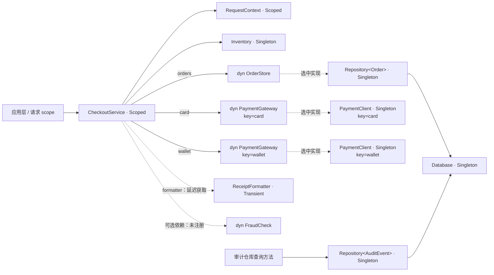

# 电商结账：Nestrs DI 业务示例

这是单 binary 的本地结账 CLI：预留库存、选择支付渠道、保存订单、生成收据并记录实际
结果的审计。每笔请求有自己的 scope，退出前等待容器关闭。Cargo package 是
`nestrs-di-example`，唯一程序入口是 `checkout`；`src/main.rs` 组织私有模块，没有
为了测试额外导出应用 library。

数据库、支付客户端和初始化延迟全部在进程内模拟。订单、库存与审计仅存在内存中，
不同进程不共享；不需要数据库、HTTP 服务或支付账户，不会真实扣款。

## 运行与输入

先按[仓库 README](../../README.md)构建匹配的 CLI、driver 和私有桥接库，并将 CLI
加入 PATH。在仓库根目录运行：

```bash
cargo nestrs run -p nestrs-di-example -- sample
cargo nestrs run -p nestrs-di-example -- place-order \
  --customer Alice --sku KEYBOARD --quantity 1 \
  --payment card --payment-token approved
cargo nestrs run -p nestrs-di-example -- place-order --customer Bob
cargo nestrs run -p nestrs-di-example -- --help
cargo nestrs run -p nestrs-di-example -- place-order --help
```

进入 `example/di-checkout/` 后可省略 `-p nestrs-di-example`。无子命令时只显示帮助，
不构建 DI 容器。应用检查、运行和测试使用 `cargo nestrs`，普通 Cargo 不提供声明宏
桥接与自动绑定环境。

| `place-order` 参数 | 默认值 | 含义 |
| --- | --- | --- |
| `--customer NAME` | 必填 | 客户名称 |
| `--sku SKU` | `KEYBOARD` | 商品编号 |
| `--quantity N` | `1` | 数量；金额由目录价格计算，0 会被业务拒绝 |
| `--payment CHANNEL` | `card` | 只接受 `card` 或 `wallet` |
| `--payment-token TOKEN` | `approved` | 本地模拟凭据；`declined` 表示拒付 |

单笔成功退出 `0`，业务拒绝或应用错误退出 `1`，CLI 参数错误退出 `2`。帮助退出 `0`。
`sample` 中的拒付与缺货是预设业务结果，整个样例流程正常完成后退出 `0`。

初始化相关参数可放在子命令前或后：

```bash
cargo nestrs run -p nestrs-di-example -- sample --eager
cargo nestrs run -p nestrs-di-example -- sample --scope-initialization eager
cargo nestrs run -p nestrs-di-example -- sample --max-concurrency 1
cargo nestrs run -p nestrs-di-example -- sample --eager --scope-initialization eager --max-concurrency 1
```

本例 root / scope 均默认 Lazy、**4** 个构造名额、**4** 个 Tokio worker。`--max-concurrency` 必须为
正整数，控制容器的构造任务数量，不限制已经创建的服务处理多少业务请求。
`--eager` 在 root 创建时初始化 Singleton 及其必要依赖；`--scope-initialization`
接受 `lazy` 或 `eager`，控制每笔请求的 scope 创建行为。Eager 会等待选中的 Scoped
服务初始化成功才交付 scope；这两个选项独立，均不会改变服务的生命周期。

应用调用 `ServiceProvider::build(Some(options))` 显式传入这些参数，因此不采用
Cargo.toml `[nestrs-cli]` 的启动默认值。core 自身的缺省构造上限是 32；本例为了
观察行为单独选择 4。更完整的配置规则见[工具链说明](../../docs/NESTRS_CARGO_TOOLCHAIN.md)。

## 四笔样例请求的预期结果

| 请求 | 输入 | 结果 | 库存净变化 |
| --- | --- | --- | --- |
| Alice | 数量 1，card | 支付成功，创建订单和收据 | −1 |
| Bob | 数量 2，wallet | 支付成功，创建订单和收据 | −2 |
| Carol | 数量 1，token 为 declined | 支付拒绝，归还预留库存，不创建订单 | 0 |
| Dave | 数量 99 | 支付前发现库存不足，不扣款、不创建订单 | 0 |

`sample` 与 `place-order` 共用应用层流程；每批最多两笔请求通过 `tokio::join!`
并发推进，各自拥有 scope，等待两者关闭后再处理下一批。Alice/Bob 为第一批，
Carol/Dave 为第二批。业务并发与 DI 构造并发是两个设置。

初始 KEYBOARD 库存为 5，单价 19,900 分。最终两张订单分别为 19,900 和 39,800 分，
剩余库存为 2，审计为 4 条。忽略日志时间戳，汇总行应为：

```text
[结果] 成功订单 2 笔；剩余库存 2 件；成交金额 597.00 元；审计 4 条
```

订单编号、完成顺序和日志交错可能变化；Dave 检查时 Carol 可能还占用预留库存，
所以当时看到的可用量可能是 1，拒付回滚后的最终库存仍为 2。

## 依赖如何组成业务



图中省略了 Singleton `AppConfig` 到模拟资源 factory 的配置输入。

| 能力 | 本例位置与实际行为 |
| --- | --- |
| Singleton | AppConfig、Database、Inventory、两个闭合 Repository 和两个 keyed PaymentClient 被同一 root 的多个 scope 共享；不同 key 的 PaymentClient 是不同实例 |
| Scoped | RequestContext 与 CheckoutService 在同一 scope 内复用，不同请求隔离 |
| Transient | ReceiptFormatter 每次独立解析创建；一个 lazy 注入句柄成功获取后复用自己的目标 |
| 显式 constructor | CheckoutService::new 的参数是唯一依赖来源，交付拥有 lease 的令牌并移入字段；id 由普通业务表达式初始化 |
| factory | AppConfig 同步创建；Database 与两个 PaymentClient 异步初始化，普通参数在真实 frame 中借用，跨 await 保活 |
| 自动 trait 绑定 | 普通 `impl OrderStore for Repository<Order>`、`impl PaymentGateway for PaymentClient` 按请求参与选择，不写 bind |
| 精确 key | constructor 的 `#[inject("card")]` 与 `#[inject("wallet")]` 选择对应 provider |
| Optional | 没有 FraudCheck provider，因此 `Option<dyn FraudCheck>` 交付 None |
| 闭合查询根 | 审计仓库没有消费字段，普通查询里的 `Repository<AuditEvent>` 仍进入编译计划 |
| 异步关闭 | 每笔请求等待 scope.dispose_async，最终等待 provider.dispose_async；初始化错误同样进入关闭路径 |

[CheckoutService](src/checkout/service.rs) 的参数与字段用业务类型书写；工具按构造函数
整值参数来源将对应字段改写为 `Injection<T>` / `LazyInjection<T>`，不会改写普通 id。
自动字段模式的其他服务用 `#[inject]` 指定输入。字段和参数的 keyed helper 写
`#[inject("card")]` 或 `#[inject(123)]`，不接受 `#[inject(key = ...)]`；provider
声明的配置继续使用 `key = ...`。全部语法见[声明指南](../../docs/NESTRS_MACROS.md)。

CheckoutService 同时依赖两种支付渠道，所以 Lazy 首次构造它也会初始化两者。
`PaymentMethod` 只决定本次调用哪个已注入渠道。formatter 参数带 `#[lazy]`，
`format_receipt` 内部才调用 `self.formatter.get().await?`；只有成功订单生成收据，
四笔样例共创建两个格式器，拒付与缺货不会创建它。它是 Transient，不被 Eager 或
scope 创建时单独初始化；如果目标改为 Singleton/Scoped，其自主预热需要另外通过
服务级 `#[lazy]` 控制。延迟依赖仍参与编译期完整图验证和关闭顺序。

库存预留在短 Mutex 临界区完成，支付等待期间不持锁。未提交的 `Reservation` 在
拒付、future 取消或展开栈时通过 Rust Drop 归还库存；保存订单后才 `commit`。
这是业务 RAII，与容器 cleanup hook 分开。示例的 cleanup hook 是**无参数的类型级
异步回调**，用于显示容器会等待清理；它拿不到具体连接实例，日志不代表关闭了某个
真实数据库连接。真实 SDK 资源应按自身 API 实现关闭。

业务服务不持有 provider，也不在业务方法内查容器。应用层负责查询、调用与 owner
关闭；返回的共享引用仍借用真实 root/scope，不能一边继续使用引用一边消费 owner。
编译计划、直接输入与 factory frame 的设计见[core 架构](../../nestrs-core/README.md)。

## 查看实际编译图

从仓库根目录执行：

```bash
cargo nestrs graph -p nestrs-di-example
cargo nestrs graph -p nestrs-di-example --bin checkout
cargo nestrs graph -p nestrs-di-example --bin checkout --output target/checkout-di.html
```

graph 对选定入口执行 check，读取同一编译计划生成的 sidecar，不运行业务、构造
回调、factory 或 value 表达式。当前 package 只有正常的 checkout，成功时退出 `0`；
HTML 包含图数据、脚本和样式，无需网络或服务。

默认文件在仓库 workspace 的 `target/nestrs-di.html`；进入本项目目录执行
`cargo nestrs graph` 也写到同一处。`--output` 相对于调用目录解析。

在页面中搜索 CheckoutService，沿 orders 查看 `dyn OrderStore → Repository<Order>
→ Database`；检查 card/wallet 的不同 key、FraudCheck 的缺席状态及 formatter 的
延迟边。另可查找由查询发现的 Repository<AuditEvent>。图节点编号标识 provider，
与 `[构造]` 日志中的实例编号不同；接口节点表示投影关系，不创建另一份实例。
图验证通过说明静态依赖合法，factory 和业务行为仍需运行验证。

## 观察初始化失败

Bash / WSL 中可启用本地支付初始化故障：

```bash
NESTRS_EXAMPLE_FAIL_PAYMENT=1 cargo nestrs run -p nestrs-di-example -- sample
NESTRS_EXAMPLE_FAIL_PAYMENT=1 cargo nestrs run -p nestrs-di-example -- sample --eager
NESTRS_EXAMPLE_FAIL_PAYMENT=1 cargo nestrs run -p nestrs-di-example -- sample --scope-initialization eager
```

这个开关使 card factory 返回初始化错误，不是正常的 declined 业务拒付。程序应打印
带服务来源的错误并非零退出。Lazy 下错误发生在请求激活，应用关闭已创建的 scope
和 root；root Eager 下错误发生在 build，build 关闭尚未交付的 provider，此时未开始请求。
root Lazy / scope Eager 下，失败发生在 `create_scope(options).await`；创建流程先清理
尚未交付的 scope，再返回 `ScopeBuildError`，应用随后仍负责关闭 root。

编译失败的 DI 关系请看[错误示例索引](../di-errors/README.md)；不把非法注册加入
这个业务 package。框架的生命周期、部分失败图和编译器协议负例另由
[fixture harness](../../cargo-nestrs/tests/fixtures/README.md)负责。

## 阅读源码与验证

| 阅读顺序 | 代码与职责 |
| --- | --- |
| 1 | [main.rs](src/main.rs)、[cli.rs](src/cli.rs)：启动、输入、默认值与退出码 |
| 2 | [domain.rs](src/domain.rs)：请求、订单、审计、业务错误与接口，金额使用整数分 |
| 3 | [application.rs](src/application.rs)：root/scope 生命周期、两笔一批调度、实际结果审计、错误与关闭合并 |
| 4 | [checkout/service.rs](src/checkout/service.rs)、[context.rs](src/checkout/context.rs)、[receipt.rs](src/checkout/receipt.rs)：构造参数与业务协作 |
| 5 | [repository.rs](src/infrastructure/repository.rs)、[payment.rs](src/infrastructure/payment.rs)：泛型仓库、keyed factory 与 trait 实现 |
| 6 | [inventory.rs](src/infrastructure/inventory.rs)、[database.rs](src/infrastructure/database.rs)、[config.rs](src/config.rs)：库存原子预留、模拟资源和故障开关 |

[observe.rs](src/observe.rs)输出时间戳及实例编号，用于理解行为；模拟延迟不能当成
框架性能数据。开发环境使用 `cargo nestrs init`，VS Code 加 `--vscode`；其他 LSP
客户端需加载生成配置，见[IDE 指南](../../docs/NESTRS_IDE.md)。

```bash
cargo nestrs check -p nestrs-di-example --all-targets
cargo nestrs test -p nestrs-di-example --all-targets
```

[src/tests.rs](src/tests.rs)检查业务结果、库存回滚、审计和三种生命周期；
[tests/cli.rs](tests/cli.rs)启动真实进程验证帮助、输入、退出码和失败关闭。
测试专有查询仅属于测试链接单元，不改变正常运行与 HTML 图的根集合。
