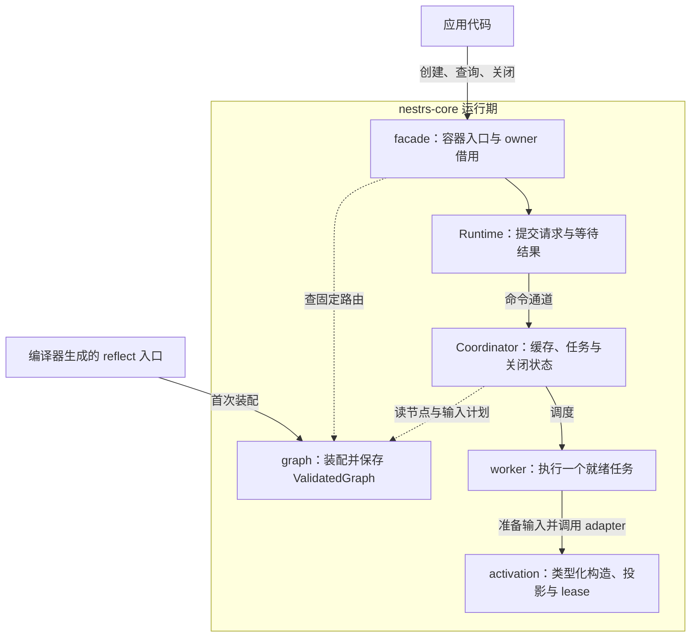
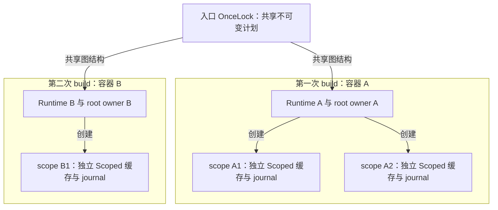
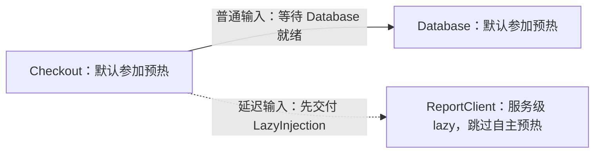
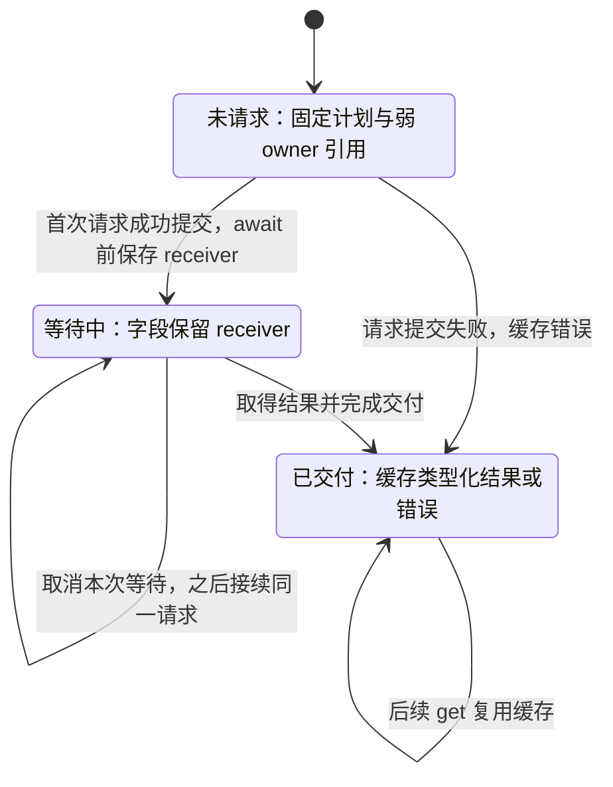
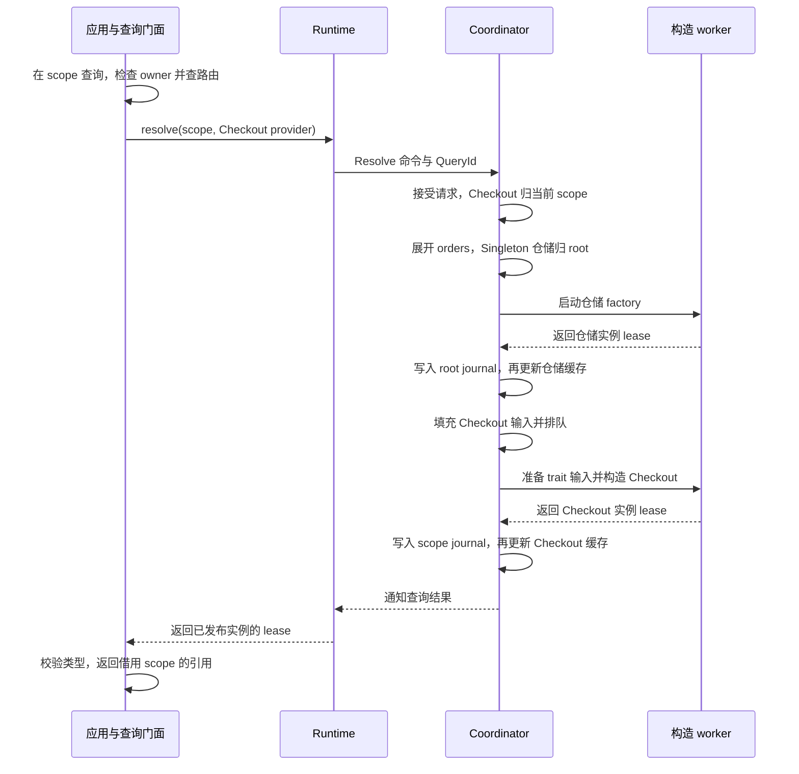
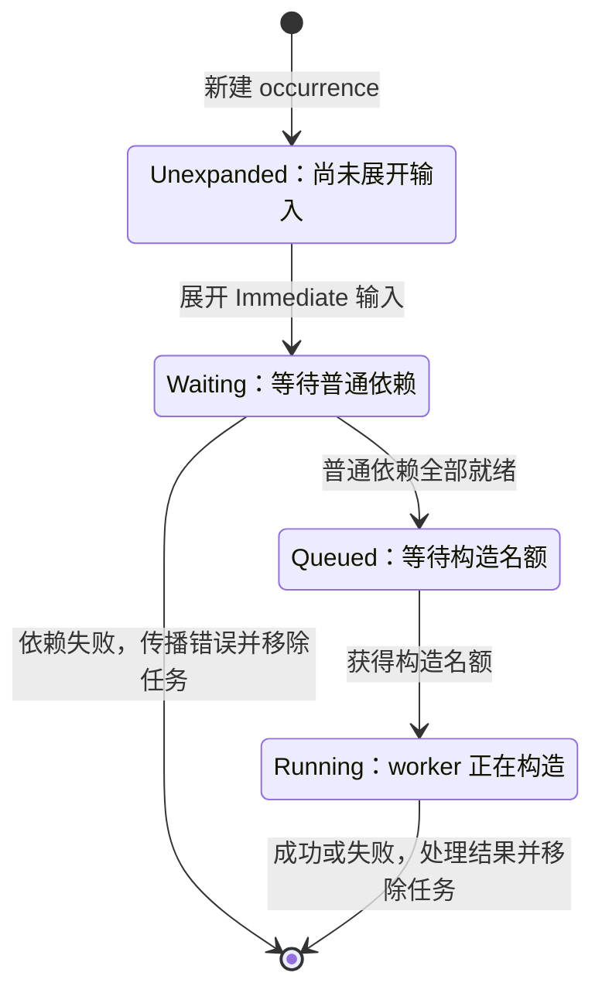
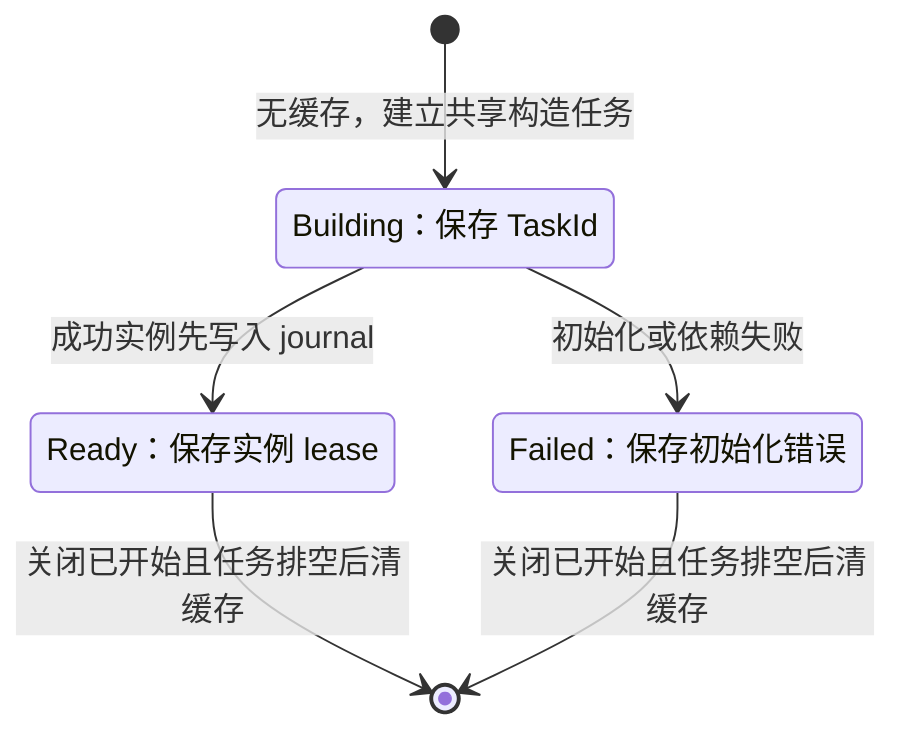
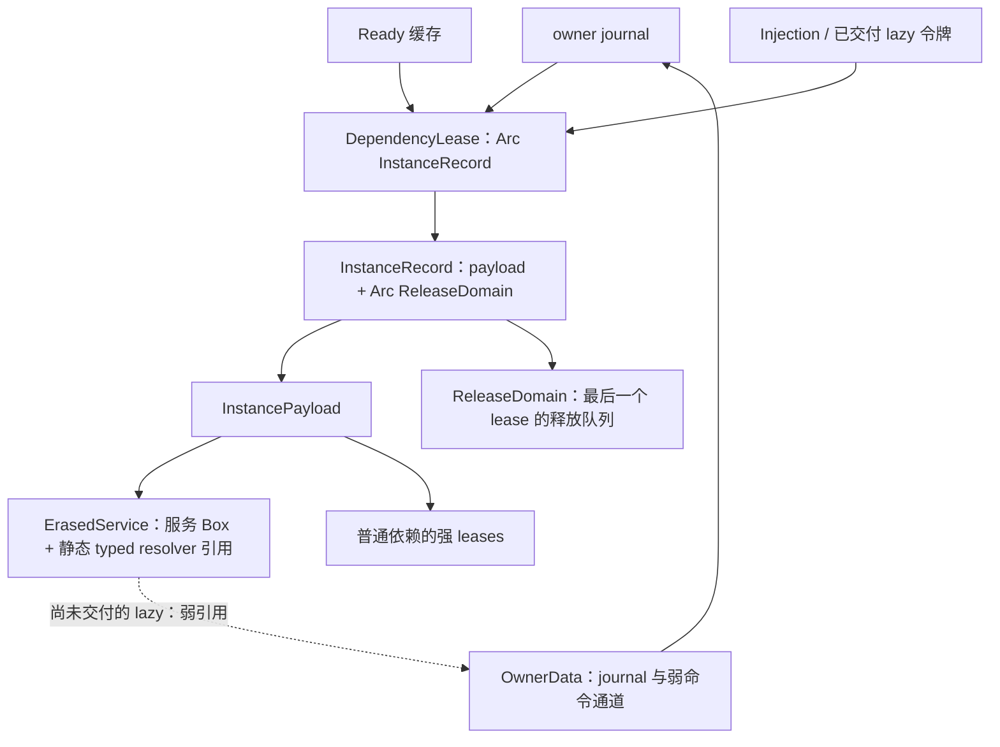
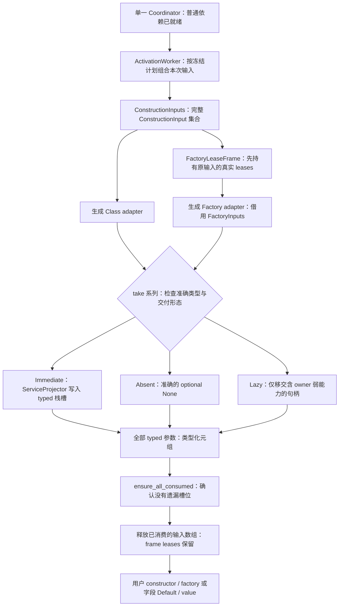
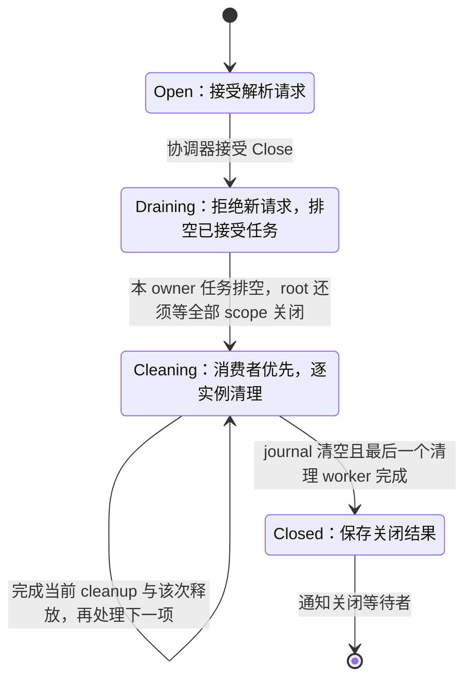

# nestrs-core

`nestrs-core` 是 Nestrs 的依赖注入容器与运行期基础库。它接收 Nestrs 编译器生成的不可变执行计划，由 Tokio 调度器按图构造、共享和清理实例。

核心流程是：**工具链收集声明与查询类型 → 编译期验证完整依赖图并生成计划 → core 装配并共享计划 → 各容器按需或提前实例化 → 等待异步关闭**。依赖图分析、构造任务展开、失败传播和最终实例释放都采用非递归算法。

本文既是架构入口，也是按执行路径组织的源码阅读说明：每个主要边界分别说明为什么存在、持有什么数据、怎样推进状态，以及哪些条件由类型、协议或调度顺序保证。内部类型用于定位代码，不是应用需要学习的一套注册 API。业务声明语法的完整说明见[宏使用指南](../docs/NESTRS_MACROS.md)，完整业务项目见[结账示例](../example/di-checkout/README.md)。

本文集中说明当前运行期实现。声明语法、编译流程和历史修复分别由
[宏使用指南](../docs/NESTRS_MACROS.md)、[rustc 集成指南](../docs/NESTRS_RUSTC_EXTENSION_GUIDE.md)
和[修复记录](../docs/NESTRS_FIXES.md)维护；基准数字只在[性能与内存](../docs/NESTRS_PERFORMANCE.md)中记录。

第一次阅读建议沿下面这条路线，而不是同时展开所有源码：

| 想先弄清楚的问题 | 对应章节 |
| --- | --- |
| core 在整个框架里负责什么，内部怎样分层？ | [定位与架构](#1-库的定位与工具链边界)、[基本概念](#2-三个不同层级的保证) |
| 工具与 core 如何对接，编辑器是否有另一套生成器？ | [工具接入](#工具怎样把声明交给-core)、[constructor 生成](#constructor-怎样进入同一构造协议) |
| injectable 结构体又被 factory 返回时，谁负责创建？ | [创建声明的冲突、不同 key 与泛型蓝图](#injectable-与-factory-返回同一类型时怎样选择) |
| 一个服务怎样被查询和关闭？ | [公开门面](#公开门面)、[完整结账示例](../example/di-checkout/README.md) |
| 编译器究竟给运行时留下了什么？ | [执行计划](#4-类型化声明与编译器执行计划)、[图的冻结](#5-依赖图如何编译和冻结) |
| 多个查询如何共享实例，延迟依赖何时创建？ | [生命周期与预热](#6-生命周期与预热)、[一次查询的执行过程](#7-非递归的-tokio-调度) |
| 为什么能安全返回引用，关闭时如何释放资源？ | [所有权与借用](#8-稳定地址强-lease-与真实借用)、[失败与关闭](#9-失败取消与关闭) |
| 为什么 runtime 要通过通道通信，而不是查询直接操作缓存？ | [通道与协调器](#为什么使用命令通道)、[通道的成本与替代边界](#当前通信模型的成本与边界) |
| 为什么同时出现 Box、Arc、Weak、Mutex 和 unsafe？ | [所有权与借用](#8-稳定地址强-lease-与真实借用)、[源码机制速查](#源码机制速查) |
| 已有冻结图，为什么还要装配和运行时任务？ | [目标程序装配](#为什么编译完还要做一次-planassembly)、[静态计划与动态执行](#静态计划没有消除哪些运行时工作) |
| 一次查询分别在哪些层完成哪些检查？ | [门面的调用路径](#查询门面具体做什么)、[生命周期与任务](#7-非递归的-tokio-调度) |
| 同一个 lazy 字段为什么既有 OnceCell 又有 receiver？ | [字段级延迟注入](#字段级延迟注入) |
| 应该从哪个函数开始读代码？ | [源码阅读路线](#10-源码阅读路线)、[测试与诊断](#11-测试与依赖图诊断) |

## 1. 库的定位与工具链边界

| 组成 | 职责 |
| --- | --- |
| `nestrs-core` | 类型化构造协议、执行计划装配、生命周期、实例构造调度、查询与关闭 |
| `cargo-nestrs` | 应用构建、声明代码生成、基于真实 Rust 类型的自动 binding、完整 DI 图编译、编辑器支持与 HTML 依赖图 |
| 工具内部的 `nestrs-tool-bridge` | 标准过程宏薄桥接，复用工具中的代码生成逻辑；不是应用需要声明的依赖 |
| 未来的 `nestrs-bootstrap` | 在 core 之上组合应用、配置和生态库；当前尚未提供 `NestrsFactory` |

core 不依赖 CLI、代码生成库或 rustc 内部库，应用运行时也不链接这些工具实现。当前生产依赖为 Tokio、thiserror 和 ahash；serde_json 仅用于测试。查询路由、owner 缓存和调度索引使用保留随机种子的 `AHashMap` / `AHashSet`；哈希迭代顺序不参与图语义或 cleanup 顺序。测量方法与实际收益见 [性能与内存测量](../docs/NESTRS_PERFORMANCE.md)。

应用开发需要 Nestrs 工具链：`#[injectable]`、`#[constructor]`、`#[factory]` 等声明的处理、trait 自动绑定、查询根收集和跨 crate 汇总均由 `cargo nestrs` 管理。应用的 `Cargo.toml` 依赖 core 与业务库；`use nestrs::{injectable, constructor, factory, lazy};` 中的 `nestrs` 是工具注入的 extern 名称，无需增加公开宏 package。

core 自身可以用普通 Cargo 检查和测试；使用 Nestrs 声明的应用通过 `cargo nestrs check/build/run/test` 构建运行。当前没有公开的手动注册门面、运行时扩图接口或单独的 `register!` 宏。普通 Cargo 可以编译 core 自身；未经过 Nestrs 工具链的应用调用 `build` 时返回 `BuildError::CompilerPlanUnavailable`，不会交付一个静默空容器。

### 工具怎样把声明交给 core

应用声明经私有 bridge 和共享 codegen 生成类型化适配器；driver 在最终入口完成
真实类型选择和完整图验证，通过 `__nestrs_reflect_v2` 交付固定计划。core 只在目标
程序中装配真实 `TypeId` 与适配函数，然后按计划构造、投影和释放实例。

工具的声明协议描述“有哪些服务和需求”，core 的私有执行契约描述“如何执行已选
服务与输入”。共享名称不能替代 driver 对签名、类型身份和生成来源的检查；业务
源码不能直接调用内部入口。目标端执行契约见第 4 节，bridge、`protocol.rs`、
编译阶段和 IDE 接入的完整关系统一见[rustc 集成指南](../docs/NESTRS_RUSTC_EXTENSION_GUIDE.md)。

### core 内部怎样分工

阅读实现时，可以把 core 分成四个协作部分：`graph` 保存确定的执行数据，`facade`
提供用户能借用的容器入口，`runtime` 决定何时执行，`activation` 完成一次具体构造
及实例保活。下图展示主要调用与计划读取关系；完整的结果返回顺序见第 7 节时序图。



| 部分 | 持有什么、处理什么 | 源码入口 |
| --- | --- | --- |
| `graph` | 已选节点、构造输入、查询路由、拓扑及反向依赖；装配后只读 | [graph/mod.rs](src/graph/mod.rs)、[graph/plan.rs](src/graph/plan.rs) |
| `facade` | root / scope 的用户入口，将内部解析结果转为有借用期的引用 | [facade.rs](src/facade.rs) |
| `runtime` | owner、缓存、活跃任务、请求订阅、就绪队列、worker 与关闭阶段 | [runtime/mod.rs](src/runtime/mod.rs) |
| `activation` | 类型化输入、Class / Factory 适配、trait 投影、稳定实例地址及强 lease | [activation/mod.rs](src/activation/mod.rs) |

此外，`service` 定义类型、key、源码位置等身份信息，`options` 保存启动选项，
`error` 组织公开错误和依赖失败路径。它们为上述部分提供公共数据，不各自启动调度器。

### 这些边界解决什么问题

| 设计选择 | 对实现的直接影响 |
| --- | --- |
| 把类型选择和完整图验证放在编译期 | 运行时接到请求后查固定路由，无需再次搜索候选、推导泛型或处理注册顺序 |
| 将不可变计划与可变运行状态分开 | 多次 `build` 可以复用结构，但每个 root 的实例、失败缓存和关闭状态仍独立 |
| 由一个协调器推进任务状态 | 并发请求在同一位置完成缓存合并、依赖推进和结果发布，worker 只执行交付给它的工作 |
| 区分调度、类型化构造和内存所有权 | 调度器能统一处理不同类型，真实构造与投影仍通过 Rust 类型检查，实例由 lease 保活 |
| 将异步 cleanup 与最终同步析构分开 | 显式关闭可以等待资源清理；逃逸令牌和 runtime 退出时的内存安全仍由所有权机制负责 |

这里的“一个协调器”指每个 root 一份状态推进逻辑。多个构造 worker 仍能并发执行；
协调器没有把所有用户构造器放在一个串行调用循环里。

## 2. 三个不同层级的保证

| 阶段 | 检查内容 | 失败表现 |
| --- | --- | --- |
| Rust 编译 | 类型、trait 投影、借用、构造 adapter、`Send` / `Sync` 等约束 | 编译错误 |
| 最终 binary / test 的 DI 编译 | 全部注册及已知闭合类型的缺失依赖、歧义、循环、输入协议与生命周期 | `cargo nestrs check/build` 编译错误，应用无需运行 |
| 实际初始化 | constructor / factory 执行，以及数据库连接等外部资源操作 | 返回初始化错误；构造 panic 被 worker 捕获并转为错误 |

最终 binary / test 的 `cargo nestrs check/build` 包含完整 DI 结构校验。单独编译 library 时只保留服务声明和查询摘要，等最终入口汇总后再检查应用图是否完整。结构合法不代表外部资源一定能初始化成功；未覆盖策略的服务在默认 Lazy 下把第三个阶段推迟到查询时，显式 `#[lazy(false)]` 的 Singleton / Scoped 则在对应 owner 创建时提前初始化，**两者都不会推迟或跳过编译期结构校验**。

全图验证只处理服务描述，不执行 constructor、factory、`Default`、`#[value]` 表达式或 cleanup。一个从未被查询的已注册服务存在图错误，也会使最终入口编译失败。

### 先区分几种容易混淆的概念

后文中的内部类型名是帮助定位代码的术语，不是应用需要调用的公开接口。

| 概念 | 含义 | 与其他概念的区别 |
| --- | --- | --- |
| 服务身份 `ServiceIdentifier` | 真实 Rust 类型身份与可选 key 的组合 | 类型名称用于诊断，不按同名字符串合并不同 Rust 类型 |
| provider / `CompiledNode` | 冻结计划中的一个构造节点；`ProviderId` 是它在 nodes 中的下标 | 描述“怎样构造”，不代表已经存在一个实例 |
| 查询路由 `RootRoute` | 请求类型/key 对应的 provider，以及必要的 trait 投影 | 多个合法视图可指向同一 provider；投影不会额外构造实例 |
| occurrence / `TaskId` | 一次实际构造及其活跃任务身份 | 同一个 Transient provider 可以对应多个 occurrence |
| owner / `OwnerId` | root 或某个 scope 的实例归属与关闭边界 | 决定缓存、journal 和 cleanup 归属，不等同于 Tokio task |
| `QueryId` | 一次普通查询或预热请求的等待订阅 | 多个 QueryId 可以等待同一个构造任务，取消一个不取消共享构造 |
| journal | owner 成功发布实例的记录 | 包含 Transient；用途是保活引用和安排关闭，不只是查询缓存 |
| `DependencyLease` | 一个实例及其必要依赖的内部强所有权凭证 | 它可以被缓存、令牌等共同持有；释放一份不代表实例立即析构 |

例如，一个 Transient 声明只有一个 `ProviderId`，但同一消费者的两个注入槽位会
请求两次构造。两个成功实例分别进入 journal；关闭时也分别处理。理解这个区别后，
就不会把编译期“节点去重”误解为运行期“所有请求共享一个实例”。

## 3. 从声明到使用

完整可运行程序见[结账示例](../example/di-checkout/README.md)，声明和注入语法见
[宏使用指南](../docs/NESTRS_MACROS.md)。后文沿同一类订单场景解释运行时：一个
Scoped 业务服务依赖 Singleton 仓储，先创建 root，再为请求创建 scope，在 scope
内取得服务，操作完成后等待 scope 关闭，最后在应用退出时等待 root 关闭。

查询失败也需要保留关闭路径。可以先保存业务操作的 `Result`，等 scope 和 root
关闭后再传播错误；同时需要报告多个错误时，应聚合业务错误与关闭错误。
[示例的生命周期入口](../example/di-checkout/src/application.rs)给出了完整处理。

### 公开门面

| API | 语义 |
| --- | --- |
| `ServiceProvider::build(options).await` | 接受 `Option<ServiceProviderOptions>`；None 使用入口项目配置，Some 完整显式覆盖；加载共享计划并等待选中 Singleton 初始化，返回 `Result<ServiceProvider, BuildError>` |
| `provider.create_scope(options).await` | 接受 `Option<ServiceScopeOptions>`；None 使用当前 root 的 scope 默认，Some 只覆盖本次创建；等待选中 Scoped 初始化，返回 `Result<ServiceScope<'_>, ScopeBuildError>` |
| `scope.service_provider()` | 返回轻量的 `ServiceProviderRef<'_>` 查询视图 |
| `LazyInjection<T>::get().await` | 获取字段或构造参数所声明的固定延迟目标，返回借用句柄的 `Result<&T, ResolveError>` |
| `provider.dispose_async().await` | 消费 root，等待已接受工作、scope 关闭和 root 清理 |
| `scope.dispose_async().await` | 消费 scope，等待该 scope 的工作与清理 |

服务查询提供以下四个普通异步方法；接收者可以是 root 或 scope 的查询视图：

| 查询方法 | 返回类型 |
| --- | --- |
| `provider.get_required_service::<T>().await` | `Result<&T, ResolveError>` |
| `provider.get_service::<T>().await` | `Result<Option<&T>, ResolveError>` |
| `provider.get_required_keyed_service::<T>(key).await` | `Result<&T, ResolveError>` |
| `provider.get_keyed_service::<T>(key).await` | `Result<Option<&T>, ResolveError>` |

`T` 可以是 concrete 类型或可绑定的 `dyn Trait`，并须满足 `Send + Sync + 'static`。key 表达式使用 `ServiceKey::Named(String)` 或 `ServiceKey::Indexed(usize)`。可选查询只有在精确类型与 key 未注册时返回 `None`；初始化失败、scope 限制、owner 已关闭等仍然返回错误。默认 key 与指定 key 的路由相互独立，不会自动回退。

服务查询统一使用这四个普通方法，原有查询宏已移除。编译器直接从方法调用收集查询根，无需使用 `register!`。

返回引用借用实际 root / scope owner，不借用临时的 `ServiceProviderRef`，因此支持示例中的链式调用。服务引用仍将被使用时，Rust 借用检查会拒绝消费对应 owner 来执行 disposal。

### 三个公开门面为什么分开

[facade.rs](src/facade.rs) 中的三个结构对应三种不同的所有权，不是同一容器的三个别名：

| 类型 | 实际字段与拥有的能力 | 设计原因 |
| --- | --- | --- |
| `ServiceProvider` | `Arc<ValidatedGraph>`、`Arc<Runtime>`、`Arc<Owner>`，以及 scope 默认初始化策略 | 拥有一个 root 的使用入口；消费这个门面意味着请求结束整个容器的生命周期 |
| `ServiceScope<'provider>` | 借用 root，加上自己的 `Arc<Owner>` | 复用同一个 runtime 与 Singleton，但独立管理本 scope 的实例；root 借用阻止 scope 仍被使用时提前消费 root |
| `ServiceProviderRef<'owner>` | 借用图、runtime 和 owner，`Clone + Copy` | 仅传递查询能力，不创建新容器、不复制缓存，不新增 Arc 强持有；借用仍要求 owner 在视图及查询结果被使用期间存活 |

`ServiceProvider` 和 `ServiceScope` 没有公开 `Clone`，因此应用不能随意复制具有关闭
责任的门面。内部的 Arc 是对象之间共享所有权的手段，不意味着外部必须获得可克隆
的容器。视图的方法消费 `self`，返回值却显式借用 `'owner`，所以
`scope.service_provider().get_required_service::<T>().await` 的临时视图可以消失，
引用仍然由 scope 支撑。这个边界同时由 [facade_api 测试](tests/unit/facade_api.rs)
和工具 fixture 的[关闭借用反例](../cargo-nestrs/tests/fixtures/di/tests/ui/fail/dispose-borrowed-scope.rs)覆盖。

### 查询门面具体做什么

四个公开查询方法最终进入 `ServiceProviderRef::query`。必选方法在它的结果上将
`None` 转成“服务未注册”的 `ResolveError`；没有另一套解析算法。按实际源码依次是：

1. 检查 owner 的公开关闭标记。已经关闭时直接报错；这只是快速失败检查，不能代替
   协调器接收命令时的状态判断，因为发送与接收之间可能发生关闭。
2. 以 `ServiceType::create::<T>()` 和精确 key 创建查询身份，查只读 `routes`。
   没有路由时可选查询返回 `None`，不提交构造请求；必选查询再把这个结果变成错误。
3. 路由存在时，以 provider 编号向 runtime 请求实例。生命周期归属、实例缓存和
   正在构造的任务在协调器中处理，门面不维护第二份缓存。
4. 获得 lease 后，concrete 查询从实例当前的共享借用恢复准确 typed pointer；trait 查询用
   路由中的 projector 产生该实例的真实 trait 视图。两者都核验类型，不靠类型名称
   字符串把任意地址解释成 `T`。
5. 返回借用 owner 的 `&T`。实际值已经先进入 owner 的 journal，临时结果 lease
   释放不会使引用悬垂；这一步的 unsafe 证明见第 8 节。

`ServiceType` 同时保存 `TypeId` 与类型名称，源码当前派生的相等/哈希会包含这两个
字段；正常构造始终从同一个 `T` 得到它们。跨 crate 同名类型不会因此相等，名称也
不能替代真实 `TypeId`。`ServiceIdentifier` 再加入 `Option<ServiceKey>`，区分未指定
key、字符串 key 与编号 key。运行期 key 只选择已冻结路由，不能要求容器临时发现新类型。

返回共享引用使服务可以在多个查询间复用；需要修改业务状态时，由服务自身选择
`Mutex`、原子值等内部可变性。容器没有公开可变解析入口。`T: Send + Sync + 'static`
是当前容器跨任务构造、共享引用和拥有实例的契约：`'static` 限制值不含短期外部
借用，不表示实例永不析构，也不表示查询结果是 `&'static T`。Tokio 在同一个任务
内驱动一个普通 future 本身不强加 `'static`；当前独立 spawn 与共享实例模型才需要
相应的拥有型边界。factory 参数对 frame 的临时借用则另由 `'frame` 表达。

## 4. 类型化声明与编译器执行计划

工具链为每个项目生成 `nestrs-reflect`：服务所在 crate 内的私有 typed adapter，以及最终 binary/test 的已验证执行计划。它不是应用需要依赖的反射 package；编译流程与生成产物见[rustc 集成指南](../docs/NESTRS_RUSTC_EXTENSION_GUIDE.md)。

core 的私有 [activation::adapter](src/activation/adapter.rs) 仅定义执行契约：

| 契约 | 用途 |
| --- | --- |
| `ActivationAdapter` | 真实服务类型、Class / Factory 构造入口、输入适配操作和 cleanup |
| `InputAdapter` | 真实输入类型、准确 `InputKind` 与可选的直接投影函数，不携带注册选择规则 |
| `ProjectionAdapter` | 把已有 concrete 实例投影为 trait 视图，不额外创建实例 |

服务声明、`primary`、候选 binding、查询摘要与泛型发现只属于工具链和生成代码。core 生产代码不再定义 `DependencyRequest`、`Delivery`、`ProviderSource` 或全局 `ProviderDefinition`。core 测试直接使用执行计划与真实适配器，不保留旧声明模型。

编译器在每个 binary / test 入口汇总本 crate 与依赖 metadata 中的声明和查询摘要，完成候选选择、泛型展开、输入计划和图验证，生成唯一的版本化计划入口。library 只贡献类型化声明，不要求自己形成完整应用图。

生成入口为私有的 `__nestrs_reflect_v2`。完整验证之后，工具只交付输入或查询路由实际使用的投影，并同步重编号；未使用的已注册 provider 仍接受全图检查。入口 metadata 旁的 `*.nestrs-reflect.json` 保存同一份已选计划，便于审阅节点、槽位和路由，运行时不读取此文件。文件位置与字段说明见[rustc 集成指南](../docs/NESTRS_RUSTC_EXTENSION_GUIDE.md)。

`v2` 表示 core 与工具生成代码之间的内部执行 ABI；JSON 清单的格式 `version` 仍为 `1`，
两者独立演进。包含 root / scope 两种默认策略的 options sink 为 `plan_set_options_v3`；
driver 在引用 core 的最终 `check/build` 中核对这个 sink 及其完整签名，空服务图也不能
混用旧 core。更新工具和 core 后应一起重新编译；CLI
使用 driver/bridge 内容指纹隔离生成缓存。

core 的 [CompiledApplication::load](src/graph/plan.rs) 使用入口共享的 `OnceLock` 装配不可变计划。首次装配仍调用目标端执行适配回调，以安全取得真实 `TypeId` 和 typed adapter 地址；这些回调不再选择候选、展开泛型或验证拓扑，也不会执行用户构造器。后续 `build` 复用同一份计划，各自创建独立的运行时、缓存与实例。这里的共享只针对结构计划，不会让不同 root 共享 Singleton。

### `build` 建立了哪些对象

对应入口是 [ServiceProvider::build](src/facade.rs)。它按顺序加载
`CompiledApplication`，选定启动选项，确认当前存在 Tokio runtime，再通过
`Runtime::start(...).await` 建立 root owner 与中央协调任务，并等待策略选出的 Singleton
初始化请求。初始化失败时会先等待尚未交付的 root 关闭，再返回错误。

`create_scope(options).await` 采用同样的“建立 owner → 按策略初始化 → 成功后交付”流程，
内部调用 `Runtime::create_scope(...).await`，复用当前 root 的计划和 runtime，
只为新 scope 建立独立 owner、缓存与 journal。二者共用私有 `initialize_owner`：
它持有尚未交付的 owner，初始化失败先关闭，并不能对已交付 owner 再发起批量初始化。
它选择 Scoped 入口，不再创建另一份协调器；Scoped 的 Singleton 依赖仍归 root。
scope 初始化失败时只关闭这个尚未交付的 scope，root 和其他 scope 可以继续使用；
若失败来自共享 Singleton，该 Singleton 的失败缓存仍保留在 root，不会自动重试。

`CompiledApplication` 保存项目默认选项和 `Arc<ValidatedGraph>`。共享与隔离关系如下：



同一 root 的 scope 复用该 root 的运行时和 Singleton，同时拥有各自的 Scoped
缓存与 journal。不同 root 连 Singleton 都不共享。`ServiceProviderRef<'owner>`
只是借用已有图、Runtime 和 owner 的查询视图，不会复制缓存或再启动协调器。

### 装配后的计划怎样表示依赖

可以按以下数据结构阅读 [graph/mod.rs](src/graph/mod.rs)：

```text
ValidatedGraph
├─ nodes[ProviderId]: CompiledNode
│  ├─ identifier / common：身份、生命周期、预热策略、来源与 cleanup
│  ├─ constructor：Class 或 Factory 的执行入口
│  ├─ dependencies[InputSlot]：每个字段或参数的固定交付动作
│  └─ requires_scope：本节点及传递依赖是否要求 scope
├─ routes[ServiceIdentifier]: RootRoute { provider, projection }
├─ topological_order：依赖优先的 provider 顺序
└─ dependents：去重后的反向依赖，用于消费者关系
```

输入数组和拓扑邻接表有不同用途：前者需要保留每个参数位置，后者表达节点间的
依赖约束。一个 trait 输入还会保留原始请求身份，不用最终选中的 concrete 类型
覆盖业务请求的接口与 key。运行时仍按已选目标和适配器执行；保存这份信息不表示
当前每一种运行时错误都会把它完整打印出来。

装配协议、执行动作与错误上下文分别承担不同职责：

| 层次 | core 中的表示 | 用途 |
| --- | --- | --- |
| 目标端装配 | `InputAdapter` 与计划入口传入的已选标量 | 按内部 v2 协议接合真实类型、输入形态和投影函数，拒绝不匹配的工具产物 |
| 单项输入执行 | `DependencyInput` | 明确区分已确定缺席、立即依赖和延迟句柄；调度与 worker 按这个枚举执行 |
| 输入位置与诊断 | `CompiledDependency` 的槽位、原始请求、optional 和标签 | 保留 trait、key、字段或参数来源；不会再次参与候选选择 |

`DependencyInput` 的 `Absent` 用 `AbsentInput::{Immediate, Lazy}` 保留缺席类别，普通
`Option<Injection<T>>` 与延迟 `Option<LazyInjection<T>>` 不互相替代；`Immediate`
保存必定存在的目标与直接投影函数；`Lazy` 保存带有目标和投影能力的共享延迟计划。
`CompiledDependency` 的原始类型与 optional 信息共同保留准确交付契约，即使缺席也会
核对 `T`。执行器不再通过若干独立的 `Option` 字段猜测输入形态；lazy 目标仍是完整图
中的依赖边，仅不作为消费者本次构造的前置任务。

这里不依赖 linkme、inventory、链接段扫描、全局构造器或可变的全局注册表。不同入口各自拥有注册集合，库的描述不会自动构成一个独立运行的容器。

typed adapter 引用 core 实际所属的私有模块。driver 根据生成来源授权访问，普通业务源码不能借此访问内部协议；core 不导出 `__private` 或换名后的公开内部 ABI。生成的类型投影和借用继续接受 Rust 的正常检查，不伪造 vtable 或绕过业务类型的可见性。

### 为什么编译完还要做一次 PlanAssembly

编译期已经确定目标选择与顺序，但执行仍需要目标程序中的真实 `TypeId`、构造函数
和投影函数地址。编译器将“固定编号和策略”写进版本化入口；目标端 adapter 回调
提供这些实际执行能力。`PlanAssembly` 负责把两者接起来，runtime 之后只读其结果。
这里没有扫描程序集、反射查找构造器或读取 JSON 注册表。

从 [graph/plan.rs](src/graph/plan.rs) 可以按以下顺序看装配器的用途：

| 装配步骤 | 实际写入的数据 | 为什么需要这一层 |
| --- | --- | --- |
| `set_options` | 入口的初始化默认值与非零构造上限 | 保留编译期配置，实例启动时再决定是否用显式选项覆盖 |
| `push_binding` | 按固定编号暂存 typed `ProjectionAdapter` | 后续输入和 trait 根引用编译器已经选中的投影，不在运行期遍历候选 |
| `push_provider` | 构造入口、策略、来源、concrete 路由，以及 `PendingNode` 的输入槽位 | provider 已存在，但每个参数的目标还要由计划填入；临时状态只在首次装配内部出现 |
| `set_input` | 每个槽位唯一的 `CompiledDependency` | 将编号和真实 adapter 类型核对后收敛为 `Absent` / `Immediate` / `Lazy`，后续不猜测可选字段组合 |
| `push_trait_route` | 请求的 trait/key 到 provider 和 projector 的映射 | concrete 查询和 trait 查询能复用同一实例，运行期不再选择实现 |
| `push_order` / `push_dependent` | 已算好的拓扑顺序与反向关系 | 预热、关闭和执行断言直接使用冻结信息 |
| `finish(self)` | `CompiledApplication { options, graph }` | 消费所有临时装配状态，完整输入才进入只读图 |

`PendingNode` 的 `Vec<Option<InputAdapter>>` 与 `Vec<Option<CompiledDependency>>`
分别跟踪“哪个槽位还没有接合”和“哪个槽位已经写好”。每次 `set_input` 取走对应
adapter；重复写入会失败，`finish` 则检查没有漏写。这里的 Option 是临时装配的
完成状态，与业务参数 `Option<T>` 是否缺席是两回事。

入口通过 `*mut ()` 同步传入栈上的装配器，再由各个受信任的 sink 恢复为唯一可变
借用。这个指针既不保存在实例中，也不交给异步 worker。标量协议用 `usize::MAX`
分别表示“无目标”和“无 binding”，生命周期/key/初始化策略也用标量编码，再由
core 解码；这样工具不用伪造目标端 Rust 枚举或 Option 的内存布局。这些细节只属于
私有 ABI，业务源码不能自己调用 sink 或凭函数名获得内部访问权限。

装配断言检查的是写入协议的一致性，例如类型、输入完整性和路由重复；它不重新
求解候选或验证完整拓扑。`OnceLock` 只缓存成功装配的不可变结构，不缓存服务实例或
某次数据库连接错误。多个 root 共享此结构，但各自的初始化失败仍存在各自 owner 中。
[计划装配测试](tests/unit/graph/plan.rs)用实际 sink 写入固定计划，并把构造函数设为
一旦执行就 panic，以检查装配期间没有意外调用用户构造；另有缺槽位、类型与共享边界测试。

### 静态计划没有消除哪些运行时工作

编译器可以决定 `Checkout → Store` 的结构和生命周期，无法提前知道网络工厂何时
完成、当前请求是否取消、哪个 scope 已经关闭，或应用这次是否实际访问 lazy 字段。
因此代码中有三种不同的“图相关数据”：

- `ValidatedGraph` 是完整、不可变的 provider 与依赖计划；每个最终入口一份。
- `Activation` 及任务之间的父子关系是当前正在执行的 occurrence；Transient 可以
  为同一个 provider 产生多份任务，任务完成后退休。
- owner 的 cache 跟踪 `Building` / `Ready` / `Failed`，合并共享构造并复用结果；
  journal 持有已发布实例并安排关闭。它们不会回写静态计划。

编译器消除了运行时的候选搜索和图合法性分析，但没有消除异步执行的状态管理。
例如 `requires_scope` 已在编译期沿完整依赖图传播，协调器只读取该布尔能力来拒绝
root 查询；它不需要为了某个 Transient 再遍历一遍依赖来判断是否间接需要 Scoped。

### constructor 怎样进入同一构造协议

自动字段构造与显式 `#[constructor]` 都交付 Class adapter。core 不分析业务函数体，
也不为 constructor 增加第二个 provider。普通输入是持有 lease 的 `Injection<T>`，
延迟输入是按值交付的 `LazyInjection<T>`；optional 使用对应的 `Option`。
调度器先等待普通依赖，再执行同步 Class 构造；延迟输入此时只交付句柄。
constructor 返回 `Result<Self, E: Debug>` 时，adapter 将错误保存为 Debug 文本，
按原生命周期进入失败缓存；输入与 frame 的运行期协议见第 8 节。

函数选择、参数到字段的真实来源映射、宏卫生及受支持的返回路径属于工具职责，
统一见[构造函数注入](../docs/NESTRS_MACROS.md#35-用-constructor-明确初始化业务状态)
与[rustc 集成指南](../docs/NESTRS_RUSTC_EXTENSION_GUIDE.md)。

### injectable 与 factory 返回同一类型时怎样选择

`#[injectable]` 与 `#[factory]` 都能声明服务的创建方式。理解它们的关系，首先要区分
**具体服务的创建声明**和**等待闭合类型的泛型蓝图**：普通非泛型 injectable 会贡献
一个具体 provider；泛型 injectable 为后续实际需要的闭合类型提供构造蓝图。
factory 则为其成功返回类型贡献具体 provider，返回 `Result<T, E>` 时服务类型是 `T`。
同步或异步工厂遵循同一套选择规则。

服务路由按**真实 Rust 类型与 key**区分，不按工厂函数名、源码模块或创建顺序区分。
同一类型的别名不产生新身份；不同模块中各自定义的结构体即使同名，也不因此成为
同一类型。默认 key、字符串 key、整数 key 分别匹配，例如字符串 `"7"` 与整数 `7`
不是同一个 key。

| 声明组合 | 编译器如何处理 | core 最终执行什么 |
| --- | --- | --- |
| 非泛型 injectable 与 factory，同类型、同 key | 两个具体 provider 冲突，报告 `NESTRS-DI007` | 没有可执行的合法计划 |
| 非泛型 injectable 与 factory，同类型、不同 key | 保留两条独立路由 | 按查询或输入的 key 执行对应构造 |
| 普通结构体仅由 factory 提供 | factory 本身完成服务声明 | 执行工厂，不要求结构体标记 injectable |
| 泛型 injectable 蓝图与返回闭合类型的 factory，同类型、同 key | 显式 factory 优先，不为这一路由加入蓝图 provider | 执行工厂 |
| 泛型蓝图与 factory 的 key 不同 | factory 不替代蓝图自己的 key；按闭合需求保留蓝图 | 各自按 key 执行构造 |

这些选择在最终 binary / test 的编译期完成。core 接收已经选定的 Class 或 Factory
入口，运行时不会重新决定“这次用结构体还是用工厂”，也没有后注册覆盖前注册的规则。
工厂初始化失败时按自身生命周期的失败规则传播和缓存，不会转而尝试 Class 构造路径。

#### 非泛型同类型同 key 会在编译时拒绝

下面是一个**预期编译失败**的完整最小程序。两个声明都使用默认 key：

```rust
use nestrs::{factory, injectable};

#[injectable]
struct Service;

#[factory]
fn make_service() -> Service {
    Service
}

fn main() {}
```

通过 `cargo nestrs check` 或 `cargo nestrs build` 检查时，诊断会指向工厂的返回类型，
并标出结构体的另一处创建声明。诊断关键内容为：

```text
error: [NESTRS-DI007] `Service` 在默认 key 下有多个创建声明
  = note: 两个声明提供同一真实类型与 key；primary 不能覆盖重复的具体类型声明。
  = help: 保留一个创建声明，或为它们设置不同 key。
```

这里的 `main` 没有调用容器 `build(None)`，仍然会报错；Lazy 初始化或从不查询这个服务
也不会推迟或跳过重复声明检查。library 可以先贡献声明，冲突在最终入口汇总时验证。

增加 `#[primary]` 不能消除这种冲突。primary 用于同 key 的接口多候选选择，不能
在同一具体类型的两个创建声明之间挑选一个。生命周期、服务级 lazy 与 cleanup
也不参与路由身份：例如一个声明为 Singleton、另一个为 Transient，仍然重复。

#### 统一由工厂创建时，只保留 factory 声明

如果需要连接外部资源、执行异步初始化，或完全控制实例如何产生，可以使用普通
结构体配合 factory。下面的 `Service` 不需要 `#[injectable]`：

```rust
use nestrs::factory;

struct Service {
    value: u32,
}

#[factory]
fn make_service() -> Service {
    Service { value: 42 }
}
```

`get_required_service::<Service>().await` 会使用这个工厂对应的路由，其他服务也可以
正常注入 `Service`。若只想定制 injectable 的同步构造逻辑，可以保留
`#[injectable]` 并使用 `#[constructor]`；constructor 替换同一个 Class provider
的自动字段构造，不会额外声明第二个 provider。相关语法分别见
[工厂声明](../docs/NESTRS_MACROS.md#4-用-factory-控制创建过程)和
[构造函数注入](../docs/NESTRS_MACROS.md#35-用-constructor-明确初始化业务状态)。

#### 两种创建方式都需要时，用不同 key 区分

以下完整程序保留默认的 Class 路由，再以 `"custom"` 注册一条 Factory 路由。
`value` 是普通字段，Class 自动构造时调用 `u32::default()`，因此得到 `0`；
工厂则明确返回 `42`：

```rust
use nestrs::{factory, injectable};
use nestrs_core::{ServiceKey, ServiceProvider};

#[injectable]
struct Service {
    value: u32,
}

#[factory(key = "custom")]
fn make_service() -> Service {
    Service { value: 42 }
}

#[tokio::main]
async fn main() -> Result<(), Box<dyn std::error::Error>> {
    let provider = ServiceProvider::build(None).await?;
    let default = provider.get_required_service::<Service>().await?;
    let custom = provider
        .get_required_keyed_service::<Service>(ServiceKey::Named("custom".into()))
        .await?;

    assert_eq!(default.value, 0);
    assert_eq!(custom.value, 42);
    assert!(!std::ptr::eq(default, custom));
    provider.dispose_async().await?;
    Ok(())
}
```

两个 provider 分别遵循自身声明的生命周期、预热策略和 cleanup；同为 Singleton
时也各自缓存自己的实例。它们不会因为返回类型相同就共享同一份实例。字段注入同样
按 key 选择：`#[inject]` 选择默认路由，`#[inject("custom")]` 选择工厂路由。
服务级 lazy 只影响自主预热，不改变这种选择；完整规则见[生命周期与预热](#6-生命周期与预热)。

#### 泛型蓝图允许工厂提供某个闭合类型

泛型 `#[injectable] struct Service<T>` 没有预先为所有 `T` 注册具体服务。
编译器遇到实际需要的 `Service<u64>` 等闭合类型时，才考虑使用蓝图创建 provider。
如果该真实类型与蓝图的 key 已有显式 factory，就采用 factory，避免再加入一份
相同路由的 Class provider。这个优先规则针对按需物化的蓝图，不适用于前面两个
非泛型具体声明的冲突，也不能使两个同类型、同 key 的 factory 合法共存。

下面的完整程序同时请求两个闭合类型：`Service<u64>` 由工厂创建，
`Service<u32>` 由泛型蓝图创建。

```rust
use nestrs::{factory, injectable};
use nestrs_core::ServiceProvider;
use std::marker::PhantomData;

#[injectable]
struct Service<T: Send + Sync + 'static> {
    value: u32,
    marker: PhantomData<T>,
}

#[factory]
fn make_u64_service() -> Service<u64> {
    Service {
        value: 42,
        marker: PhantomData,
    }
}

#[tokio::main]
async fn main() -> Result<(), Box<dyn std::error::Error>> {
    let provider = ServiceProvider::build(None).await?;
    let from_factory = provider.get_required_service::<Service<u64>>().await?;
    let from_blueprint = provider.get_required_service::<Service<u32>>().await?;

    assert_eq!(from_factory.value, 42);
    assert_eq!(from_blueprint.value, 0);
    provider.dispose_async().await?;
    Ok(())
}
```

该选择严格限定在具体类型与 key 上：

- `Service<u64>` 的工厂不会替代 `Service<u32>` 的蓝图，也不会枚举其他未被需要的类型。
- 默认、字符串和整数 key 都遵循相同规则。工厂使用 `key = "custom"` 时，不会
  压制蓝图的默认 key；默认路由仍可在需要时物化。
- 被替代的蓝图构造路径不会贡献这一路由的字段依赖需求；最终采用工厂参数声明的
  输入。其他已物化的蓝图以及所有具体 provider 继续接受完整图验证；某个具体
  provider 即使从未查询，也不能因此绕过验证。
- 未选中蓝图不等于跳过 Rust 检查。结构体及其生成代码仍须通过正常的类型、借用与
  trait 检查，工厂也必须返回合法的闭合类型值。

#### 工厂返回后不会再执行一次 Class 构造

每个已选 provider 只有一个构造入口。Factory adapter 调用工厂，取得成功值后交给
统一的实例发布、lease 保活、缓存和关闭流程；core 不会再对这个值执行 injectable
的字段注入、`#[constructor]`、字段 `Default` 或 `#[value(...)]` 初始化表达式。
如果工厂业务代码自己调用了某个普通构造函数，则该调用属于工厂自身的逻辑。

| 执行信息 | Class provider | Factory provider |
| --- | --- | --- |
| 依赖来源 | 自动字段的注入声明，或显式 constructor 参数 | factory 参数 |
| 实例如何产生 | 自动初始化字段，或执行选中的 constructor | 执行工厂并取得成功返回值 |
| 生命周期、key、primary、服务级 lazy、cleanup | injectable 及其组合属性的配置 | factory 及其组合属性的配置 |

Factory provider 不继承或合并返回类型上 injectable 的 provider 配置。即使泛型
蓝图与 factory 使用相同 key，最终也采用工厂这一整份配置；工厂未设置的项目使用
它自己的默认规则，例如未指定 lifetime 时为 Singleton，未指定服务级 lazy 时
不设置服务级预热覆盖，未指定 cleanup 时没有该 provider 的异步清理回调。
未覆盖时的具体初始化行为由本次 build 或 create_scope 的配置决定，见第 6 节。

结构体的 Rust 定义仍然有效：injectable 对注入字段生成的 `Injection<T>`、
`LazyInjection<T>` 或 optional 包装不会因改由 factory 创建而消失。工厂必须按
这些真实字段类型构造合法值，不能期待返回之后由容器自动补齐字段。普通工厂参数
是 frame 内的借用，不能直接伪装成拥有 lease 的字段令牌；延迟参数的按值交付与
跨 await 规则见[构造输入与 factory frame](#构造输入与-factory-frame)。

实现可对照工具侧的[具体路由判重](../cargo-nestrs/src/di_plan.rs)、
[重复声明诊断](../cargo-nestrs/src/compiler/di_plan/diagnostics.rs)和
[闭合蓝图选择](../cargo-nestrs/src/compiler/di_plan/mod.rs)，以及 core 的
[Class / Factory 执行契约](src/activation/adapter.rs)。已有
[图模型测试](../cargo-nestrs/tests/di_plan.rs)覆盖 primary 不能消除具体类型重复、
不同 key 保留独立路由；[真实 driver 契约](../cargo-nestrs/tests/registry_abi.rs)通过
[同 key 工厂优先](../cargo-nestrs/tests/fixtures/auto-binding/src/bin/factory_override.rs)与
[不同 key 保留蓝图](../cargo-nestrs/tests/fixtures/auto-binding/src/bin/factory_other_key.rs)
验证实际查询结果。

### 普通方法如何贡献查询根

普通查询方法的真实类型由工具链在编译期收集。有限闭合的泛型、trait 实现和跨 crate
调用进入固定计划；运行期只查已冻结路由，不读取源码、枚举实现或扩展类型集合。
动态 key 在调用时求值一次，只选择既有路由。

查询根不等于构造依赖：业务方法内的查询不会自动变成该服务的字段或 factory 输入。
编译期覆盖的调用形式、预算及边界统一见[rustc 集成指南](../docs/NESTRS_RUSTC_EXTENSION_GUIDE.md)，
各轮遗漏及对应回归见[修复记录](../docs/NESTRS_FIXES.md)。

## 5. 依赖图如何编译和冻结

图的候选选择、有限闭合展开、拓扑和生命周期校验由工具完成，生成固定路由与完整
输入槽位。core 不保留第二套图编译器。完整规则与生成阶段见
[rustc 集成指南](../docs/NESTRS_RUSTC_EXTENSION_GUIDE.md)，业务选择规则见
[宏使用指南](../docs/NESTRS_MACROS.md)。

目标端依赖以下已验证条件：

- 全部有效注册和已知闭合类型已经验证，未查询的声明不豁免结构检查。
- 每个输入的准确类型、key、optional 和投影已确定；optional 缺席被固化为执行动作。
- 拓扑邻接表可以合并重复边，输入槽位必须完整保留。同一消费者的两个 Transient
  输入仍分别构造实例。
- 延迟边仍在完整图中，参与 scope 约束和关闭排序；它仅不作为消费者构造的前置任务。

运行时首次装配后不再收集声明、物化泛型或修改路由。没有进入图的类型或 key
按未注册处理。测试按[职责分工](tests/README.md)分别验证工具语义与 core 执行。

### 编译计划与装配检查的边界

工具的 `compile(tcx)` 生成持有真实 Rust 类型的已检查计划；`emission::emit` 将其
写成调用 typed adapter 与 core sink 的入口 MIR，`artifact::write` 在最终来源审计
通过后写入审阅产物。两阶段编译与同一编译会话内的调用时序见
[rustc 集成指南](../docs/NESTRS_RUSTC_EXTENSION_GUIDE.md)。

core 的 `PlanAssembly` 只接合数字编号、真实 `TypeId` 和适配函数。它用断言拒绝
越界编号、缺少输入、重复路由及投影类型不一致等损坏的内部协议；这里不是返回
`BuildError` 的第二轮业务图分析。正常应用的结构错误应在最终入口编译时由工具报告。
`CompiledApplication::load` 的 `OnceLock` 共享的是装配结果，各次 build 的实例与
错误缓存仍独立。

## 6. 生命周期与预热

| 生命周期 | 共享边界 | 实例语义 |
| --- | --- | --- |
| `Singleton` | root / provider | 同一 root 的所有 scope 共享；始终在 root 上下文构造 |
| `Scoped` | scope / provider | 同一 scope 共享，不同 scope 隔离；root 不能直接解析 |
| `Transient` | 每次消费 occurrence | 每次查询、每个注入槽位独立构造，不进入共享实例缓存 |

Singleton 允许依赖 Transient，但整个依赖闭包不能包含 Scoped，包括经过 Transient 的间接依赖、延迟字段以及 factory 参数。Transient 可以依赖 Scoped，此时它被标记为需要 scope，root 查询会返回生命周期错误。

Transient 不进入共享缓存，不意味着查询返回后立即释放。所有成功发布实例都会进入所属 owner 的 journal，至少保留到 owner 清理；逃逸的强 lease 还可能延长最终内存存活期。

### 先区分三个不同的控制位置

这里的“预热”指容器**主动选择一些服务，提前执行真实构造，并等待结果**。
它可以执行 constructor、factory 以及其中的数据库连接等业务初始化；编译期验证依赖图
和装配冻结计划并不执行这些构造。跳过自主预热不等于未注册：服务仍在计划中，
可以由普通查询、其他消费者的普通依赖或延迟句柄的首次获取触发构造。

“懒加载”在本实现里有三个相关但独立的位置，先看它们各自决定什么：

| 控制位置 | 决定什么 | 生效时点 |
| --- | --- | --- |
| root / scope 各自的 `InitializationMode::Lazy` / `Eager` | 未写服务级覆盖的服务是否主动构造；root 针对 Singleton，scope 针对 Scoped | build 或 create_scope 成功返回前 |
| 服务声明上的 `#[lazy]` / `#[lazy(false)]` | 这个服务是否被选为所属 owner 创建过程的初始化入口 | Singleton 在 build，Scoped 在 create_scope |
| 字段、constructor / factory 参数上的 `#[lazy]` | 创建消费者时，是否先只交付句柄，把这一处依赖的获取推迟到 `get().await` | 消费者构造与之后的业务访问 |

前两项控制**选谁主动构造**；第三项控制**构造一个消费者时，是否必须等这条依赖**。
生命周期另行决定实例共享范围。默认 Lazy、服务级 lazy 和延迟字段都不改变
Singleton / Scoped / Transient 的含义，也不免除完整依赖图的编译期检查。

### 在 Cargo.toml 设置创建默认值

`build(None)` 使用最终入口 package 的 `[nestrs-cli]` 配置。root 和 scope 的默认策略
**分别设置、互不继承，未配置时均为 Lazy**；同一 root 及所有 scope 共享默认 32 个
构造名额。例如，服务器可以在启动时准备共享资源，每个请求仍只构造实际需要的服务：

```toml
[nestrs-cli]
initialization = "eager"
scope-initialization = "lazy"
max-concurrent-activations = 32
```

`initialization` 控制 build 的 Singleton 初始化；`scope-initialization` 保存在
所创建的 root 中，供之后的 `create_scope(None)` 选择 Scoped 入口。只把 root 设置为
Eager 不会自动让每个 scope 都 Eager。配置在编译期验证并固化进计划，不继承依赖或
workspace 默认值；core 运行时不解析 TOML。修改配置后需要重新构建。完整规则见
[工具链指南](../docs/NESTRS_CARGO_TOOLCHAIN.md#cargotoml-中的容器启动配置)。

### 代码显式覆盖

需要程序化控制时，向 `build` 传入 `Some(options)` 完整覆盖项目默认值：

```rust
use std::num::NonZeroUsize;
use nestrs_core::{
    InitializationMode, ServiceProvider, ServiceProviderOptions, ServiceScopeOptions,
};

let provider = ServiceProvider::build(Some(ServiceProviderOptions {
    initialization: InitializationMode::Eager,
    scope_initialization: InitializationMode::Lazy,
    max_concurrent_activations: NonZeroUsize::new(16).unwrap(),
}))
.await?;

// 使用当前 root 的 scope 默认值 Lazy；显式 #[lazy(false)] 的 Scoped 仍会初始化。
let request_scope = provider.create_scope(None).await?;
request_scope.dispose_async().await?;

// 只为这一次批处理 scope 选择 Eager，不修改 root 或随后 scope 的默认值。
let batch_scope = provider
    .create_scope(Some(ServiceScopeOptions {
        initialization: InitializationMode::Eager,
    }))
    .await?;
batch_scope.dispose_async().await?;
provider.dispose_async().await?;
```

`None` 与 `Some` 的区别是**是否采用外部默认值**，不是 Lazy 与 Eager 的区别：

| 调用 | 采用的默认配置 |
| --- | --- |
| `ServiceProvider::build(None)` | 入口 package 固化进计划的配置；manifest 未设置的字段才采用库基线 |
| `ServiceProvider::build(Some(options))` | 完整使用传入的 `ServiceProviderOptions`，不逐字段合并项目配置 |
| `provider.create_scope(None)` | 当前 root 保存的 `scope_initialization` |
| `provider.create_scope(Some(options))` | 仅这一次采用传入的 `ServiceScopeOptions`，不改变 root 或之后 scope 的默认值 |

`ServiceProviderOptions::default()` 始终表示库的 root Lazy / scope Lazy / 32 基线，
不读取项目配置。因此 **`build(Some(Default::default()))` 不等于 `build(None)`**：
前者明确选择库基线，后者可能采用项目配置的 Eager 或其他构造上限。
`ServiceScopeOptions::default()` 明确选择 Lazy，所以在 scope 默认 Eager 的容器中，
`create_scope(Some(Default::default()))` 会为本次选择 Lazy，`create_scope(None)`
仍采用 Eager。即使 options 字面量使用 `..Default::default()`，也只是补齐库默认
字段，不能用来表达“其余字段继承项目”。

这些选项只控制默认策略，服务上的显式 `#[lazy]` / `#[lazy(false)]` 始终优先。
所有 scope 复用 root 的构造并发额度，不提供独立的 worker 上限。已移除
`build_with_options` 与 `create_scope_with_options`；两类创建各自只有一个公开入口。

### 服务级初始化策略

“初始化入口”是创建 owner 时主动请求构造的服务。**没有被选为入口，不代表绝不会
被创建**：另一个入口的普通依赖也可能需要它。下面只描述入口选择，不描述依赖展开
之后的全部实例；Singleton 在 build 使用 root 模式，Scoped 在 create_scope 使用
本次 scope 模式。

| 该服务的声明 | 所属 owner 为 Lazy | 所属 owner 为 Eager |
| --- | --- | --- |
| 不写服务级 `lazy` | 跳过 | 选中 |
| `#[lazy]` / `#[lazy()]` / `#[lazy(true)]` | 跳过 | 跳过 |
| `#[lazy(false)]` | 选中 | 选中 |

这张表还需要结合生命周期和调用入口阅读：

- **build 只选择 Singleton 入口**。即使 root 为 Eager，也不会创建 scope 或初始化
  Scoped。root 为 Lazy 时，显式 `#[lazy(false)]` 的 Singleton 仍会在 build 返回前构造。
- **create_scope 只选择当前 scope 的 Scoped 入口**。scope 为 Lazy 时，显式
  `#[lazy(false)]` 的 Scoped 仍在 scope 返回前构造；scope 为 Eager 时，未标注服务
  也参与初始化。Scoped 的普通依赖可以触发尚未创建的 Singleton。
- **Transient 从不作为自主初始化入口**，包括标注 `#[lazy(false)]` 的情况。它可以
  作为某个入口的普通依赖被构造，每个消费槽位仍有独立实例。

创建成功表示选中服务已经准备好。当前没有公开 `warm_up()`，也没有“先创建 scope，
再单独调用预热”的内部操作入口；需要提前构造时，在创建前选择模式。owner 已交付后，
使用普通查询取得所需服务。即使 Lazy 下没有任何选中入口，`create_scope(None)` 仍是
异步且返回 Result 的统一接口；即使没有服务需要构造，它也会等待协调器确认 owner
登记成功，不能交付已被关闭中的 runtime 拒绝的 scope。业务调用应保留 `.await?`。

服务上的 lazy 不生成代理，也不把普通输入改成延迟句柄。若已初始化的消费者普通
依赖一个 `#[lazy]` 服务，该目标仍须先完成构造，消费者才能构造。直接查询该目标
也会按正常规则构造或复用它。完整声明语法见
[服务级预热声明](../docs/NESTRS_MACROS.md#34-用-lazy-控制某个服务是否自主预热)。

### 创建时的初始化实际怎样执行

root 的 build 和 scope 的 create_scope 使用同一个解析调度器：

1. 建立尚未交付的 owner；scope 还须等待协调器确认登记。然后从冻结计划中按
   生命周期和策略选出入口，先提交全部选中请求，再等待其结果。
2. 每个请求先检查所属 owner 的状态与生命周期缓存。已成功的 Singleton / Scoped
   复用实例；正在构造的复用同一任务；已缓存的构造失败仍返回原失败。
3. 为需要新构造的节点展开普通输入。普通依赖准备好后才调用消费者的构造函数；
   延迟输入此时只创建 `LazyInjection<T>` 句柄，不因这条输入立即构造目标。
4. 就绪节点共享 root 的构造名额并发执行。依赖一就绪即可推进消费者，不等待整层
   完成，也不保证互相独立的服务按某个固定顺序执行业务副作用。
5. 等待所选请求完成。正常等待期间遇到构造错误，仍收齐其他已提交请求的结果。
   成功才交付 owner；失败则先等待它关闭，再返回保留初始化与清理原因的错误。

这里的 `.await` 会等待初始化完成；**返回成功只保证选中的入口及其普通依赖已构造
成功并发布**。它不保证所有 lazy 字段都调用过 `get()`，也不保证从未触达的外部资源
可用。构造名额限制同时执行的构造 worker，不限制业务请求数量或队列长度。

后续查询复用已创建的 Scoped 实例及其已保存的 Transient 输入，不重新构造消费者，
也不扫描消费者的 lazy 字段。另一个 scope 有独立缓存，根据自己的创建配置或查询
构造实例；不会继承上一个 scope 的 Scoped 实例。

对于“每个 HTTP 请求创建一个 scope”，默认 Lazy 通常能避免构造本次请求不使用的
服务；Eager 适合希望在业务开始前确认一组 Scoped 服务可用的流程。切换为 Eager
主要改变初始化时机，不保证减少总耗时或内存，也不改变依赖图验证。

### 从同步 scope 和独立预热迁移

原来的 `let scope = provider.create_scope();` 改为
`let scope = provider.create_scope(None).await?;`，调用函数需要能够等待并处理
`ScopeBuildError`。原来的 `scope.warm_up().await?` 删除，把 Eager 放进 root 的
`scope_initialization`、manifest 的 `scope-initialization`，或本次
`create_scope(Some(ServiceScopeOptions { initialization: InitializationMode::Eager }))`。
旧调用曾在 Lazy root 下显式预热所有默认 Scoped，
迁移时应明确选择 scope Eager，不能只删除那次调用而保留 scope Lazy。

创建失败不再把“已交付但预热失败的 scope”留给调用者。错误中的 `error` 保留
`ResolveError`，`dispose_error` 保留可能的 `DisposeError`；调用者仍负责自己已经
持有的 root 和其他 scope 的关闭。已经记录的 scope cleanup 错误仍会按既有规则汇总到
root 的最终关闭结果；“root 仍可用”不表示它最终关闭时会忽略这些错误。新增的
`ServiceProviderOptions::scope_initialization` 也需要补进完整结构体字面量；使用
`..Default::default()` 时则默认 Lazy。

如果已经采用上一阶段的异步 scope API，再把 `build().await` 改为 `build(None).await`、
`create_scope().await` 改为 `create_scope(None).await`；
`build_with_options(options)` / `create_scope_with_options(options)` 分别改为
`build(Some(options))` / `create_scope(Some(options))`。返回值、初始化失败关闭和取消
语义沿用上一阶段，变化是配置参数收敛进单一入口。

### 按构造时序理解普通依赖与延迟依赖

假设三个服务均为 Singleton，全局为 Eager：`Checkout` 普通注入 `Database`，
同时通过延迟字段注入 `ReportClient`；只有 `ReportClient` 服务本身标注 `#[lazy]`。
假设没有其他消费者或主动查询触发 ReportClient，且构造均成功：



| 时点 | 实际发生的事 |
| --- | --- |
| `build(options).await` | 选择 Checkout 和 Database；先完成 Database，再构造 Checkout。Checkout 取得可用的 Database 令牌和尚未请求的 ReportClient 句柄 |
| build 返回成功 | Checkout / Database 已可用；ReportClient 尚未构造，报表连接初始化也尚未执行 |
| 查询 Checkout | 返回 root 已有的同一实例，不创建 ReportClient |
| 业务首次执行 `checkout.reports.get().await` | 该句柄请求 ReportClient；协调器构造目标并交付同一实例的强 lease，句柄缓存类型化结果 |
| 同一字段再次或并发 `get()` | 共享这一次获取的结果；成功后直接从字段缓存返回，失败也缓存 |
| root 关闭 | 只清理已成功构造的实例，完整依赖关系要求先清理 Checkout，再清理其已构造的依赖；从未创建的 ReportClient 无需 cleanup |

最容易混淆的是“服务跳过预热”和“字段延迟获取”的组合。仍假设全局 Eager、A/B
都是 Singleton，A 使用默认策略且依赖 B，没有其他触发来源：

| A 对 B 的输入 | B 的服务级策略 | build 时 B 是否构造，为什么 |
| --- | --- | --- |
| 普通输入 | 未标注 | 是；B 自主预热，A 也必须等它 |
| 普通输入 | `#[lazy]` | 是；B 跳过自主预热，但 A 的普通输入需要它 |
| 延迟输入 | 未标注 | 是；A 不等待这条输入，但 B 自己仍被选为预热入口 |
| 延迟输入 | `#[lazy]` | 否；B 未自主预热，A 只取得句柄，待后续首次获取 |

因此，要让上例 ReportClient 在 Eager 模式下推迟到业务真正使用时创建，需要同时
排除它的自主预热，并推迟消费者对它的依赖获取；还要确认没有其他普通消费者或主动
查询提前请求它。这是两个独立控制位置的配合。
如果改为全局 Lazy，且所有服务都没有 `#[lazy(false)]`，build 不构造上述服务；
首次查询 Checkout 才构造 Database 和 Checkout，延迟的 ReportClient 仍等后续获取。

### 字段级延迟注入

字段或 constructor / factory 参数的延迟输入交付 `LazyInjection<T>`；业务显式调用
`get().await -> Result<&T, ResolveError>` 获取目标。字段写法为 `#[inject] #[lazy]`，
参数用裸 `#[lazy]`；这里不使用服务级的布尔配置语法。optional 缺席直接交付 `None`，
存在时为 `Option<LazyInjection<T>>`。具体类型、trait、key 和闭合泛型均使用同一冻结
选择。完整语法与示例见[延迟注入声明](../docs/NESTRS_MACROS.md#33-用-lazy-推迟某个字段的依赖初始化)。

普通字段的 `Injection<T>` 在消费者开始构造前已有目标，可以同步只读解引用；
延迟字段持有的是获取能力，消费者构造时只收到句柄。它没有同步 `Deref`、`Clone`、
可变访问或公开构造函数，业务要在使用前显式等待。

延迟字段自身的缓存与服务生命周期缓存分工不同：

| 目标生命周期 | 同一个延迟字段多次 `get()` | 不同延迟字段首次 `get()` |
| --- | --- | --- |
| Singleton | 固定同一次获取结果 | 同一 root 复用同一目标实例 |
| Scoped | 固定同一次获取结果 | 同一 scope 复用，不同 scope 分开 |
| Transient | 该字段只取得一次实例，后续复用 | 每个字段各自构造一次实例 |

上表按合法的生命周期依赖成立。同一 Transient 消费者声明的多个实例，也各自拥有
独立的字段句柄；一个字段的多次 `get()` 与多次普通 Transient 根查询是不同的消费方式。
所有 lazy 边仍参与缺失依赖、歧义、循环和 Scope 检查，Singleton 不能借 lazy 依赖
Scoped。`get()` 不重新选择 provider、不扩图。Singleton 或同一 scope 的 Scoped
可能已由预热或其他消费者创建，此时首次获取复用生命周期缓存中的目标；Transient
没有这种共享缓存，其他字段已创建的实例不会替代本字段独立的一次构造。

### 失败、取消与关闭发生在什么时候

创建时初始化把选中服务的运行期错误提前到 build 或 create_scope；延迟获取则把尚未触达
目标的错误留到首次 `get()`。图结构错误仍在 check/build 阶段拒绝，与两种时机无关。

| 场景 | 当前处理 |
| --- | --- |
| build 的预热失败 | 返回 `BuildError::Initialization`；交付 root 前先等待关闭，初始化错误和可能的清理错误均保留 |
| scope 创建初始化失败 | 返回 `ScopeBuildError { error, dispose_error }`；交付 scope 前先等待该 scope 关闭，保留初始化和可能的清理错误；root 保持可用 |
| 取消查询的等待 | 注销等待订阅，已接受的初始化继续，由所属 owner 收纳 |
| 取消尚未返回的 build / create_scope | 未交付 owner 的 Drop 发起关闭，已接受任务继续排空并清理；取消者没有等到清理完成 |
| 取消一次字段 `get()` 后再次获取 | 若请求已提交，接续同一请求，不为 Transient 重复创建；已交付的成功或失败结果固定缓存 |
| owner 已开始关闭才首次获取 | 不再接受新的延迟请求；已经被接受的请求继续排空，已有字段缓存仍可读取，但 cleanup 后业务资源是否可用由业务决定 |

构造函数和 factory 执行时还占用构造名额，所以**不要在构造阶段等待尚未交付的
lazy 句柄**。当前实现会明确拒绝，且不污染该字段缓存；构造所必需的输入应声明为
普通依赖。即使目标 Singleton 已在别处就绪，只要当前句柄还没有类型化缓存，这条
限制仍适用。准确判断和派生任务限制见下文[构造期间的等待限制](#构造期间的等待限制到底检查什么)。

前面的表描述公开行为。接下来解释这些行为如何由共享计划、字段状态、订阅和 lease
共同实现。初始化入口的选择与失败处理见[公开 build / scope 入口](src/facade.rs)，
调度请求见[Runtime](src/runtime/handle.rs)，回归见[初始化策略测试](tests/unit/runtime/initialization.rs)；
真实声明的组合回归见[服务级 lazy 契约](../cargo-nestrs/tests/provider_lazy_contracts.rs)。

#### 为什么需要四个类型，而不是在字段里保存一个 Future

一个 Future 表示一次可取消的等待；字段需要记录的则是“这一处依赖是否已经提交，
最终交付了什么”。这份状态必须比任意一次 `get()` 的 Future 活得更久。
现有类型按稳定计划、实例上下文、可变状态与公开入口分工：

| 类型 | 保存什么 | 共享范围与作用 |
| --- | --- | --- |
| `LazyInputPlan` | 已选 provider、消费者标识与源码位置、输入编号和投影函数 | 装配时按已选延迟边创建；不同 root/scope、同一声明的多个消费者实例共享 `Arc`，避免每个字段复制诊断信息 |
| `LazyDependency` | `Arc<LazyInputPlan>`、弱 resolver 和等待许可函数 | 组合固定计划与此次构造的实际 owner；不保存初始化结果、不创建目标实例 |
| `DeferredSlot<T>` | 上述上下文、可接续 receiver、类型化结果 OnceCell | 每个实际字段独有；同一声明的多个 Transient 消费者也各有自己的槽位 |
| `LazyInjection<T>` | 一个 `Box<DeferredSlot<T>>` | 业务持有的薄句柄；提供受 `&self` 借用约束的 `get().await -> Result<&T, ResolveError>` |

例如，两个订单服务实例可以共享“reports 字段选中哪个 provider”这份计划，
但不能共享“这个订单服务已经为 reports 提交过一次请求”这份状态。
不同字段即便选中同一个 Transient provider，也要各自构造一次。
Singleton / Scoped 是否合并为同一实例，由协调器的生命周期缓存决定；
它与字段自己的 OnceCell 是不同层次的复用。

`Box` 保持内部槽位地址稳定并表达独占所有权，移动句柄不会移动槽位；没有为此增加
手写裸指针或独立的槽位 lease。外层句柄是一指针大小，并不意味着整条延迟依赖只占
一个指针：Box 内容、共享计划和首次请求时的通道仍然占用内存。
这些类型是当前源码的职责拆分，不是额外的业务配置或新 API。
对应实现见 [公开句柄](src/activation/lazy.rs)、[共享描述与请求能力](src/activation/construction/lazy_dependency.rs)
和[冻结图中的延迟边](src/graph/mod.rs)。

#### OnceCell、watch 和 Mutex 为什么同时存在

[DeferredSlot](src/activation/deferred.rs) 的结果字段实际是
`OnceCell<Result<Injection<T>, ResolveError>>`。OnceCell 让同一字段同时只有一个
调用执行交付过程；把 `Result` 放进 cell 则表示**成功和失败都只交付一次**。
如果使用只在成功时填充的 `get_or_try_init`，失败后的访问还会重复执行初始化逻辑，
与“同一字段固定一次 occurrence，失败也不隐式重试”的契约不符。

然而，OnceCell 的初始化 Future 可以被取消。假如请求已提交，调用者随后超时，
cell 仍然为空；单靠 cell 无法知道旧请求是否仍在执行。因此字段另存一个
`watch::Receiver<Option<Result<DependencyLease, ResolveError>>>`：`None` 表示尚无结果，
`Some` 表示已完成。它用于保留并接续一次请求的最新结果，不是持续发布业务事件。

首次访问的关键顺序是：

1. 快速读取 OnceCell；已经交付就直接返回引用或错误，不访问通道或接收端锁。
2. 检查当前任务是否允许等待，再通过 `get_or_init` 取得该字段的初始化权。
3. `subscribe()` 优先克隆字段已保存的 receiver；仅在它不存在时提交 `ResolveLazy`。
   提交与保存 receiver 全程同步，第一次 `.await` 之前字段已经记住了请求。
4. 等待 watch 的完成结果，取得真实 lease，再用 `ProjectionTarget::project` 完成类型化交付。
   投影直接写入栈上接收槽，并核对类型与实例身份；optional 缺席早在消费者构造时就已确定，
   此处已有句柄只会交付真实目标或错误，不使用临时构造 buffer 或装箱载荷。
5. 先把交付结果写入 OnceCell，再同步取走并释放字段 receiver。两个动作之间没有 `.await`，
   不会因取消留下“请求忘记了，结果又没记住”的空窗。

receiver 使用 `std::sync::Mutex<Option<_>>`，因为这里只需要同步地克隆、保存和取走句柄；
锁不会跨 `.await`，也不包住请求提交、投影或用户实例析构。watch 的 `borrow()` 读锁同样
在 `changed().await` 前释放，否则会妨碍发送端发布结果。
取走旧 receiver 后在锁外 `drop`：结果通道可能持有一份真实实例 lease，
释放它可能触发用户析构，不能让用户代码在内部锁下运行。

成功交付时，watch 结果和 `Injection<T>` 曾短暂各持一份同实例 lease。
及时移除 receiver 可以释放通道及这份重复保活，之后只保留缓存令牌。
错误结果同样缓存并释放 receiver；依赖构造失败会补入消费者的来源链，
请求或投影错误则附带字段标签及消费者位置，错误信息无需靠 owner 继续存活才能保存。

| 场景 | 当前实现怎样处理 |
| --- | --- |
| 同一字段并发 `get()` | 一次提交、一次类型化交付；所有调用复用相同结果 |
| 不同字段请求同一 Transient provider | 独立 receiver 和 OnceCell，各有一次 occurrence；一处失败不会污染另一处 |
| 首个等待被取消，之后再次 `get()` | 新的初始化 Future 复用字段 receiver，接续旧请求，不再构造一份 Transient |
| 目标构造或投影失败 | 错误成为该字段的缓存结果，后续 `get()` 不重试 |

#### 为什么请求能力是 Weak，结果保活却是强 lease

若字段强持有 owner，会形成 `owner journal → 消费者实例 → 延迟字段 → owner` 的引用环。
`LazyDependency` 因而弱持有 `dyn LazyResolver`；runtime 直接由已有 `OwnerData` 实现
此协议，复用 owner 的 Arc 分配，不为每个字段创建 resolver 对象或第二套运行时状态机。
只有首次提交才临时升级 owner 和命令通道，强引用不跨 `.await`。

这里关联的是**消费者构造时的实际 owner**。即使从 scope 查询 Singleton，
Singleton 字段也绑定 root；关闭查询来源的 scope 不会使它丧失 root 上的首次请求能力。
Scoped 消费者的字段则绑定对应 scope。共享的 `LazyInputPlan` 不改变这些归属关系。

第一次请求与关闭竞争时，字段先检查 owner 的原子状态，协调器处理命令时再以自身状态
作最终接受决定；“已经发入队列”不保证一定获准初始化。尚未提交的字段遇到 closing、
closed 或已经销毁的 owner，会返回并缓存首次获取失败。

已经被接受的请求则继续排空：取消等待以后，即使 owner 已关闭并销毁，字段仍能从保存的
receiver 交付原请求结果，不需要重新升级 Weak。成功后 `Injection<T>` 的强 lease
保证引用地址有效；它不撤销逻辑关闭，也不保证 cleanup 后的业务资源仍可使用。
若 Tokio 协调器退出且尚未发布结果，watch 关闭会转成明确错误，不会无限等待或重新提交。
已缓存成功或失败的字段后续直接返回缓存，不再检查 owner 状态。

按 [DeferredSlot::get](src/activation/deferred.rs) 阅读这条路径时，可以把一次访问
分为三个阶段：



图中状态是字段的获取阶段，不是新增的运行时枚举。等待许可检查在状态推进前执行，
被拒绝的构造阶段访问不会污染字段缓存；完成交付后才释放 receiver。

#### 构造期间的等待限制到底检查什么

[ActivationContext](src/runtime/lazy.rs) 用 Tokio task-local 标记整个构造 worker Future，
包括输入准备和用户 factory 的各次 `.await`；标记跟随任务，不依赖操作系统线程。
worker 占有一个构造名额，如果它等待新的 lazy 目标而目标还要竞争同一组名额，
名额用尽时就可能出现所有 worker 都等不到下一步的情况。

因此，`get()` 在缓存尚未交付时，**先检查许可，再等待 OnceCell 的初始化权**。
这也覆盖“另一调用已在初始化，此构造 worker 只是第二个等待者”的情况；
若把检查放在 initializer 内，第二个调用会先等 cell，来不及被拒绝。
拒绝直接返回 `ResolveError`，既不提交请求也不写缓存，服务发布后仍可正常获取。

条件是**当前句柄是否已有类型化缓存结果**，不是目标 provider 是否已经在别处就绪：
即使 Singleton 已在 owner 缓存中，或结果已经进入 watch，当前句柄尚未完成交付时仍拒绝。
反之，当前句柄已经缓存结果时可直接读取，不需要等待许可。

task-local 不传播到用户自行 `tokio::spawn` / `spawn_blocking` 的任务，实现也不分析
任意用户任务的等待关系。因此不要在 factory 中派生任务后再等待它获取未完成的延迟目标；
这仍可能耗尽构造名额。构造阶段需要的服务应声明为普通依赖，延迟获取留到发布后的业务方法。

工厂的延迟输入按值交付句柄，可以跨 await 保存并移入返回服务；普通参数仍只借用
真实 frame。声明限制和完整示例见[延迟工厂参数](../docs/NESTRS_MACROS.md#43-把延迟依赖传入工厂)。

对应回归可读 [句柄缓存与取消](tests/unit/activation/lazy.rs)、
[owner 关闭及构造许可](tests/unit/runtime/lazy.rs)、[真实 worker 的混合输入与 owner 归属](tests/unit/runtime/lazy_delivery.rs)。

## 7. 非递归的 Tokio 调度

每个 root 启动一个中央协调任务，管理所有 scope、共享初始化状态、就绪队列、活跃任务和 worker。门面通过命令通道提交请求，worker 只构造一个依赖已经就绪的节点，不递归调用 resolver。

### 为什么使用命令通道

这里要同时处理三个不同的生命周期：调用者等待一次查询、服务初始化一次实例、
root/scope 接受工作直到关闭。它们不能绑在同一个 future 上。例如两个查询共同
等待一个 Singleton，第一个查询超时后，第二个查询需要的初始化仍应继续；已经没有
等待者时，当前契约也要求已接受的工作继续完成，由实际 owner 收纳结果。

`Runtime::start` 因而启动独立协调任务，查询 future 只持有自己的等待凭证。
协调器集中修改“是否已初始化、谁等待谁、归哪个 owner、还能否接受新工作”等状态。
这样 `ensure_task` 可以在一次同步状态处理中完成“查缓存 → 创建任务 → 写入 Building”，
后来的同类请求只能复用这个 TaskId，不会从两条路径同时启动同一个 Singleton。

`mpsc` 的多发送者对应多个查询和 owner，单接收者对应这一个协调器。它是进程内
命令队列，传递 Rust 值、编号和回复通道，不是进程间 RPC，也不需要序列化服务。
当前四种异步工具各负责一件事：

| 机制 | 保存或传递的内容 | 为什么使用它 |
| --- | --- | --- |
| `mpsc::unbounded_channel` | `Register`、`Resolve`、`ResolveLazy`、`CancelQuery`、`Close` 命令 | 让所有请求经过同一个状态修改入口；同步方法和 `Drop` 可以直接提交 |
| `oneshot` | scope 登记确认、一次普通查询的 `Resolution`，或一次显式关闭的结果 | 调用者只需要一个结果，等待端与初始化任务分开持有 |
| `watch` | lazy occurrence 尚未完成的 `None`，及完成后的 `Some(Resolution)` | 接收端保存在 lazy 槽位中，一次 `get()` 被取消后，下一次仍能接续同一请求 |
| `JoinSet` | 构造和 cleanup worker 的完成事件或 `JoinError` | 由协调器集中回收 worker；panic 也能关联回具体 provider/owner |

`JoinSet` 的完成结果直接由事件循环接收，不会再发送到 `mpsc`。`watch` 在这里也
不是不断推送服务状态的流；每个请求发布一次结果，利用的是它可以保存最近结果、
接收端可以克隆的性质。lazy 槽位另有类型化结果缓存，详见第 6 节的延迟输入和第 8 节的所有权说明。

选择无界命令队列仍受同步析构路径约束：scope 创建时发送 `Register`，取消查询的
`Drop` 要发送 `CancelQuery`，owner 的 `Drop` 要发送 `Close`；后两条路径不能等待
“队列空出一个位置”。有界队列当然可以设计，但需要为队列满时的注册、退订和关闭
分别设计可靠提交规则，不能只把 `unbounded_channel()` 换成有容量的 `channel()`。

“单写者”描述调度状态的所有权，不代表只有一条操作系统线程。一个 Coordinator future
同一时刻由一个执行者推进；Tokio 可以在不同线程间调度它，各 worker 也可以并行。
`owners`、`tasks`、缓存和就绪队列不需要各自加锁。跨任务共享的 owner journal、关闭
结果和 lazy 槽位仍有短时锁或原子状态，因此不能把整个实现称作无锁容器。

DI 或异步 factory 并不必然要求这种结构。共享状态加短时锁、共享初始化 future 等
方案也可实现相同契约，但仍须解决初始化去重、查询取消、结果发布和关闭竞争。
当前代码选择把这些状态转换集中在一个地方，以消息与任务调度开销换取明确的修改边界。

### 请求入口、协调器与 worker 各做什么

| 实现位置 | 具体职责 |
| --- | --- |
| [handle.rs](src/runtime/handle.rs) 的 `Runtime` | 分配 QueryId，发送 Resolve / Close 等命令，等待结果；预热也复用普通解析请求 |
| [coordinator.rs](src/runtime/coordinator.rs) 的 `Coordinator` | 独占任务图与 owner 的调度状态，处理命令和 worker 完成事件 |
| [task.rs](src/runtime/task.rs) 的 `Activation` | 保存一次未完成构造的 owner、provider、输入就绪状态、消费者和等待者 |
| [worker.rs](src/runtime/worker.rs) 的 `ActivationWorker` / `CleanupWorker` | 独占一次构造或清理所需的输入，通过 `run(self)` 完成工作并交回结果 |

两个 worker 都是拥有真实数据的一次操作对象：`ActivationWorker` 保存计划、provider、
已就绪输入、释放域和 `ActivationContext`；`CleanupWorker` 保存待清理的已发布实例及计划。
它们消费自身完成工作，结束后把结果交回 `Coordinator`。`ActivationContext` 保存实际 owner
的弱请求能力，负责组合延迟输入及安装/检查构造任务的等待限制；它不保存另一份初始化缓存。

`Runtime` 是门面持有的请求句柄，真正的任务表在 `Coordinator` 内。协调器通过
事件循环接收请求和 worker 结果；构造器中的业务 `.await` 发生在 worker 里，
不会让协调器等待这个构造器返回后才接受其他查询。

一次查询大致经过以下步骤：

1. 门面先查冻结路由，再发命令；协调器确认请求可接受后查实际 owner 的缓存。Singleton / Scoped 已成功或失败时复用结果，正在构造时共享同一任务。
2. 通过显式工作队列展开 `Immediate` 输入所需的构造 occurrence；Transient 为每次消费创建独立任务。`Absent` 与 `Lazy` 不提交目标构造任务，随后由 worker 分别准备缺席值或延迟句柄。
3. 把依赖就绪的任务放入就绪队列，在构造并发上限内启动 Tokio worker。
4. worker 返回后，协调器先把成功实例的强 lease 写入 owner journal，再更新缓存、通知等待者并推进消费者。
5. 完成的任务移出活跃任务表；Singleton / Scoped 的成功 / 失败结果留在 owner 缓存中，Transient 不写共享缓存。

### 编号、表和队列分别记录什么

读 [coordinator.rs](src/runtime/coordinator.rs)、[task.rs](src/runtime/task.rs) 时，
先区分下面几个编号。它们都便于索引，但表示的对象不同，不能拿一个代替另一个：

| 编号 | 表示什么 | 例子 |
| --- | --- | --- |
| provider 编号（`usize`） | 冻结计划中的一个服务节点 | 某个 key 下的 `OrderStore` 选定了哪一个 concrete provider |
| `OwnerId` | 当前 root 或某个 scope；root 固定为 `0` | 两个 scope 请求同一 Scoped provider，实际 owner 不同 |
| `TaskId` | 本次需要完成的一次构造 occurrence | 一个 Transient provider 被两个槽位消费，会有两个 TaskId |
| `QueryId` | 一次普通查询或预热请求的订阅 | 十个查询等待同一个 Singleton，可以是十个 QueryId 对应一个 TaskId |
| Tokio `Id` | 一个已经启动的 worker 任务 | 从 `JoinError` 找回 panic 的构造或 cleanup 属于谁 |

`Runtime` 的 `next_owner`、`next_query` 是原子计数器，因为不同调用者可同时使用请求
句柄。`Coordinator::next_task` 是普通计数器，因为只有协调器创建构造任务。编号
用于关联运行时对象，服务类型身份与 key 查找仍由冻结计划负责。

下面这些集合都不保存第二份静态 DI 图；静态图是共享的 `Arc<ValidatedGraph>`。
它们记录的是执行当前计划时出现的 owner、任务、订阅和结果：

| 数据 | 所有者与范围 | 存在原因及移除时机 |
| --- | --- | --- |
| `owners: AHashMap<OwnerId, OwnerState>` | 当前 root 的协调器 | 定位每个 owner 的缓存、关闭阶段和活跃任务；scope 关闭完成后移除 |
| `OwnerState::cache` | 每个 owner | provider → Building / Ready / Failed；只缓存 Singleton 或 Scoped，排空后清除 |
| `tasks: AHashMap<TaskId, Activation>` | 当前 root 的协调器 | 只保存尚未结束的构造；成功、失败或依赖失败后移除 |
| `OwnerState::active_tasks` | 每个 owner | 按 owner 索引未完成 TaskId；关闭可直接判断集合是否为空，不扫描整张任务表 |
| `query_tasks: AHashMap<QueryId, TaskId>` | 当前 root 的协调器 | 让取消按 QueryId 直接定位订阅；退订或任务完成即删除 |
| `Activation::query_waiters` / `lazy_waiters` | 一次构造 | 保存当前普通查询的回复端及 lazy 槽位回复端；普通订阅可单独删除，构造结束后全部交付 |
| `Activation::parents` | 一次构造 | 记录等待此结果的 `(消费者 TaskId, 输入槽位)`，完成后只唤醒直接消费者 |
| Waiting 中的 `inputs` / `children` | 一次构造，按参数槽位排列 | 前者保存已就绪 lease，后者记录未完成子任务，供结果填槽及失败退订使用 |
| `ready: VecDeque<TaskId>` | 当前 root 的协调器 | 保存依赖已就绪、尚未拿到构造名额的任务，按入队顺序取出 |
| `jobs` / `job_kinds` | 当前 root 的协调器 | 前者回收真实 worker，后者将 Tokio 任务 Id 关联到构造 TaskId 或 cleanup owner/provider |
| `OwnerData::journal` | owner 与协调器共享 | 保存成功发布实例的强 lease，支撑返回引用和后续关闭；Transient 也要进入此处 |

`tasks` 与 `active_tasks` 是同一批未完成任务的两个索引，一个按 TaskId 定位状态，
另一个按 owner 判断是否排空。`query_tasks` 与 `query_waiters` 也是两个方向的索引，
前者避免取消时遍历所有任务。`job_kinds` 则不能省成从正常返回值读取身份，因为
worker panic 时只会得到含 Tokio Id 的 `JoinError`，没有正常 `JobCompletion`。

`inputs` 中的 `None` 不单独决定语义：它可能表示尚未交付，也可能对应计划中的
Absent / Lazy。`remaining` 只统计未完成的 Immediate 槽位；worker 最终同时读取
冻结 `DependencyInput` 与槽位 lease，才能区分缺席、已就绪输入和延迟句柄。

这里用 aHash 容器做索引，不依赖哈希遍历顺序表达执行顺序。就绪推进由显式队列
控制，清理使用第 9 节说明的顺序约束。不过并发完成及多个消费者的入队先后不承诺
业务可观察的固定总顺序，构造器不应依赖无依赖节点之间谁先启动。

### 事件循环什么时候算接受请求

`Runtime::request_resolution` 发送成功，表示命令已经进入队列，还不表示请求已经
被接受。门面和 Runtime 的 owner 原子状态检查只是快速失败；排队期间可能已经
有关闭命令改变 owner 状态。`Coordinator::accept_resolution` 再检查 root 与实际
请求 owner 是否仍开放、provider 编号是否有效，以及从 root 查询是否违反 scope 要求，
通过后才查缓存或建立任务。

每轮 `Coordinator::run` 先 `launch_ready()`、再 `advance_closures()`，随后用
`tokio::select!` 等待一个命令或一个 worker 完成事件。处理命令、展开依赖、更新缓存
与填槽都是不含 `.await` 的状态处理；业务 factory 的 `.await` 发生在独立 worker 中。
所以慢网络初始化不会让协调器停止接收其他命令。

这不代表事件循环保证严格的请求优先或完成优先。命令和完成同时可用时由 `select!`
选择；某个很大的子图展开仍会同步占用本轮协调器，其他事件要等这一轮处理结束。
非递归解决的是调用栈增长，并没有把一次大图展开自动切成协作让出的多个批次。

普通查询取消时，`ResolutionRequest::drop` 向同一通道发送 `CancelQuery`：

- 如果还没装入订阅，接受请求时发现回复端已关闭，就不保存等待者，但仍推进已接受的初始化。
- 如果已装入订阅，`query_tasks` 找到任务并删掉对应回复端；其他查询和依赖消费者继续等待。
- 如果构造已经完成，完成路径已删除订阅索引，随后到达的取消命令是无害的空操作。

所以“取消只取消等待”同时包含两点：不终止构造，也不把已取消的普通等待者无限
留在长期 Pending 的任务中。lazy 的 watch 接收端属于句柄本身，取消单次 `get()`
不会注销该 occurrence，下一次可以继续等待；普通 oneshot 的查询则是独立的一次订阅。
相关回归在 [requests.rs](tests/unit/runtime/requests.rs) 与
[subscriptions.rs](tests/unit/runtime/subscriptions.rs)。

### 沿订单服务走一次首次查询

继续使用第 3 节的例子，假设 root 和 scope 都使用默认 Lazy 且没有服务级预热覆盖，两个实例
都尚未构造。第一次在 scope 中查询 `CheckoutService` 时会发生以下过程：



图中的 worker 表示承担当前构造的 Tokio 任务，两次构造各有自己的 worker；它不表示
固定线程，也不表示 root 内所有构造必须串行。下面把时序中的步骤对应到源码入口：

| 步骤 | 对应实现 | 在本例中的结果 |
| --- | --- | --- |
| 1. 查询固定路由 | `ServiceProviderRef::query` | 用 `CheckoutService` 的真实类型身份和默认 key 找到其 ProviderId |
| 2. 提交解析请求 | `Runtime::request_resolution` | 将 scope 的 OwnerId、ProviderId 和等待结果的通道交给协调器 |
| 3. 接受请求、决定 owner 与缓存 | `accept_resolution` → `ensure_task` | 确认 root/scope 仍开放且满足 scope 要求；Checkout 归当前 scope，无缓存则建立任务 |
| 4. 展开普通输入 | `Coordinator::expand` | 读取 orders 槽位的 Immediate 目标；OrderStore 已选中 MemoryOrderStore 的 factory provider |
| 5. 合并仓储构造 | `Coordinator::ensure_task` | 仓储是 Singleton，因此切换到 root owner；所有 scope 共享它的构造和结果 |
| 6. 执行就绪节点 | `Coordinator::launch_ready` → worker | 无前置依赖的仓储 factory 先运行；Checkout 保持 Waiting，不占构造名额 |
| 7. 发布依赖、推进消费者 | `Coordinator::settle` | 仓储 lease 先进入 root journal，再更新缓存并填充 Checkout 的 orders 输入 |
| 8. 构造消费者 | worker → Class adapter | 对同一个仓储实例做真实 trait 投影，将 `Injection<dyn OrderStore>` 交给 Checkout |
| 9. 返回引用 | `settle` → `ServiceProviderRef::query` | Checkout 进入 scope journal 后才通知查询；门面校验类型并返回借用 scope 的引用 |

随后，同一 scope 再查询 Checkout，由协调器复用缓存中的 lease；另一个 scope 会创建
自己的 Checkout，但仍复用 root 中的 MemoryOrderStore。同一个实例经 trait 访问
只是换了一种类型化视图，不会把仓储 factory 再调用一次。

上面的函数都能从 [facade.rs](src/facade.rs)、[handle.rs](src/runtime/handle.rs) 和
[coordinator.rs](src/runtime/coordinator.rs) 顺序追到。即使命中缓存，普通查询仍经过
请求通道交给协调器，门面没有另一份自行更新的缓存。

### 活跃任务与生命周期缓存是两套不同状态

活跃任务图的终点表示任务从表中移除，不保存一个长期驻留的 Completed 状态：



共享缓存只适用于 Singleton / Scoped；Transient 不经过这张缓存状态图。
并发请求在 Building 状态订阅同一任务，在 Ready / Failed 状态分别复用实例或错误，
这些查询都不改变缓存状态。图中只保留真正的状态转换：



`Unexpanded` 表示任务已建立但尚未检查输入；`Waiting` 保存按槽位排列的输入和
尚未完成的依赖计数；`Queued` 表示前置依赖齐全、等待构造名额；`Running` 表示
worker 已启动。依赖失败可以让 Waiting 任务直接结束，消费者构造器不会被调用。

任务完成后便从活跃表移除，成功或失败结果由 Singleton / Scoped 缓存继续保存。
Transient 不写共享缓存，但成功实例仍进入 journal。这样活跃任务表反映的是
“当前还要推进什么”，缓存与 journal 分别反映“可以复用什么”和“由谁负责保活清理”。

### 为什么是构造 occurrence，而不是每个 provider 一个任务

`ensure_task(requested_owner, provider, expansion)` 先决定服务归谁，再查缓存：
Singleton 总是切到 root；Scoped 留在请求所属 scope；Transient 留在当前实际构造
上下文而不查共享缓存。这样从 scope 首次触发 Singleton 时，其 Transient 依赖也在
root 上下文构造，不会意外依附触发它的 scope。

静态图只说明“哪些类型依赖哪些 provider”，实际构造图还必须表达消费次数。
例如 `A` 同时有 `left: T`、`right: T` 两个普通输入，即使两边的 provider 编号相同：

| T 的生命周期 | 这两个槽位怎样执行 |
| --- | --- |
| Singleton | 同一个 root 缓存；若尚未完成，共享一个 TaskId，完成后向两个槽位分别交付同一实例的 lease |
| Scoped | 同一 scope 内与上述相同；不同 scope 使用不同缓存和实例 |
| Transient | 两次 `ensure_task` 各建一个 TaskId，向两个槽位交付不同实例 |

因此 `Activation::parents` 的键是 `(父 TaskId, 槽位)`，不能只保留父 TaskId；
`remaining` 统计的是待完成输入槽位数，也不是去重后的 provider 数。共享子任务
完成一次时，可能向同一个父任务填入两个槽位并分别减计数，直到归零才排队。
关闭所需的 provider 级拓扑可以去重边，构造输入的槽位却不能随之去重。

普通查询和反向订阅的零项／单项直接放在任务记录内；第二项才建立哈希集合，
大量共享订阅仍按 QueryId 或 `(TaskId, 槽位)` 定位删除，不扫描整组等待者。
Lazy watch 同样有内联单项路径，但不会因某次 get 取消而丢弃其可接续的订阅。
`children` 只记录实际 Pending 的输入，零项／单项不另分配数组；多个 Pending
输入才按完整槽位数分配索引，缓存命中、缺席和 Lazy 不单独占用子任务记录。

菱形依赖同理：`A → B → D` 与 `A → C → D` 两条路径中，D 是 Singleton 时共享
root 中同一构造；D 是 Scoped 时只在相同 scope 内共享；D 是 Transient 时 B、C
各自消费一个 D。复用与否取决于生命周期和实际 owner，不取决于发现依赖的先后顺序。

`expand` 用 `Vec<TaskId>` 作为显式展开栈：新建任务放进去，每次弹出一个并扫描其
全部输入。它只为 Immediate 创建子任务，命中缓存时直接截断这一支；Absent 与
Lazy 保留槽位却不增加 `remaining`。展开栈不同于 `ready` 队列：前者表示“还需检查
输入”，后者表示“已经能构造、等待名额”。任务先是 Unexpanded，正是为了避免把
“尚未扫描，所以暂时计数为 0”误判成已就绪。

### 为什么失败后仍可能看到其他 factory 继续运行

假设 A 依赖 B、C，B 失败时 C 已经被接受或正在运行。`settle` 会让 A 以依赖错误
结束，A 的构造器不会被调用；但 C 继续完成并由其 owner 收纳。它可能还有别的
消费者，也可能产生必须正确清理的资源，不能因为 A 已经失败就把 C 的任务丢掉。
即使扫描输入时发现 B 的缓存早已是 Failed，当前实现仍扫描并接受 A 其余选定输入，
再结束 A。这是明确的执行策略，不是只完成查询 future 后忘记取消剩余任务。

结束失败消费者时，`children` 按槽位定位尚未就绪的子任务，从子任务 `parents` 中
删除它的反向订阅。这样一个长时间 Pending 的共享服务不会积累已经失败的父任务
记录；删除的是订阅，子任务本身仍在其 owner 的 `active_tasks` 中等待排空。

`settle` 的失败传播也使用 `VecDeque`，不递归调用父任务的结束逻辑。两条失败边
可能都指向同一父任务，首次处理移除任务后，后续处理发现任务不存在便跳过，因此
不会重复通知、重复发布或把活跃数量减两次。

成功路径的顺序是 `publish journal → 更新缓存 → 通知查询和消费者`。先给 owner
建立强持有，才能允许门面把临时取得的 lease 转成借用 owner 的引用。失败路径不
发布实例，只在 Singleton / Scoped 缓存中保留错误；同 owner 后续请求继续获得
该失败，不自动重试。Transient 失败属于这次 occurrence，下次消费会创建新任务。
这里的活跃任务及时退役不等于成功实例立即销毁：实例存活由 journal 和 lease 决定。

worker 返回构造错误，或者 Tokio 捕获构造 panic，都会进入这条完成路径；
`handle_completion` 通过 `job_kinds` 找到服务身份并生成 `ResolveError`。
cleanup 的错误回收则属于关闭协议，详见第 9 节。
[coordinator.rs 测试](tests/unit/runtime/coordinator.rs) 覆盖失败缓存、失败后的
子任务排空与深链构造/关闭；[subscriptions.rs](tests/unit/runtime/subscriptions.rs)
覆盖失败父任务逐槽位退订和保留健康消费者。

### 依赖就绪与并发上限

默认整个 root 最多运行 **32 个构造任务**，所有 scope 和并发查询共享上限；通过 `max_concurrent_activations: NonZeroUsize` 配置。等待依赖的任务不占名额，节点完成就立即推进可运行的后继，没有等待整层完成的屏障。该上限不控制业务方法自身的执行并发。

core 使用应用当前的 Tokio runtime，不创建嵌套 runtime。当前线程 runtime 支持异步并发推进，多线程 runtime 可以并行执行 worker。短同步构造直接在 worker 内执行；阻塞初始化需要用户工厂显式安排，例如使用 `spawn_blocking`，框架不会自动迁移所有同步构造。

例如 A 同时依赖 B 和 C，B 已完成而 C 仍等待网络，A 会继续 Waiting；只依赖 B 的
其他任务此时已经可以运行。协调器按依赖完成事件推进消费者，不要求所有同层节点
一起结束。这也解释了为何等待依赖不应该占用构造名额。

当前命令通道为无界通道；构造并发上限只约束已经启动的构造 worker，不是请求队列
容量限制，也不为业务请求提供背压。大量请求的接入控制仍应由应用层安排。

`running_activations` 只在构造 worker 启动与回收时增减，不能用 `jobs.len()` 代替：
同一个 JoinSet 中还包含 cleanup worker，而 cleanup 使用按 owner 串行的另一套规则。
等待 Immediate 依赖的任务、排队任务和等待结果的查询都不占构造名额。
构造中的 factory 自己等待外部 I/O 仍占一个名额，业务再 spawn 的任务也不会自动
变成协调器可统计的独立构造。构造中首次等待尚未交付的 lazy 输入会被拒绝，避免
用完全部名额后每个 worker 都反过来等待新构造；具体检查见 `ActivationContext`。

创建过程先为所有选中的初始化入口提交查询，再逐一等待结果。虽然等待代码
写成循环，初始化请求已全部提交，所以独立分支可以同时构造。在结果等待阶段，
创建流程保留第一个错误并继续等待其余结果。如果提交阶段本身失败，或创建 future
被取消，保存的请求凭证一同退订；此前已接受的初始化任务继续排空。未交付 owner
同时进入关闭流程；初始化复用普通解析请求，没有独立的预热命令或调度器。

### 当前通信模型的成本与边界

有效路由上的普通查询，即使已经命中 Singleton / Scoped 缓存，仍经过
`门面查路由 → 创建 oneshot → 发送 Resolve → 协调器查缓存 → 发送结果`。
缓存命中省去构造任务、输入展开和 worker，不省去命令及回复通道。多线程执行器中
还可能有跨线程唤醒；当前门面没有“绕过协调器直接读取已发布实例”的路径。
缺失路由可在门面直接返回 `None`，已交付结果的同一个 lazy 句柄也有本地缓存快路，
因此不能概括为任意查询都必经命令队列。

无界队列使同步提交简单，但没有请求背压。并发上限为 32 也不代表最多保留 32 条
请求、32 个任务或 32 个实例：大量请求可在队列、任务表或等待者集合中积累；
一个 Transient provider 在长期 owner 中不断被消费，成功实例也会积累在该 owner
的 journal，直到关闭。评估内存时应分别看排队请求、未完成任务和 owner 已发布实例，
不能只看 worker 数量或只判断 `tasks` 是否为空。

中央协调器也需要处理所有缓存命中和状态变更，可能在很高查询并发下成为串行开销。
当前 `advance_closures` 每轮扫描 owner，只把可推进关闭的 owner 下标收集到复用
数组中，root 最后检查；不再为每个普通查询分配全部 owner 的快照。扫描仍有成本，
尚未实现缓存查询直读、请求容量控制或关闭专用的增量队列。是否更换结构，应先测量
对应负载，并重新验证取消、发布与关闭竞争。

协调器每 4096 个调度轮次检查一次容量，以该窗口的实际元素峰值为基准，保留至少
64 项的基线；只有容量超过基准四倍时，才尝试缩至两倍。维护覆盖 owner、任务、
查询和 worker 索引、就绪与关闭下标数组、root 活跃集合及关闭排序的实例下标数组。
正在运行的任务、成功／失败缓存和 journal 都不被清空。持续同量级负载可复用容量，
峰值过去后的低负载窗口会回收明显过剩部分；完全无调度事件时不主动唤醒或开启
计时器，因此这不是限时归还内存或 RSS 上限的承诺。

这些取舍解释了代码为什么需要通道、任务表和多个索引，也界定了它们解决的问题：
只把 `mpsc` 换成锁或把任务放到调用者 future 内，并不能自动保留现有语义。

## 8. 稳定地址、强 lease 与真实借用

DI 容器返回引用且支持异步初始化，安全性需要同时回答：实例放在哪里、谁保活它、依赖何时释放、factory 的参数实际借用了谁。

### 实例与注入令牌

实例存放在稳定地址的 Box 中，`ErasedService` 引用按准确类型共享的静态地址恢复函数，取址时通过 `Any` 检查；发布后不移出载荷，发布前核对构造结果的实际类型与图声明。`Injection<T>` 以只读 `Deref` 提供业务访问，内部持有真实强 lease，没有公开构造、`Clone`、`Copy`、可变访问或裸指针导出。

为什么不是直接放一个 `Box<dyn Any>` 就结束？这里有两个不同任务：拥有异构服务，
以及在通过动态检查后恢复其准确地址。[ErasedService](src/activation/erased_service.rs)
用 `value: Box<dyn Any + Send + Sync>` 保存实际 `T`，以静态引用保存
`TypedAddressResolver<T>`，内容是 `fn(&AnyService) -> Option<NonNull<T>>`。
恢复器来自类型关联常量的静态提升，不保存实例状态，也不为每个实例再分配一个 Box。
`pointer::<T>()` 先通过 `Any` 恢复准确的 resolver，再由它对当前服务做安全的
`downcast_ref::<T>()`，从这个共享借用生成指针；`type_name` 只是诊断文字。
resolver 支持门面的 `T: ?Sized` 请求签名，但只为实际 concrete 类型恢复地址，
不会把某个 concrete 地址直接当作任意 trait object。函数指针天然支持 Send / Sync，
这里不需要为缓存裸指针手写相应的 unsafe impl。

取址时机是安全契约的一部分：构造结果在 worker 和消息之间移动时，只携带拥有的
Box 与恢复函数。它进入 `Arc<InstanceRecord>` 中之后，`DependencyLease::pointer`
才从不再移动的服务 Box 取得地址。之后可以移动或克隆 lease，但不能移动或独占
借用服务 Box；只有最后一个 lease 释放后才取走载荷。Box 的分配地址保持不变，
并不足以允许继续使用移动 Box 之前派生的旧指针。
非零大小服务的 Box 与实例记录 Arc 仍有分配开销；共享恢复器只消除逐实例的恢复器
分配，没有删除 lease 或缓存旧裸指针。零大小服务本身不需要载荷堆分配。
[实例擦除测试](tests/unit/activation/erased_service.rs)覆盖多次移动、失败 downcast
之后的发布、重复共享取址、跨线程保活，以及零大小类型和准确类型拒绝。

准确 concrete 地址还不能直接当成任意 `dyn Trait` 地址。trait object 包含真实的
vtable 信息；生成投影函数先恢复 `&Concrete`，再执行 rustc 检查过的
`for<'a> fn(&'a Concrete) -> &'a Trait` 转换。`ServiceProjection::bound` 将得到的
完整地址与**原 concrete 实例的 lease** 一起放进 `Injection<Trait>`，不重新构造服务，
也不手工拼接 vtable。一个 concrete 的多个接口视图共享同一个实例记录。

内部强所有权的链路是：



`DependencyLease` 是可克隆的内部 `Arc<InstanceRecord>`，克隆它只增加同一记录的引用
计数。公开 `Injection<T>` 则不提供 `Clone`：它表达已交付给某个消费者的只读令牌，
并不把内部共享所有权操作全部暴露给业务。业务仍可能通过 `Option::take` 等安全操作
移动令牌，所以正确性不能建立在“令牌绝不会离开原字段”的假设上。
`Deref` 返回的 `&T` 受 `&Injection<T>` 的借用期约束；需要可变业务状态时，服务自行
提供锁、原子或其他内部可变性，容器不借出 `&mut T`。
各持有者的责任不同：

| 持有者 | 责任 |
| --- | --- |
| owner journal | 保活查询返回的引用，记录成功发布时间和 cleanup 顺序 |
| Singleton / Scoped 缓存 | 合并初始化，保留成功实例或共享失败 |
| `Injection` / `ErasedServiceRef` / 已完成的 `LazyInjection` | 保活令牌指向的实例，即使安全代码将令牌移出消费者 |
| factory frame | 为普通 factory 参数提供跨 await 的真实借用来源；延迟参数独立拥有句柄 |
| 实例保存的依赖 leases | 保证消费者析构期间，其必要依赖仍然存活 |

journal 位于门面与协调器共享的 owner 数据中，存活不依赖协调任务是否还在运行。只有确认实例已被 journal 收纳，门面才能把经过类型检查的内部指针恢复成借用 owner 的 `&T`。

实例额外保存一份普通依赖 leases，并不只是重复字段的令牌。factory 的参数通常只是
本次调用的 `&T`，显式 constructor 也可能只使用依赖计算一个普通值，没有把令牌存到
最终服务里。统一保存这些依赖，才能让“已声明的普通依赖至少活到消费者析构结束”
不取决于用户究竟保留了哪个参数。重复 Transient 输入按槽位保留各自的 lease；
Absent 没有实例，Lazy 尚未请求目标，二者都不进入这份普通依赖数组。

`InstancePayload` 中字段的声明顺序也是契约的一部分：先 `service`，再
`_dependencies`。Rust 在运行消费者的 `Drop` 并析构其字段之后才释放额外依赖数组。
即使业务在自己的 `Drop` 中访问依赖，或消费者析构发生栈展开，数组仍覆盖这一阶段的
保活需要。最后的释放过程由第 9 节的 ReleaseDomain 接管。

### owner 为什么拆成三个内部类型

[owner.rs](src/runtime/owner.rs) 中的类型分别承担用户存活期、共享保活数据和调度
状态，不能只按名称把它们理解成三个同义的容器：

| 类型 | 谁持有 | 保存的关键内容 |
| --- | --- | --- |
| `Owner` | root / scope 门面 | 共享 OwnerData 与命令发送端；最后一个句柄 Drop 时发起非阻塞关闭 |
| `OwnerData` | 门面与协调器共同持有；lazy 只弱引用 | journal、请求开放状态、最终关闭结果及弱命令通道 |
| `OwnerState` | 协调器独占 | 缓存、活跃任务集合、详细关闭阶段、错误与关闭等待者 |

协调器持有 OwnerData 而不反向持有 Owner，因此门面消失能够触发 Owner 的 Drop。
journal 又随共享数据存活，因此协调器退出不会先于仍被用户借用的门面销毁实例。
跨线程可见的开放状态只负责快速拒绝请求，完整关闭阶段仍由协调器推进。

为什么不把 journal 一并留在协调器缓存中？公开查询返回的是借用 owner 的 `&T`，
而不是每个查询新发一份公开 `Arc<T>`。Tokio runtime 停止时，协调器任务和缓存都可能
先被销毁，门面却仍在调用者手中；只有 journal 随 OwnerData 共享存活，原有引用才
仍然有真实持有者。因此 journal 不只是日志，删除它会改变返回引用的安全前提。

这里的共享状态没有全部做成无锁结构：

| 状态 | 同步方式与范围 |
| --- | --- |
| cache、active_tasks、详细 OwnerPhase | 协调器独占，只在其事件循环中更新，无须给每张表加共享锁 |
| journal | `std::sync::Mutex<Vec<Published>>`；发布、取出下一项以及关闭前排序时访问；不在锁内运行 cleanup / 用户 Drop，也不跨 await 持锁 |
| close_result | 单独的 Mutex；保存并允许晚到的关闭等待者取得同一结果 |
| 是否开放 | `AtomicU8`；Release 写入 / Acquire 读取，供门面和 lazy 快速拒绝，不能替代协调器的最终接受检查 |
| 实例与共享描述的存活 | Arc 引用计数；它不自动同步服务自己的可变业务数据 |

`complete_close` 先写入最终结果再发布 CLOSED，避免读到“已经关闭”却拿不到结果。
OwnerData 的弱命令发送端、lazy 的弱 owner 引用共同避免容器持有的服务反向强持有整个
owner 和通道。已经交付的 lazy 值才用强 lease 保活目标，不靠升级 owner 延长其生命周期。

从 scope 查询 Singleton 时，实例实际保存在 root journal；公开返回值仍受 scope
的借用约束，而 scope 本身借用 root。API 不会因为 Singleton 共享，就返回可脱离
容器的 `'static` 引用。服务的 `'static` 类型约束与引用的借用期是两件不同的事。

构造输入、trait 根查询与延迟目标交付共用 `ServiceProjector` /
`ProjectionTarget::project`：已选函数把带真实 lease 的 `Injection<T>` 写入栈上的
类型化接收槽，再核对其类型与原实例身份。`RootRoute` 保存查询的已选投影，concrete
根查询从当前实例的共享借用恢复准确类型地址。投影不需要逐参数装箱的中间载荷；这不表示
查询命令、服务构造或整个容器没有分配，公开引用仍绑定原有 owner 借用期。

门面最终出现的 `unsafe { pointer.as_ref() }` 依赖四个同时成立的事实：

1. `Coordinator::settle` **先**把成功实例的 lease 放入实际 owner 的 journal，**再**回复查询。
2. concrete 查询检查准确地址类型；trait 查询还通过 `ProjectionTarget` 验证结果属于
   原实例。仅检查 `T` 不够：另一个同类型实例可能并未被此 owner 保活。
3. 指针从最终实例记录中的服务 Box 派生；所有 lease 释放前不会移动或独占借用该 Box。
4. 返回的是 `&'owner T`。查询视图借用 root / scope 门面，Rust 会拒绝在该引用仍被
   使用时消费门面执行 `dispose_async(self)` 或将门面丢弃。

临时投影令牌可以在返回前释放自己的 lease，因为 journal 已独立持有原实例。
`FactoryInputs::take` 也会消费临时令牌，但其保活依据是 factory frame；
`Injection::deref` 的依据则是令牌自身。读这些 unsafe 时应分别找到对应的持有者，
不能把“堆上地址稳定”单独当作存活期证明。相关回归包括
[Tokio 停止后查询引用仍有效、拒绝同类型实例替换](tests/unit/facade_api.rs)和
[投影身份及逃逸令牌](tests/unit/activation/construction/projection.rs)。

当前可调度服务需要满足 `Send + Sync + 'static` 约束。服务类型不得携带非 `'static` 的外部借用；这不表示实例永远不释放。

### 构造输入与 factory frame

调度器按 provider 编号统一处理异构服务；生成的构造 adapter 则知道每个字段或参数的
准确 Rust 类型。二者通过一份完整的 `ConstructionInputs` 交接：worker 放入已经选定
的实例 lease、投影函数或延迟描述，adapter 用 `take::<T>(slot)` 直接取得 typed 参数。
这里没有“先生成 typed token、装进 `Box<dyn Any>`、再从 Box 取回”的逐参数中转。

| 功能对象 | 持有的数据与边界 |
| --- | --- |
| `ConstructionInput` | 一个槽位的准确服务类型、`InputKind` 和 Absent / Immediate / Lazy 来源；不负责查询或选择 provider |
| `ConstructionInputs` | 一次构造的完整槽位集合；统一检查来源、准确类型、交付形态和单次消费 |
| `ServiceProjection` | 单个已有实例的凭证；完成准确类型恢复或真实 trait coercion |
| `ProjectionTarget` | 栈上 typed 接收槽和错误状态；检查完整交付、准确类型及同一实例 lease |
| `FactoryLeaseFrame` | 从尚未消费的输入派生真实依赖 leases；为 factory 普通参数提供跨 await 的借用来源 |
| `FactoryInputs<'frame>` | 受真实 frame 借用期约束的参数读取视图；普通参数借用实例，lazy 参数按值移交句柄 |

`InputKind::{Required, Optional, LazyRequired, LazyOptional}` 是交付契约，不表示
槽位是否已消费。`ConstructionInputs::new` 一次验证完整来源，不暴露可留下半填槽位的
写入接口；创建失败时整个集合按 Rust 所有权释放。之后 `take` 系列先检查槽位范围、
消费状态、交付形态和准确类型，普通输入还要成功投影，最后才标记为已消费。错误读取
不会先取走原输入，optional 的 `None` 也必须匹配准确的 `T` 和普通/延迟类别。

可以按三道检查阅读 [inputs.rs](src/activation/construction/inputs.rs)：

| 时机 | 检查的问题 | 为什么仍需要这一层 |
| --- | --- | --- |
| worker 组合输入 | 槽位数量、连续编号、Immediate 是否有 lease、Absent / Lazy 是否误带实例 | 调度结果必须与冻结计划逐槽一致 |
| `ConstructionInputs::new` | 完整输入的来源与 InputKind 是否相容、lazy 描述是否属于该槽位 | 不把半填的输入交给 adapter；这里尚不执行 projector，也不调用用户代码 |
| typed `take` | 槽位尚可用、准确 `T`、required/optional/lazy 类别，以及需要时的投影和 lease 身份 | 只有这里知道生成 adapter 要取的实际 Rust 类型，成功后才将槽位置为 Consumed |

例如槽位已经是 `Absent + Optional + ReportService`，它仍不能被
`take_optional::<OtherService>()` 读取。`None` 没有指针，也不能因此跳过类型检查。
“缺席输入已就绪”和“没有填入输入”是两种情况；“已消费”又是独立状态，不能借用
`None` 同时代表三者。投影回调即使吞掉一次错误写入、重复写入或返回 Ok 却没有写入，
`ProjectionTarget` 也会拒绝整次交付。

如果第 3 个参数读取失败，前两个已经取得的 typed 局部量、未消费的输入和 worker 的
保活数组依照 Rust 所有权释放；业务 constructor / factory / Default / value 尚未开始。
这保证交付失败前没有这些业务构造副作用，不等于回滚已经成功发布的依赖：那些实例
仍归原 owner，可能正被其他请求使用。错误读取本身不消费出错槽位的回归见
[输入形态、None 类型与失败释放测试](tests/unit/activation/construction/inputs.rs)。



生成代码必须先取得全部 typed 参数，调用 `ensure_all_consumed()`，随后才执行用户
constructor、factory 或字段 `Default` / `value`。自动字段、显式 constructor 与 factory
将参数放入 typed 元组，不为每个输入新增可能与业务 const/function 冲突的名字。
自动字段的业务表达式仍在最终 struct literal 中按原字段顺序计算，保留闭包参数推导、
类型转换等字段类型上下文；显式 constructor 取得拥有 lease 的令牌，由用户函数决定
保存依赖或计算普通值。

生成绑定的名称隔离属于 codegen，业务 token 的来源和字段表达式的求值上下文仍须
保留。其卫生与 raw identifier 规则见[rustc 集成指南](../docs/NESTRS_RUSTC_EXTENSION_GUIDE.md)，
逐轮发现和补齐的路径见[修复记录](../docs/NESTRS_FIXES.md)。

全部参数读取并验证后，生成代码立即释放已经消费完的输入槽位数组，再执行用户逻辑，
避免该临时集合随长时间 factory future 存活。依赖保活数组按实际 Immediate 输入数量
预留容量；独立的 `FactoryLeaseFrame` leases 继续保活参数引用，不因释放空输入数组
而缩短真实借用期。

Factory 路径先有真实 frame，再取普通参数的引用。frame 的保活列表只能从同一份
尚未消费的输入派生；直接投影还验证结果 token 与原输入属于同一实例，不能用另一个
同类型实例替换。factory future 存活期间 frame 一直持有这些 lease，因此可以交付
`&'frame T`；不能先释放临时令牌，再通过延长借用或伪造 `'static` 补上生命周期。
Class/Factory 的区别和真实 frame 仍然保留，输入直接交付不会重写协调器状态机。

下面是内部 adapter 的借用关系，省略具体路径，只保留与所有权有关的签名：

```text
ClassConstructor = fn(ConstructionInputs) -> Result<ErasedService, ConstructionError>
FactoryConstructor = for<'frame> fn(FactoryInputs<'frame>) -> Result<ErasedService, ConstructionError>
AsyncConstructor = for<'frame> fn(FactoryInputs<'frame>) -> FactoryFuture<'frame>
FactoryFuture<'frame> = Pin<Box<dyn Future<Output = Result<ErasedService, ConstructionError>> + Send + 'frame>>
```

`for<'frame>` 表示 adapter 必须适用于 worker 当次给出的合法借用期，不能自行要求
参数是 `'static`。worker 拥有 frame，`frame.inputs()` 从它借出参数，异步 adapter 的
future 不得活得比该借用更久。future 完成后，worker 才能消费 frame，将依赖数组转入
成功实例的 `InstancePayload`。同步 factory 使用同一 frame，唯一区别是不需要等待
一个 factory future；Class 则直接接收拥有 lease 的输入并调用同步构造入口。

普通 factory 参数虽然能跨 await 使用，也不能作为非 `'static` 引用存进返回服务；
最终服务仍受 `Send + Sync + 'static` 约束。延迟参数是按值交付的 `LazyInjection<T>`，
不借用 frame，所以可以移入服务。`Pin<Box<...>>` 统一存储不同 async factory 产生的
future 类型并维持其 pin 约束；这份装箱没有因去除逐参数的 PreparedInput 而消失。

如果整个构造 worker 因执行器关闭被丢弃，借用中的 future 随其状态一并释放，随后
才结束 frame 的保活。正常查询取消只注销订阅，不会这样丢弃 worker；两种取消不能混称。
[factory frame 测试](tests/unit/activation/construction/factory.rs)分别检查跨 await
借用、worker 丢弃、成功后的 lease 转交，以及同类型替换不能逃出 frame 保活边界。

[Coordinator::launch_ready](src/runtime/coordinator.rs) 将普通依赖 lease 与实际 owner
的弱能力交给 [ActivationWorker::run](src/runtime/worker.rs)。worker 仅在 `Lazy`
分支组合共享 `LazyInputPlan` 与 `Weak<dyn LazyResolver>`，不请求目标，也不为尚未
存在的目标制造 lease。每个 lazy 字段仍有独立的请求、取消接续与类型化结果状态；
共享的只是固定计划描述。

实际 owner 由当前构造任务决定：Singleton 即使从 scope 查询也关联 root；Scoped
关联对应 scope，Transient 沿用当前解析链的 owner。弱请求能力不会延长 owner 生命；
首次成功交付后的强 lease 才负责实例保活。槽位的 OnceCell、请求接续和共享计划
分别保存什么，以及它们如何处理取消，见[字段级延迟注入](#字段级延迟注入)。

`ServiceProjector` 是保留的 typed 回调，使用真实 Rust coercion；跨 crate 的私有
concrete 在其所属 crate 内投影，消费方只需命名可访问的请求类型。已移除旧的
`InputPreparer`、`PreparedInput` 及可变准备 buffer；直接交付只消除这条中转链，
槽位集合、依赖 lease 列表、factory future 和 lazy 状态仍各有内存成本。

## 9. 失败、取消与关闭

### 失败如何传播

| 情况 | 行为 |
| --- | --- |
| 图结构非法 | 最终 binary / test 的 `cargo nestrs check/build` 编译失败；无需启动应用或服务构造 |
| 未经 Nestrs 工具链生成计划 | `build(None)` / `build(Some(...))` 均返回 `BuildError::CompilerPlanUnavailable` |
| 缺少当前 Tokio runtime | 返回 `BuildError::RuntimeUnavailable` |
| 启动预热失败（包含 Lazy 下 `#[lazy(false)]` 的 Singleton） | 关闭尚未交付的 root，处理已接受任务并清理成功实例，再返回 `BuildError::Initialization { error, dispose_error }` |
| scope 创建初始化失败（包含 Lazy 下 `#[lazy(false)]` 的 Scoped） | 关闭尚未交付的 scope，再返回 `ScopeBuildError { error, dispose_error }`；已存在的 root 与其他 scope 不受关闭影响 |
| 查询、生命周期或构造失败 | 返回 `ResolveError`；初始化诊断保留 provider、key、源码与依赖路径 |
| cleanup 或关闭期间跟踪到的实例析构 panic | 记录失败、继续清理其他实例，最终聚合为 `DisposeError` |

Singleton / Scoped 的初始化失败缓存到所属 owner 关闭，后续查询不会自动重试。Transient 的失败只属于本次 occurrence，下次请求可以创建新的 occurrence；一个 `LazyInjection` 字段固定持有同一次 occurrence，因此该字段反复 `get()` 不会重试失败。普通前置依赖失败时，消费者不会开始构造；延迟目标失败发生在消费者已构造之后，由调用 `get()` 的业务代码处理。其他请求可能使用的成功共享实例不会被连带清理。

factory 返回 `Result<T, E>` 时要求 `E: Debug`，同步和异步 adapter 都保存错误诊断文本，不承诺保留业务错误完整的 `Error::source` 链。constructor / factory panic 通过受跟踪的 worker 结果进入初始化错误，协调器继续运行。`BuildError::Initialization` 和 `ScopeBuildError` 均保留公开的 `ResolveError` 及可选 `DisposeError`；关闭诊断可通过 `DisposeError::failures()` 逐项读取。

错误路径也有专门的数据结构，而不是每经过一层消费者就拼接一份长字符串。
[error.rs](src/error.rs) 中的 `ResolveError` 共享一个 `ResolveFailure`，其中原始
`detail: Arc<str>` 与路径头分开；`FailureFrame` 保存当前服务的 type/key/source，
其 `parent` 指向共享的后续路径。`ResolveError::dependency` 只新增当前消费者的头，
不会修改被 Singleton 缓存或被另一条查询共享的后缀。

因此 A 和 B 依赖同一个失败的 C 时，各自得到 `A → C` 与 `B → C`，而 C 的原始原因
仍只有一份共享文本。Display 和 Debug 用循环走路径；最后释放路径时，
`FailureFrame::drop` 反复通过 `Arc::into_inner` 拆开独占前缀，遇到仍共享的后缀就停。
它解决的是深链格式化和析构的栈深度问题，不会省掉最终格式化输出本身的空间。
[错误模型测试](tests/unit/error.rs)覆盖 20,000 层路径在 128 KiB 栈上显示与释放，
以及缓存故障仍保留时反复创建的请求路径能够及时回收。

以下 panic 捕获说的是可展开的 Rust panic；`panic=abort`、进程退出或直接终止不能
通过 `catch_unwind` 转化成容器错误。用户析构在栈展开过程中再次 panic 也受 Rust
本身的终止规则约束，不能据这些保护承诺任意用户代码都能恢复。

panic 的载荷也可能是带有自定义 `Drop` 的用户值。[panic_payload.rs](src/panic_payload.rs)
统一保护载荷回收：若其析构再次 panic，会在原有诊断后补充原因，继续处理其他查询与
cleanup。释放队列在当前完成组仍有效时回收错误载荷，因此它释放出的依赖也纳入同组；
完成回执只保存诊断文本，轮询或丢弃回执不再触发用户载荷的析构。普通同步 `Drop`
在自身取得排空权、且不处于栈展开时，仍在排空后传播本组的首个原始 panic。

载荷回收采用有界策略：原始载荷尝试析构一次；若这一步又产生 `String` / `&str`
panic，正常回收该二级载荷。若二级载荷仍是任意用户类型，则放弃释放它及其持有资源，
避免它的 `Drop` 不断产生新 panic。这是发生二次析构 panic 时的容错取舍，正常错误载荷
不会因此跳过析构。

### 取消等待与取消初始化分开

查询 future 被丢弃，只取消等待。协调器已经接受的初始化继续执行，成功实例仍由 owner 收纳。关闭等待被取消，也不会取消已经启动的关闭流程。

普通查询与创建期初始化的等待被丢弃后会提交退订命令，协调器移除失效等待订阅，不需要等慢工厂完成才释放。消费者因其他
依赖失败后，也会注销对未完成依赖的等待记录。`LazyInjection::get()` 的接收端由
字段持有，取消一次等待后仍可接续同一次初始化。

这个契约让共享初始化不受单个请求取消影响，也使 cleanup 有明确归属。

例如两个查询同时等待同一个 Singleton factory：它们各有 QueryId，但共享
Building 缓存里的一个 TaskId。第一个查询取消时，只移除它的订阅；factory 继续，
第二个查询仍能收到结果。即使两个查询都取消，只要初始化已被协调器接受，成功
实例仍会写入 journal，后续由 owner 关闭流程清理。

不同公开 future 的取消要分开看：

| 取消的位置 | 当前实现保留的工作 |
| --- | --- |
| 查询 future 尚未被 poll | async 函数主体尚未执行，没有仅凭创建 future 提交 Resolve |
| 查询已提交请求 | 丢弃等待凭证，发送退订；接受的构造继续，由已有 owner 收纳 |
| `build(None)` / `create_scope(None)` 正在初始化 | 创建函数内部尚未交付的 owner 被 Drop，发出关闭请求；已接受任务继续排空并清理，取消者没有等到 cleanup 完成 |
| `dispose_async(self)` 等待中 | 关闭请求继续，owner 的 Drop 也负责幂等兜底；future 被丢弃不撤销关闭 |

`dispose_async(self)` 与普通查询还有一个所有权区别：它的 future 从创建时就拥有
被消费的门面，即使尚未 poll 就被丢弃，该门面的 Owner::drop 仍会发起非阻塞关闭。
不能据“未 poll 的查询没有请求”推断未 poll 的 dispose 也没有关闭作用。

“已接受”以协调器通过 `accept_resolution` 的检查并建立或加入任务为准；仅调用
`send` 不能越过关闭边界。若关闭先被协调器处理，尚未被接受的请求会被拒绝。
已经接受的 Waiting / Queued / Running 工作仍会继续，取消方不用再提供自己的栈帧
来保活构造输入。父任务因某条边失败而退役时，只注销其余输入槽位的反向订阅，
已经接受的子任务仍独立排空。

[请求退订测试](tests/unit/runtime/requests.rs)覆盖取消创建期初始化时尚未轮到 await 的请求；
[协调器订阅测试](tests/unit/runtime/subscriptions.rs)检查取消、完成的不同顺序不影响
健康等待者，持续 Pending 的共享子任务也不会积累历史失败父节点。

### 关闭顺序

每个 owner 的状态单向推进：



1. 拒绝新解析，继续处理已接受的工作。
2. 工作排空后，按冻结图中的依赖关系安排实例清理，消费者先于依赖。
3. 每个 owner 同时最多运行一个 cleanup worker，上一项 hook 和该次触发的释放处理完成后才推进下一项。
4. root 等待全部 scope 关闭后，才开始清理 root 的实例。

串行约束以 owner 为单位：不同 scope 可以同时执行各自的 cleanup。构造任务的并发
上限不限制 cleanup worker 的数量；root 的最后一步会汇总此前 scope 的关闭错误。

对照 `advance_closures`，Draining 判断看的是本 owner 的 `active_tasks` 是否为空，
不是当前 Running worker 数为零：Queued 和等待依赖的任务同样属于已经接受的工作。
开始 Cleaning 前先清空缓存，移除其重复 lease；journal 保留待清理实例，并整理顺序。
每次从 journal 取出一项后立即释放锁，再启动 CleanupWorker。其结果被协调器收回后，
`Cleaning { running: true }` 才恢复为 false，下一项才可开始。

root 发起关闭会同时将现有 scopes 标为 Draining。root 的 active_tasks 全部结束仍
不够，还要等 scope 的协调器状态被移除；scope 的共享 OwnerData 可以继续为晚到的
等待者保存最终结果。关闭扫描将 root 放在 scopes 后面，避免最后几个空 scope 被
移除后再无新事件、root 却尚未推进。重复 Close 不把 Cleaning 退回 Draining，
已完成的关闭直接返回保存的结果，不会再次调用 hook。

普通依赖先于消费者发布，而延迟目标可能晚于消费者发布。因此关闭不能只依赖发布时间
倒序，还要遵守图中的消费者优先关系。没有延迟边时仍使用逆发布时间；存在延迟边时，
使用全图的反向 Kahn 调度（没有实例的 provider 也要传递依赖约束），在当前允许清理的
实例中优先选择最晚发布的一项。配置的 hook 对每个成功发布实例调用一次；
未实例化的延迟目标不执行 cleanup，未成功发布的值不按成功实例执行该 hook。
普通 Rust 值的析构仍遵循其所有权。

排序工作空间由协调器复用，provider 桶与待排序结果只保存 journal 下标；置换在
原 journal 内完成，不建立第二份实例集合，也不克隆 lease。去重依赖目标的小数组
同样复用。完整图的计数与就绪堆仍须逐次重置，算法仍包含全图遍历；这项优化降低
分配频率和临时容量，不把没有实例的中间节点从约束中删掉。含零或一个实例的
journal 不需要重排。工作数组不跨 await 借用，不持有实例或用户回调。

用第 3 节的订单服务理解这个顺序：先关闭 scope 时，处理其 Checkout 实例；root
中的 Singleton 仓储仍然存活。等全部 scope 完成后，root 才调用仓储的 cleanup。
若另一个消费者通过 lazy 字段稍后才构造了依赖，发布时间可能是“消费者 → 依赖”，
清理仍必须是“消费者 → 依赖”，此时就需要完整依赖关系来修正简单的逆发布时间。

**cleanup hook 目前不接收服务实例。** 工具生成的内部签名是
`CleanupHook = fn() -> CleanupFuture`，其中 future 的输出为 `()` 且是 `Send + 'static`；
用户提供的是可零参数调用、返回相容 future 的函数，常见写法是 `async fn cleanup()`。
它不是 `async fn cleanup(&self)`，也不是会自动寻找业务资源字段的析构反射机制。
因为按实际成功实例调度，Transient 多次成功构造会让同一配置函数被多次调用。
服务自己拥有的文件、连接句柄等 Rust 值最终仍由其 `Drop` 负责释放。

CleanupWorker 若配置了 hook，先调用它取得 future、poll 到结束并析构该 future；
随后释放当前 journal lease，若触发最后 lease 的释放，再等待本次 ReleaseCompletion。
未配置 hook 时直接进入 lease 释放步骤。hook 创建、poll 和 future 的 Drop 都分别
捕获 panic；出错会记入诊断，并尽量继续当前实例的释放和后续实例的 cleanup。
相关故障注入见 [cleanup 与 panic 载荷测试](tests/unit/runtime/panic_payloads.rs)。

`dispose_async(self)` 消费 owner 并等待上述流程。普通 `Drop` 只向已有协调器发送幂等关闭请求，不阻塞、不临时启动 runtime、不调用 `block_on`。有活跃 runtime 时尽力执行异步清理；runtime 已退出时只保证同步安全释放，不能保证异步 cleanup 完成。因此，需要确认 hook 已完成的应用应显式 await disposal。

### 逻辑关闭与最终内存释放

逃逸的注入令牌不会阻止逻辑关闭，但会延长实例及必要依赖的内存存活期。cleanup 已执行后，不再承诺这些服务仍具备业务可用性。

owner 开始关闭后，尚未初始化的 `LazyInjection` 拒绝新的初始化；此前已接受的初始化
继续排空。已成功获取的延迟句柄仍以强 lease 维护内存，即使消费者在 `Drop` 中将它
移出，关闭后也不会得到悬垂引用。

最后一个实例 lease 释放时，载荷进入独立于 Tokio 的 `ReleaseDomain` 队列，由循环销毁。释放消费者导致更多依赖 lease 归零时，继续入队处理，避免深层依赖沿嵌套 `Drop` 再次形成递归。队列锁不包围用户析构代码。

为什么不能仅让 `Arc` 自然析构？如果 A 最后持有 B、B 最后持有 C，直接嵌套 Drop
会让长依赖链变成长调用栈。[instance.rs](src/activation/instance.rs)的
`InstanceRecord::drop` 先取走整个 `InstancePayload`，再交给
[release.rs](src/activation/release.rs)；记录自身不沿依赖边同步递归销毁载荷。

ReleaseDomain 不是 Tokio 任务，而是调用线程推动的同步排空协议：

1. 入队时在队列锁内追加载荷。如果已有排空者，本次只追加并返回；没有时取得排空权。
2. 排空者一次取一项，**释放锁**，再执行 `drop(payload)`，从而先析构服务、后释放依赖。
3. 同线程重入释放出的依赖再次入队，由外层循环稍后处理；没有用递归调用继续销毁
   下一个服务。其他线程也可追加，各线程不同时排空同一个域。
4. 循环将待处理项清空后撤销排空标记。即使 Tokio 已经停止，这条同步路径仍可工作。

逻辑关闭需要知道“这次释放有没有结束、发生了哪些 panic”，所以又有独立的完成组。
`release_tracked` 通过 `Arc::into_inner` 判断当前 lease 是否取得最后一个记录：若
还有逃逸 lease，直接返回 None，不等待业务归还；若取得记录，则提交载荷并返回
`ReleaseCompletion`。调用本身在获得排空权时可能已经同步完成整个队列，回执未必
需要真正挂起。

每项释放在入队前给自己的 `ReleaseGroup` 增加 pending，释放后减去。TLS 的
`ACTIVE_RELEASE` 只传播当前线程正在释放的完成组：由消费者析构、甚至 panic
载荷析构释放出的依赖，先增加同组计数，再让父项结束，避免回执过早完成。
另一线程同时提交的无关释放保持自己的组；同一排空者处理它们也不会混淆错误归属。
`ReleaseCompletion` 只含完成组和诊断文字，不持有实例 lease；丢弃它取消等待，
不取消已经提交的析构，也不会自己阻止被等待对象释放。最后一项结束在锁外唤醒等待者。

ReleaseDomain 捕获可展开的析构 panic 后继续排空；队列锁不包围用户 Drop，完成组
和原始 panic 载荷也分开。仅普通同步 Drop 自己取得排空权且本线程没有正在展开时，
才在排空后恢复它的第一个原始 panic；其他线程提交的失败不会被错误地抛给排空线程。
这不是所有线程都会收到 Drop panic 的承诺。关闭使用 tracked 路径，收集文本交给
DisposeError；异常载荷回收仍受本节开头说明的有界策略限制。

[实例释放测试](tests/unit/activation/instance.rs)覆盖 20,000 节点在 128 KiB 栈上的
释放、最后 lease 的约束、跨线程排队、跨释放域重入、panic 载荷的再析构和 TLS
退出。它们验证容器管理的依赖链；业务另行构造的 Arc 环、`mem::forget`，以及
二次析构 panic 的保守泄漏策略，并不因此变成“绝不会泄漏”。

当前没有自动超时或强制终止策略。不返回的 factory / cleanup 会使显式关闭持续等待；构造并发上限不提供终止保证。

## 10. 源码阅读路线

下面是职责划分；内部模块不是业务公开 API。建议分四遍阅读，每一遍只回答一个问题：

1. **容器由什么组成？** 先看 `lib.rs` 的公开导出，再看 `facade.rs` 的三个门面结构、
   `ServiceProvider::build` 和 `graph/mod.rs` 的数据结构。此时把计划当成已经验证好的输入，
   先理解每次 build 创建什么、scope 共享什么。
2. **一次查询怎样完成？** 从 `ServiceProviderRef::query` 进入 `Runtime::resolve`，
   再依次读协调器的 `accept_resolution`、`ensure_task`、`expand`、`launch_ready`、
   `settle`。对照第 7 节的订单例子，追踪 ProviderId、TaskId 和 OwnerId。
3. **服务和依赖怎样安全存活？** 看 `ActivationWorker::run` 如何建立完整输入，再看 `ConstructionInputs::take`、
   `FactoryLeaseFrame`、`ProjectionTarget::project`、`Injection` 与 `DependencyLease`。
   最后读 OwnerData 的 journal，确认“先发布后返回引用”的保证在哪里成立。
4. **取消、延迟和关闭怎样收尾？** 看 `ResolutionRequest::drop`、`DeferredSlot::get`、
   `begin_close`、`advance_closures`，最后看 `ReleaseDomain`。分开跟踪等待订阅、
   已接受构造、异步 cleanup 与最后一个 lease 的释放。

读完这四遍后，若要维护工具与 core 的接合处，再从 `graph/plan.rs` 的装配检查进入
[rustc 集成指南](../docs/NESTRS_RUSTC_EXTENSION_GUIDE.md)中的生成协议和计划入口。
本表集中保留运行期源码入口。

| 位置 | 阅读重点 |
| --- | --- |
| [src/lib.rs](src/lib.rs) | 公开导出、模块边界 |
| [src/options.rs](src/options.rs) | 启动选项类型与库的基线默认值 |
| [src/facade.rs](src/facade.rs) | owner 借用、build / scope / disposal 和普通查询方法 |
| [src/activation/adapter.rs](src/activation/adapter.rs) | 目标端最小类型化执行契约 |
| [src/graph/plan.rs](src/graph/plan.rs) | 入口计划的首次装配、共享与内部协议检查 |
| [src/graph/mod.rs](src/graph/mod.rs) | 已选节点、三种输入执行动作、保留的请求诊断与根查询路由 |
| [tests/unit/graph/plan.rs](tests/unit/graph/plan.rs) | 直接验证真实计划 sink、类型化能力与装配边界 |
| [src/runtime/handle.rs](src/runtime/handle.rs)、[coordinator.rs](src/runtime/coordinator.rs) | 请求提交、唯一可变调度状态、依赖推进与发布 |
| [owner.rs](src/runtime/owner.rs)、[task.rs](src/runtime/task.rs)、[worker.rs](src/runtime/worker.rs) | owner 状态、缓存与活跃任务、单节点构造 / 清理 |
| [src/activation/construction/inputs.rs](src/activation/construction/inputs.rs)、[factory.rs](src/activation/construction/factory.rs) | 完整输入集合、直接 typed 读取、工厂 frame 与真实借用 |
| [src/activation/lazy.rs](src/activation/lazy.rs)、[deferred.rs](src/activation/deferred.rs) | 薄句柄、类型化内部槽位、一次请求与缓存交付 |
| [construction/projection.rs](src/activation/construction/projection.rs) | 构造输入、根查询与 lazy 共用的类型化投影和实例身份检查 |
| [src/runtime/lazy.rs](src/runtime/lazy.rs) | owner 请求协议与等待许可 |
| [src/activation/instance.rs](src/activation/instance.rs)、[injection.rs](src/activation/injection.rs)、[release.rs](src/activation/release.rs) | 稳定实例、强 lease、迭代析构 |
| [src/error.rs](src/error.rs) | 公开错误、可共享的依赖失败路径及非递归显示 / 释放 |

底层 `activation` 提供执行适配、构造输入、实例与 lease 能力；`graph` 装配并保存工具已编译的计划；`runtime` 组合图与 activation；`facade` 组合运行时和用户借用。core 没有生产 registration 层，也不反向依赖工具或未来的 bootstrap。

### 源码机制速查

遇到某个 Rust 类型或容器时，先确认它表达的是共享结构、独占操作还是持久状态。
下面的表用于定位前文的理由，不表示应用要直接使用这些内部类型。

| 在源码中看到的机制 | 当前用在哪里、解决什么问题 | 阅读位置 |
| --- | --- | --- |
| `Vec` 与编号 | 冻结 provider 和参数槽位按下标访问；每个槽位保留一次真实消费，不能由去重拓扑边替代 | [输入计划](#装配后的计划怎样表示依赖) |
| `AHashMap` / `AHashSet` | 查询身份及动态 owner/task/query 的索引；哈希顺序不决定依赖或清理顺序 | [运行时状态](#7-非递归的-tokio-调度) |
| `OnceLock` | 进程中同一入口首次装配计划，后续 build 共享只读结果 | [PlanAssembly](#为什么编译完还要做一次-planassembly) |
| `OnceCell` | 一个 lazy 句柄只交付并保存一个类型化结果或错误；取消初始化 future 后可继续获取 | [延迟输入](#字段级延迟注入) |
| `Arc` | 计划、实例 lease 和共享故障路径各自具有多个持有者；类型相同的 Arc 不代表同一层所有权 | [强 lease](#8-稳定地址强-lease-与真实借用) |
| `Weak` | lazy 能联系实际 owner，却不能通过未访问的字段反向保活整个容器 | [延迟输入](#字段级延迟注入) |
| `Box` | 保存稳定服务值、拥有 lazy 控制块或擦除 future 类型；地址恢复器使用静态引用，不另行装箱 | [稳定地址](#实例与注入令牌)、[输入和 frame](#构造输入与-factory-frame) |
| `Mutex` 与原子值 | 保护跨任务可见的短状态、receiver、journal、关闭结果和释放队列；不把业务 future 放在锁里 await | [owner 拆分](#owner-为什么拆成三个内部类型)、[最终释放](#逻辑关闭与最终内存释放) |
| 函数指针与 typed adapter | 调度器处理异构服务，生成代码负责恢复准确参数并执行真实类型转换 | [执行契约](#4-类型化声明与编译器执行计划)、[输入交付](#构造输入与-factory-frame) |
| `unsafe` | 受信任计划地址、准确 typed pointer 与 owner/lease 保活证明的接合处 | [所有权与借用](#8-稳定地址强-lease-与真实借用) |
| 显式队列与迭代循环 | 深依赖展开、错误传播与最后 lease 释放不沿服务深度递归调用 | [任务推进](#7-非递归的-tokio-调度)、[失败与关闭](#9-失败取消与关闭) |

要调整某一机制，先保留它维护的契约。例如删除通道后仍需保证“取消等待不取消已
接受构造”，换掉 lease 后仍需证明“临时查询结果释放不能让 owner 借用悬垂”。
替代方案需要重新验证这些条件；本文说明的是当前实现与取舍，不把可能的优化写成
已经存在的接口或性能结论。

## 11. 测试与依赖图诊断

### 编译诊断如何阅读

结构错误由最终入口的工具编译报告，使用 `NESTRS-DI001` 等原生 rustc 诊断，附业务
类型、字段或参数位置。错误分类、定位和真实输出统一见
[DI 诊断说明](../docs/NESTRS_DIAGNOSTICS_DESIGN.md)与[依赖错误示例](../example/di-errors/README.md)。
core 的 `BuildError`、`ResolveError` 和 `DisposeError` 处理运行期启动、构造、查询
及关闭失败，两类错误的边界见第 2、9 节。

### 测试分工

core 的所有测试实现集中在 [`tests/`](tests/README.md)：内部单元测试通过 `#[path]`
保留私有访问边界，`tests/support/` 只提供只读计划快照，`tests/compiler/` 由真实
工具链创建隔离工程编译。core 直接测试冻结计划的装配、调度、输入与所有权；
候选选择、泛型、图错误、源码定位和跨 crate 归工具侧生产测试。

从仓库根目录可以执行：

```sh
cargo check -p nestrs-core --all-targets
cargo test -p nestrs-core
cargo clippy -p nestrs-core --all-targets -- -D warnings
```

完整职责表、普通 Cargo 与 Nestrs 编译计划两条启动路径、真实编译器契约命令统一见
[测试指南](tests/README.md)。普通 core 测试通过不能代表应用声明、跨 crate 或
rust-analyzer 已通过验证；构造投影的零临时分配测试也不能代表整个容器零分配。

HTML 图展示编译计划，不是实例状态或 runtime 诊断。命令使用方式统一见
[工具链指南](../docs/NESTRS_CARGO_TOOLCHAIN.md)。
